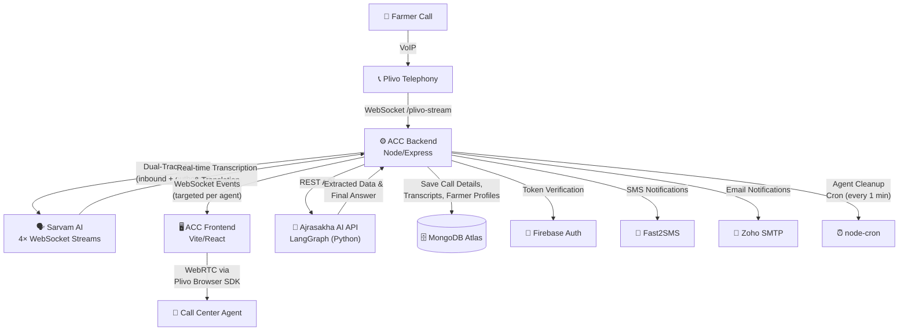

# Annam Call Center (ACC) Documentation

Annam Call Center (ACC) is a dedicated microservice architecture designed to handle real-time voice calls from farmers, enabling live voice-based agricultural support. By routing voice calls through Plivo, transcribing and translating the conversation in real-time via Sarvam AI (dual-track: farmer audio + agent audio), and displaying them to human call-center agents via WebSocket events, ACC bridges the language and technical barriers for farmers. Agents review AI-extracted data, optionally correct it, and then generate expert agricultural answers through a LangGraph-based human-in-the-loop AI pipeline.

---

## Glossary of Project Terms

When discussing and working on the ACC project, several key terms are used:

### 1. Workflow
A **workflow** is the end-to-end sequence of tasks, processes, or data flows that occur during a feature's lifecycle. In ACC, the workflow maps out the lifecycle of a phone call:
*   **Trigger**: A farmer dials the Plivo phone number.
*   **Agent Assignment**: The `AgentAssignmentService` atomically finds an available agent (not busy, active, with lowest `agent_N` number) and marks them as busy with the call UUID.
*   **Routing**: The Plivo system notifies the ACC backend via webhooks, and the backend routes the call to the assigned agent's SIP endpoint.
*   **Dual-Track Streaming**: The real-time audio is streamed in base64 packets using WebSockets (`/plivo-stream`). Each call produces **two parallel audio tracks** — `inbound` (farmer) and `outbound` (agent) — each with its own pair of Sarvam AI WebSocket connections (transcribe + translate), totaling **4 concurrent WebSocket streams per call**.
*   **Real-time Transcription & Translation**: Sarvam AI processes each track's audio via streaming WebSockets (`wss://api.sarvam.ai/speech-to-text/ws`), returning both the original-language transcript and an English translation. A debounce mechanism (1 second) batches partial results before emitting them to the frontend.
*   **Farmer Lookup**: The `FarmerService` looks up the calling phone number in the `call_farmers` collection. If a known farmer profile exists, it is attached to the call context.
*   **UI Delivery**: The conversation is rendered as real-time chat bubbles in the agent's dashboard. Each message includes `originalText`, `translatedText`, `detectedLanguage`, and `track` (farmer/agent). Messages are sent only to the assigned agent and admin/moderator users.
*   **AI Data Extraction**: After the call ends (or while reviewing the transcript), the agent triggers the `AccAgentService` which calls the external Ajrasakha AI API to extract structured data: `query`, `crop`, `state`, `district`, `domain`, farmer details (name, phone, age, gender, village, block, primary crop), etc.
*   **Human-in-the-Loop Correction**: The agent reviews the AI-extracted fields in an editable draft form. Corrections are pushed back to the AI thread via `AccAgentService.updateState()`, which updates the LangGraph checkpoint.
*   **AI Answer Generation**: The agent triggers `AccAgentService.resumeAndGetAnswer()`, which resumes the LangGraph execution from the corrected checkpoint. The AI fetches context via MCP servers and generates a final expert agricultural answer.
*   **Save & Completion**: The full call details (Plivo metadata, both tracks' transcripts/translations/languages, agent ID) are saved to MongoDB via `PlivoService.saveCallDetails()`. The agent is then marked as available again.

### 2. Dependencies
**Dependencies** are external software libraries, platforms, APIs, or databases that the application relies on to function. For ACC, these include:
*   **Plivo**: VoIP and telephony platform for receiving calls and forwarding audio. Backend uses `plivo` Node SDK for call detail retrieval and SIP endpoint management. Frontend uses `plivo-browser-sdk` for WebRTC-based in-browser call handling.
*   **Fast2SMS**: SMS gateway platform used to send quick text notifications/SMS messages to phone numbers via the Quick SMS Bulk API (`https://www.fast2sms.com/dev/bulkV2`).
*   **Sarvam AI**: Speech-to-Text (STT) and translation services supporting regional Indian languages. Used via WebSocket streaming for real-time transcription/translation during calls (`wss://api.sarvam.ai/speech-to-text/ws` with model `saaras:v3`), and via REST API for on-demand text translation (`https://api.sarvam.ai/translate` with models `mayura:v1` and `sarvam-translate:v1`, supporting 22+ Indian languages).
*   **MongoDB**: Primary database storing call details, transcripts, farmer profiles, agent statuses, contexts, and Plivo credentials.
*   **Firebase**: Authentication service for securing agent and administrator dashboards. Backend uses `firebase-admin` for token verification and user management. Frontend uses `firebase` client SDK for login/auth state.
*   **Ajrasakha AI API (External Service)**: An external LangGraph-based AI Agent service (Python) accessed via HTTP REST calls (`POST /threads`, `POST /threads/{id}/runs/wait`, `GET/POST /threads/{id}/state`). It handles the conversational agent loop, executes extraction tasks via LLM prompts, retrieves context from Model Context Protocol (MCP) servers, and generates final agricultural responses. Configured via `ACC_AGENT_BASE_URL` and `ACC_AGENT_ASSISTANT_ID` environment variables.
*   **Nodemailer (Zoho SMTP)**: Email notification service using `nodemailer` with Zoho Mail SMTP (`smtp.zoho.in:465`). Used for sending platform notifications.
*   **node-cron**: Scheduled job runner. Runs an agent status cleanup job every minute (`*/1 * * * *`) to mark agents offline if their heartbeat is older than 75 seconds.

---

## System Architecture & Tech Stack

### Backend (`acc-backend`)
*   **Framework**: Node.js + Express.js (v5)
*   **Design Pattern**: Dependency Injection via `inversify` and Routing Controllers (`routing-controllers`)
*   **API Reference**: Scalar API Docs (`/reference` endpoint)
*   **Package Manager**: pnpm (v10.4.1)
*   **Modules & Services**:

    | Module | Service | Controller | Description |
    |--------|---------|------------|-------------|
    | `plivo` | `PlivoService` | `PlivoController` | Telephony interface, Sarvam WebSocket connector (dual-track transcription & translation), call detail saving to MongoDB, Plivo API integration, Fast2SMS endpoint |
    | `plivo` | `AgentAssignmentService` | — | Dynamic agent number assignment (`agent_N`), SIP credential lookup (DB + env fallback), agent busy/available state machine |
    | `plivo` | `FarmerService` | `FarmerController` | CRUD operations for farmer profiles indexed by phone number |
    | `user` | `UserService` | `UserController` | Agent online/offline toggling, heartbeat tracking, inactive agent cleanup (75s threshold), agent availability queries, user profile management |
    | `acc-agent` | `AccAgentService` | `AccAgentController` | LangGraph AI agent integration: thread creation, transcript data extraction, human-in-the-loop state correction, checkpoint management, answer generation |
    | `context` | `ContextService` | `ContextController` | Context text storage in MongoDB and on-demand text translation via Sarvam REST API (22+ Indian languages, chunked batching for long texts) |
    | `auth` | `FirebaseAuthService` | `AuthController` | Firebase Admin token verification, user creation/lookup, Firebase display name sync |

*   **Background Jobs**:
    *   `agentStatusCleanupJob`: Runs every 1 minute via `node-cron`. Calls `UserService.cleanupInactiveAgents()` to mark agents offline whose `lastAgentActiveAt` is older than 75 seconds.
    *   `PlivoService` GC sweep: Runs every 15 minutes. Purges stale in-memory call sessions (transcripts, translations, WebSocket streams) older than 1 hour.

*   **WebSocket Server** (`/plivo-stream`):
    *   Handles Plivo media stream events (`start`, `media`, `stop`)
    *   Authenticates frontend clients via Firebase token in query params
    *   Targets WebSocket messages to the assigned agent + all admin/moderator clients
    *   Auto-reconnects Sarvam AI WebSocket streams on disconnection

### Frontend (`acc-frontend`)
*   **Framework**: Vite + React 19 + TypeScript
*   **Styling**: Tailwind CSS v4 + Radix UI Primitives + PrimeReact + Framer Motion (animations)
*   **Routing**: TanStack Router (`@tanstack/react-router`)
*   **State Management**: TanStack Query (`@tanstack/react-query`) + Zustand (with `devtools` + `persist` middleware for auth store)
*   **Telephony**: Plivo Browser SDK (`plivo-browser-sdk`) for WebRTC-based in-browser call handling
*   **Key Components**:

    | Component | Description |
    |-----------|-------------|
    | `CallInterface` | Primary call handling UI — live transcript display, AI data extraction form, human-in-the-loop correction, answer generation |
    | `IncomingCallBox` | Incoming call notification and accept/reject UI |
    | `CallAgentDashboard` | Agent's main dashboard with status controls and active call management |
    | `ACCAnalyticsDashboard` | Admin analytics dashboard with metrics and agent performance |
    | `CallHistory` | Call history browser with search, filters, and Excel export |
    | `CallLog` | Admin call log view with agent name/email columns and filters |
    | `ManageCallAgents` | Admin panel for managing call agent assignments and status |
    | `FarmerDetails` | Farmer profile viewer/editor |
    | `FeedbackModal` | Post-call feedback collection |
    | `QueryFilterBar` | Reusable filter bar for call/question queries |
    | `SarvamTranslatePairDropdown` | Language pair selector for Sarvam translation |

*   **Frontend Service Layer** (`hooks/services/`):

    | Service | Description |
    |---------|-------------|
    | `accAgentService` | Client for ACC Agent API (thread creation, data extraction, state update, answer generation) |
    | `authService` | Firebase authentication flows |
    | `plivoWebSocketService` | WebSocket connection management for `/plivo-stream` |
    | `sarvamSttService` | Sarvam Speech-to-Text client |
    | `translateService` | On-demand text translation client |
    | `userService` | User/agent management API client |
    | `contextService` | Context storage API client |
    | `questionService` | Question list API client |

---

