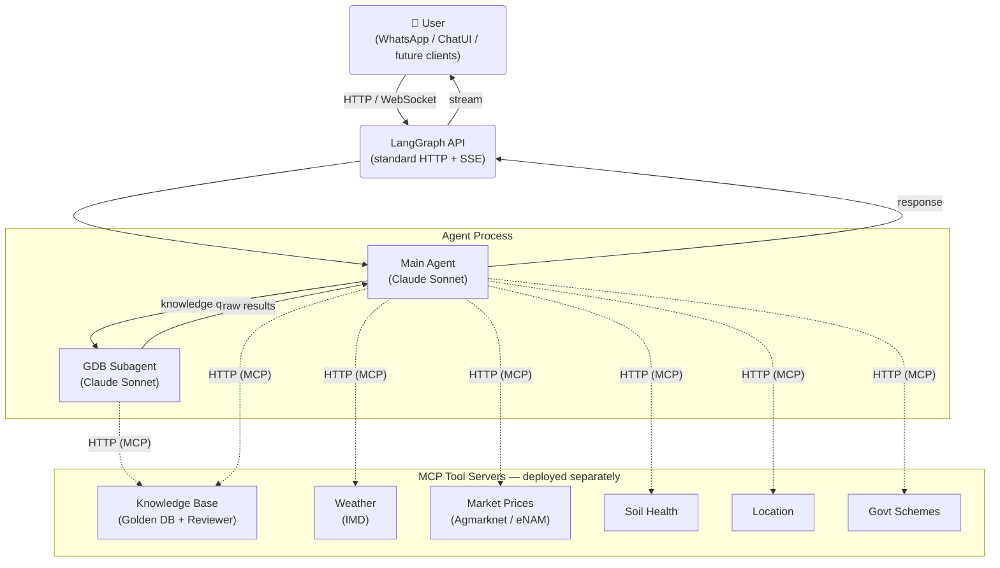
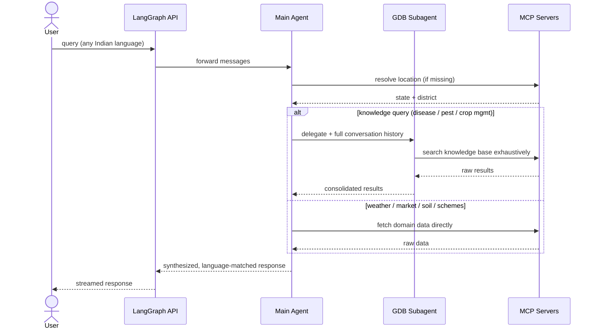

# AjraSakha AI Agent

## Overview

AjraSakha is an AI assistant for Indian farmers that answers queries about crop diseases, pests, fertilizers, soil health, market prices, weather, and government schemes — in any Indian language.

### Architecture

The system has two independent parts that communicate over the network:

**1. The Agent** — a LangGraph graph (Claude Sonnet) that receives user messages, decides what information is needed, calls the appropriate MCP servers, and synthesizes a final response. It maintains conversation state and handles multi-turn dialogue.

**2. MCP Tool Servers** — independent HTTP services, each responsible for one domain. Although their source code lives in the same repository for convenience, they are **deployed and run as separate processes/containers**, completely independent of the agent. The agent never imports or calls them directly — it reaches them at runtime through an MCP client over HTTP.



### Clients

The agent exposes a **standard LangGraph HTTP API** (streaming SSE). Any client can connect to it — currently WhatsApp and a chat UI, with other clients possible in the future without any changes to the agent itself.

### The Agent in detail

The agent is a **supervisor + subagent** setup:

- The **main agent** handles routing, location resolution, language detection, and final response synthesis.
- For deep knowledge retrieval (diseases, pests, crop management), it delegates to a **GDB subagent** — a separate LLM react loop with access only to knowledge base tools. The subagent receives the full conversation history for context, exhausts all available knowledge sources, and returns raw results to the main agent.

This keeps the main agent's context clean while giving the subagent everything it needs to search thoroughly.

### Query flow



### MCP Tool Servers

Each server is an independent HTTP service built with FastMCP. The agent connects to them via an MCP client — there is no direct code import. Here is what each server does:

**Knowledge Base (Golden DB)**
The primary knowledge source. Stores expert-answered farming Q&A, tagged by crop, state, season, and domain. Supports both vector similarity search (semantic) and full-text keyword search. The GDB subagent queries this first and most exhaustively.

**Reviewer System**
A human-in-the-loop layer. Every incoming farmer query is submitted here so the agri expert team can review it. If a previously reviewed answer exists for that question, it is returned directly. If not, the question is queued for expert review and the farmer is notified to check back. Also holds a Package of Practices corpus as a secondary fallback.

**Weather (IMD)**
Connects to India Meteorological Department APIs. Provides 7-day forecasts, current conditions, district-level rainfall statistics, severe weather warnings, and subdivision-level monsoon patterns — all by GPS coordinates or station ID.

**Market Prices — Agmarknet (primary)**
Connects to the government Agmarknet API. Resolves state → district → market → commodity IDs progressively, then fetches live mandi arrival and price data (min / max / modal price).

**Market Prices — eNAM (fallback)**
Used only if Agmarknet has no data. Connects to the eNAM (National Agriculture Market) portal to fetch trade data by state, APMC, and commodity.

**Soil Health**
Connects to the government Soil Health Card GraphQL API (soilhealth.dac.gov.in). Given a farmer's soil test values (N, P, K, Organic Carbon), state, district, and crop, it returns official fertilizer dosage recommendations.

**Location**
Reverse-geocodes GPS coordinates (lat/lon) to city, state, and district using OpenStreetMap Nominatim. Used by the main agent whenever a query lacks an explicit location.

**Government Schemes**
Connects to the MyScheme (myscheme.gov.in) API. Accepts farmer demographics (state, age, gender, caste, occupation, BPL status, etc.) and returns matching central/state agriculture and rural schemes. A second tool fetches full eligibility, benefits, and application process for a specific scheme.

---

## Feature Status

Current state of all major features and planned work.

### Knowledge Retrieval

| Feature | Status | Notes |
|---|---|---|
| GDB vector (embedding) search | ✅ Done | Semantic similarity search against expert Q&A |
| GDB full-text (keyword) search | ✅ Done | Atlas Search index built and ready |
| **Pre-LLM exact match — integration & testing** | 🔄 In progress | Full-text index is ready; end-to-end wiring and validation pending |
| Reviewer dataset integration | ✅ Done | Human-reviewed answers returned when available |
| Package of Practices (POP) search | 🔄 Planned | POP corpus exists; integration work upcoming |
| GDB subagent architecture | ✅ Done | Dedicated subagent with isolated context |
| Deterministic agent test suite | 🔄 Planned | Framework to be established; foundational work ahead |

#### Pre-LLM Exact Match — Key Planned Feature

When a farmer query comes in, before invoking the LLM at all, the system should attempt a **direct exact match** against the knowledge base using all available metadata (question text, crop, state, season, domain). If a sufficiently close match is found, the stored expert answer should be returned directly — bypassing the LLM entirely. This reduces latency, cost, and hallucination risk for well-covered queries. The underlying full-text search index is built and ready; end-to-end integration and validation are the next steps.

---

### Banned Chemicals & Colloquial Term Lookup

| Feature | Status | Notes |
|---|---|---|
| Banned chemicals MCP tool | 🔄 Partial | Tool scaffolded, not fully integrated |
| Colloquial / local name resolution | 🔄 Partial | Tool scaffolded, not fully integrated |

When the agent formulates an answer involving chemical names, technical terms, or scientific crop names, it should make a lookup against an internal reference system to:

1. Flag or substitute any chemicals that are government-banned in India.
2. Replace technical/scientific terms with locally known colloquial names (e.g. regional crop variety names, common pest names in the farmer's language).

Both lookups should happen dynamically via a dedicated MCP tool after the answer is drafted, before it is sent to the farmer. Partially built — needs to be completed and wired into the response pipeline.

---

### Market Prices

| Feature | Status | Notes |
|---|---|---|
| Agmarknet integration | ✅ Done | Primary source for mandi prices |
| eNAM integration | ✅ Done | Fallback when Agmarknet has no data |
| Other state APMCs / scraper-based sources | 🔄 In progress | Additional state-level markets not yet covered |

---

### Weather

| Feature | Status | Notes |
|---|---|---|
| IMD integration (forecast + warnings) | ✅ Usable | 7-day forecast, district warnings, rainfall stats |
| Full IMD capability utilisation | ⚠️ Partial | Several IMD endpoints available but not actively used in responses |
| Agro-climatic zone advisory | ❌ Not started | Zone-based crop and season recommendations |
| Crop life-cycle weather advisory | ❌ Not started | Stage-aware advisories (sowing / growth / harvest) |

---

### Soil Health

| Feature | Status | Notes |
|---|---|---|
| Soil Health Card API integration | ✅ Done & stable | Fertilizer dosage from soilhealth.dac.gov.in |

---

### Location & Context Propagation

| Feature | Status | Notes |
|---|---|---|
| Location capture in main agent state | ✅ Done | GPS / pincode resolved to state + district |
| Location passed to subagents | ⚠️ Partial | Main agent captures location but does not yet propagate it into subagent context — subagents operate without location awareness |

---

### Agent Architecture

| Feature | Status | Notes |
|---|---|---|
| Supervisor + subagent pattern | ✅ Done | Main agent orchestrates GDB subagent |
| Reduce LLM involvement for matched queries | ❌ Not started | For GDB queries where all metadata is present and an exact match is found, the answer should be returned directly without going through the full LLM synthesis pipeline |

---

### Project structure (high level)

```
ajrasakha/
  agents/    # agent logic — main graph, subagents, prompts, config
  tools/     # MCP server implementations — one per domain, deployed separately
  api/       # FastAPI layer — request handling and response streaming
  utils/     # shared utilities
```

The `tools/` directory is co-located for convenience but each tool server runs as its own process/container, independent of the agent.

---

## Prerequisites

- Docker + Docker Compose
- `uv` (Python package manager)

## Setup

1. Copy the env file:
   ```
   cp .env.example .env
   ```
   Fill in all required values in `.env`.

2. Install dependencies:
   ```
   uv sync
   uv pip install aegra-cli
   ```

## Running with Docker

Start all services:
```
aegra up
```

Stop all services:
```
aegra down
```

View logs:
```
docker compose -f docker-compose.yml logs -f
```

## Running in Development (hot reload)

```
aegra dev
```

Server starts at `http://127.0.0.1:2026` by default.

Options:
```
aegra dev --port 8000
aegra dev --no-db-check
aegra dev -e /path/to/.env
```
