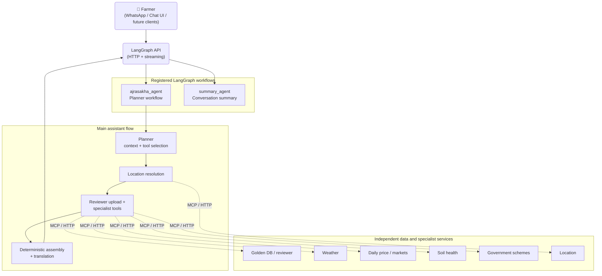
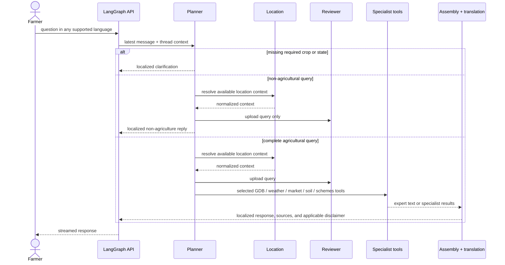

# AjraSakha AI Agent

## Overview

AjraSakha is an AI assistant for Indian farmers. It answers questions about crop
diseases, pests, fertilizers, soil health, market prices, weather, and government
schemes in the farmer's language and script.

### Architecture

The AI service combines LangGraph workflows with independent data and specialist
services reached over configured MCP and HTTP endpoints.

**LangGraph workflows** — the service currently exposes the main farmer-assistant
workflow and a conversation-summary workflow. The main workflow plans the request,
resolves context, selects specialist tools, and produces the final response.

**Data and specialist services** — these provide expert Q&A, reviewer workflows,
weather, market prices, soil recommendations, location, and schemes data. Their
data stores remain outside the LangGraph application.


```mermaid
graph TD
    User("👤 Farmer\n(WhatsApp / Chat UI / future clients)")
    API("LangGraph API\n(HTTP + streaming)")

    subgraph Graphs ["Registered LangGraph workflows"]
        Main["ajrasakha_agent\nPlanner workflow"]
        Summary["summary_agent\nConversation summary"]
    end

    subgraph MainFlow ["Main assistant flow"]
        Planner["Planner\ncontext + tool selection"]
        Location["Location resolution"]
        Execute["Reviewer upload +\nspecialist tools"]
        Assemble["Deterministic assembly\n+ translation"]
    end

    subgraph Services ["Independent data and specialist services"]
        GDB["Golden DB / reviewer"]
        Weather["Weather"]
        Market["Daily price / markets"]
        Soil["Soil health"]
        Schemes["Government schemes"]
        Geo["Location"]
    end

    User --> API
    API --> Main
    API --> Summary
    Main --> Planner --> Location --> Execute --> Assemble
    Execute -. "MCP / HTTP" .-> GDB
    Execute -. "MCP / HTTP" .-> Weather
    Execute -. "MCP / HTTP" .-> Market
    Execute -. "MCP / HTTP" .-> Soil
    Execute -. "MCP / HTTP" .-> Schemes
    Location -. "MCP / HTTP" .-> Geo
    Assemble --> API
```

### Clients

The service exposes the standard LangGraph HTTP API with streaming responses.
WhatsApp and the chat UI are current clients; other clients can integrate without
changing the graph implementation.

### The Agent in detail

`ajrasakha_agent` is a planner-led workflow rather than a single supervisor loop.
The planner uses the latest farmer message and available thread context to classify
the request, resolve the required crop and state, and select tools. State and crop
completeness are handled deterministically after classification.

| Component | Responsibility |
|---|---|
| Planner | Classifies domain/tool flags, rephrases the query, and determines required context. It asks for crop only when the classified domain requires one. |
| Location resolution | Uses the state in the latest message first, then thread GPS when available. If neither is available, it asks for state rather than a district-only follow-up. |
| Reviewer upload | Uploads every complete agricultural query before specialist tools run. |
| Golden retrieval | Retrieves similar expert Q&A through the Golden API and preserves available answer, author, and source information. |
| Specialist agents | Fetch weather, daily market prices, soil-health recommendations, and government schemes when selected by the plan. |
| Answer assembly | Builds specialist and expert-answer bodies deterministically, then translates when required and appends the appropriate sources and disclaimers. |
| Summary workflow | Produces a compact factual summary of a farmer conversation for later context. |

The shared MiniMax chat model is used for the active planner and other agent steps.
The legacy single-LLM/tool loop remains available only when
`USE_PLANNER_GRAPH=false`.

### ACC workflow

The ACC (Agricultural Call Center) workflow is implemented at
[`ajrasakha/agents/acc_agent/`](ajrasakha/agents/acc_agent/). It supports
transcript extraction, human verification, and parallel answer routing. It is
**not currently registered** in `langgraph.json`, so it is not exposed by the
default LangGraph server configuration. See its
[dedicated README](ajrasakha/agents/acc_agent/README.md) for the complete design.

### Query flow


```mermaid
sequenceDiagram
    actor Farmer
    participant API as LangGraph API
    participant Planner as Planner
    participant Location as Location
    participant Reviewer as Reviewer
    participant Tools as Specialist tools
    participant Answer as Assembly + translation

    Farmer->>API: question in any supported language
    API->>Planner: latest message + thread context

    alt missing required crop or state
        Planner-->>API: localized clarification
    else non-agricultural query
        Planner->>Location: resolve available location context
        Location-->>Planner: normalized context
        Planner->>Reviewer: upload query only
        Planner-->>API: localized non-agriculture reply
    else complete agricultural query
        Planner->>Location: resolve available location context
        Location-->>Planner: normalized context
        Planner->>Reviewer: upload query
        Planner->>Tools: selected GDB / weather / market / soil / schemes tools
        Tools-->>Answer: expert text or specialist results
        Answer-->>API: localized response, sources, and applicable disclaimer
    end

    API-->>Farmer: streamed response
```

### Data and specialist services

Each service is independently deployed and is reached through its configured
runtime endpoint.

**Golden DB and Reviewer**

Golden retrieval finds similar agricultural Q&A. The main path uses embedding-based
similarity retrieval through the Golden API. Reviewer upload records complete
agricultural questions for the expert workflow; responses can carry expert answer
text, author, and sources when available.

**Weather**

The weather agent retrieves forecast and warning data. The graph has a dedicated
unavailable-data path so a service failure is not presented as a normal weather
recommendation.

**Market prices**

The planner routes market questions through the daily-price agent. The market stack
uses configured mandi data sources, including Agmarknet and eNAM support, and
formats returned data before translation.

**Soil health**

The soil agent provides crop and location-aware soil-health and fertilizer guidance
when selected by the plan.

**Location**

Location tools resolve available GPS or explicit location context to support
state/district-aware planning and specialist calls.

**Government schemes**

The schemes agent retrieves schemes and eligibility-oriented information using the
available farmer context.

---

## Feature Status

Current state of major AI-service features.

### Knowledge Retrieval

| Feature | Status | Notes |
|---|---|---|
| Golden similar-question retrieval | ✅ Active | Embedding-based retrieval through the Golden API; results can include answer text, author, and sources. |
| Pre-LLM exact-match bypass | ❌ Not active | The earlier exact-match path was removed; the active similar-question path is embedding-based. |
| Reviewer workflow integration | ✅ Active | Complete agricultural queries are uploaded before specialist execution. |
| Expert-queue fallback | ✅ Active | When no usable answer is available, the graph returns the localized expert-queue/testing path. |
| Deterministic planner tests | ✅ Active | Focused planner, routing, language, location, and answer-assembly tests are maintained under `ajrasakha/agents/tests/`. |

### Banned Chemicals and Term Resolution

| Feature | Status | Notes |
|---|---|---|
| Chemical-checker agent | ⚠️ Disabled by default | `ENABLE_CHEMICAL_CHECKER` is currently `False` in `plan_executor.py`. |
| Chemical-checker triggers | Ready behind the flag | When enabled, the planner can trigger checking from the query and after GDB retrieval. |

### Market Prices

| Feature | Status | Notes |
|---|---|---|
| Daily-price routing | ✅ Active | Market questions are routed through the daily-price agent. |
| Agmarknet and eNAM support | ✅ Available | Configured market integrations used by the market stack. |
| Response formatting | ✅ Active | Raw market data is formatted before translation. |

### Weather

| Feature | Status | Notes |
|---|---|---|
| Weather-agent integration | ✅ Active | Selected by the planner for weather-related questions. |
| Unavailable-data reply | ✅ Active | The graph takes a dedicated terminal path when weather data cannot be returned. |
| Crop life-cycle advisory | ❌ Not implemented here | No stage-aware advisory workflow is registered in the current main graph. |

### Soil Health

| Feature | Status | Notes |
|---|---|---|
| Soil-health specialist | ✅ Available | Invoked only when selected by the plan. |

### Location and Context Propagation

| Feature | Status | Notes |
|---|---|---|
| Latest-message state resolution | ✅ Active | The planner prefers an explicit state in the latest farmer message. |
| GPS location fallback | ✅ Active | Thread GPS is used when the latest message does not provide a state. |
| Crop completeness | ✅ Active | Crop is required only for crop-required domains; one unresolved follow-up falls back to `all`. |
| Historical-context isolation | ✅ Active | Older unrelated turns do not supply state or crop for a new question. |

### Agent Architecture

| Feature | Status | Notes |
|---|---|---|
| Planner graph | ✅ Default | `USE_PLANNER_GRAPH=true` routes through planner, location, execution, assembly, and translation. |
| Non-agriculture path | ✅ Active | Reviewer upload only, then a localized catalog response; specialist tools are skipped. |
| Deterministic answer assembly | ✅ Active | The planner graph does not use a synthesizer LLM for answer-body assembly. |
| Script and language handling | ✅ Active | The latest farmer message determines the normalized vocal-language/script pair used for fixed content and translation. |
| Legacy tool loop | ⚠️ Optional | Available only with `USE_PLANNER_GRAPH=false`. |

#### Running tests

From the `ai/` directory:

```bash
uv run pytest ajrasakha/agents/tests/test_planner.py -v
uv run pytest ajrasakha/agents/tests/ -v
```

Some tests exercise live services and require the appropriate environment
configuration. Legacy routing tests target the non-planner path and require
`USE_PLANNER_GRAPH=false`.

---

### Project structure (high level)

```
ai/
  langgraph.json                # registered LangGraph workflows
  ajrasakha/
    agents/                     # planner, graph nodes, specialist agents, prompts
      ajrasakha.py              # main farmer-assistant graph
      summary_agent.py          # conversation-summary graph
      acc_agent/                # ACC workflow source (not currently registered)
    tools/                      # domain integrations and supporting services
  docker-compose.yml            # local PostgreSQL, Redis, and AI API stack
  aegra.json                    # container/runtime configuration
  pyproject.toml
```

The tool and data-service source is co-located for development convenience, but
the services are reached through configured runtime endpoints.

## Services

| Compose service | Container | Description |
|---|---|---|
| `ai` | `ai-api` | LangGraph AI API |
| `postgres` | `ai-postgres` | PostgreSQL persistence |
| `redis` | `ai-redis` | Redis broker and streaming support |

---

## Prerequisites

- Python 3.10 or later
- `uv` (Python package manager)
- Docker and Docker Compose for the local container stack

## Setup

1. Copy the environment template:

   ```bash
   cp .env.example .env
   ```

   Fill in the required model, database, and service endpoint values in `.env`.

2. Install the AI-service dependencies:

   ```bash
   uv sync
   ```

## Running with Docker

From `ai/`, start the local PostgreSQL, Redis, and AI API stack:

```bash
docker compose up --build
```

Stop the stack:

```bash
docker compose down
```

View AI API logs:

```bash
docker compose logs -f ai
```

## Running in Development (hot reload)

From `ai/`, start the LangGraph development server:

```bash
uv run langgraph dev --no-browser --allow-blocking
```
