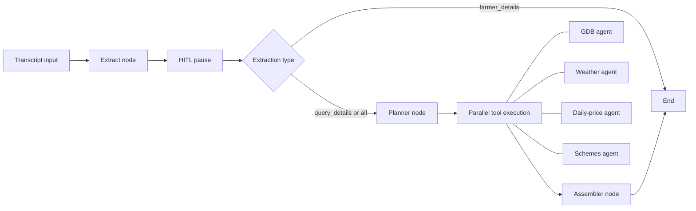

# ACC Agent (Agricultural Call Center Agent)

A LangGraph workflow for agricultural call-centre transcripts. It extracts
farmer and query context, pauses for human verification, routes answer requests
to the relevant agricultural agents, and returns structured output for the
call-centre agent.

The graph is registered as `acc_agent` in
[`ai/langgraph.json`](../../../langgraph.json).

## Overview

The ACC Agent supports two connected use cases:

1. Extract a farmer profile from a transcript without generating an answer.
2. Extract a query, let a human verify it, then produce an answer using one or
   more domain agents.

Its extraction, planning, and assembly nodes use the shared self-hosted,
OpenAI-compatible MiniMax chat model. They do not call Anthropic directly.

## Architecture



The graph is compiled with `interrupt_after=["extract"]`. A caller must use a
stable LangGraph thread and the platform's state/update-and-resume flow to
review or correct extracted values before continuing. `verified_by_human` is
included in state for the calling application; the graph's branch is determined
by `extraction_type`.

## Files

| File | Description |
|---|---|
| `graph.py` | Graph definition, conditional route, and extraction interrupt |
| `state.py` | `AccAgentState` schema |
| `nodes.py` | Extraction, planning, tool execution, and assembly nodes |
| `extraction.py` | Extraction-mode validation and response-to-state mapping |
| `lgd_location.py` | LGD state/district normalization |
| `prompts.py` | Extraction, planning, and assembly prompts |
| `__init__.py` | Exposes `acc_graph` |

## State schema

```python
class AccAgentState(TypedDict):
    # Input
    transcript: str
    extraction_type: Literal["farmer_details", "query_details", "all"]

    # Query extraction
    extracted_query: Optional[str]
    extracted_state: Optional[str]
    extracted_district: Optional[str]
    extracted_crop: Optional[str]
    standardized_domains: list[str]

    # Farmer-profile extraction
    extracted_name: Optional[str]
    extracted_phone: Optional[str]
    extracted_age: Optional[int]
    extracted_gender: Optional[str]
    extracted_village: Optional[str]
    extracted_block: Optional[str]
    extracted_primary_crop: Optional[str]
    extracted_secondary_crops: list[str]

    # Verification and location
    location: Optional[Location]
    verified_by_human: bool

    # Answer routing and results
    selected_tools: list[str]
    gdb_response: Optional[str]
    weather_response: Optional[str]
    market_response: Optional[str]
    schemes_response: Optional[str]
    final_answer: Optional[str]
```

Only `transcript` is needed to start an extraction. `extraction_type` is
optional at the input boundary and defaults to `all`.

## Workflow

### 1. Extract node

The agent reads the transcript and extracts either query details, farmer details,
or both. It normalizes the requested extraction mode and sets
`verified_by_human` to `False`.

Query extraction includes a concise question, state, district, crop, and one or
more standardized domains. Farmer-profile extraction includes name, phone, age,
gender, village, block, and primary/secondary crops when explicitly stated.
Unknown profile values are `null`; `secondary_crops` is always an array and
never repeats the primary crop.

### 2. Official location normalization

After extraction, state and district values are normalized against the
Government of India Local Government Directory (LGD) datasets. District matching
is limited to the selected state, so a same-named district in another state is
not chosen.

Matching uses normalized exact names, supported historical aliases, and a
conservative fuzzy match. When LGD responds successfully but cannot safely match
a value, it becomes `All`. If the LGD service is unavailable or unconfigured,
the extracted location is preserved.

### 3. Human-in-the-loop verification

The graph pauses immediately after extraction. The call-centre application
reviews or updates the extracted values before resuming the same LangGraph thread.

`farmer_details` ends after this extraction/verification step. `query_details`
and `all` continue to planning after the thread resumes.

### 4. Planner node

For answer-generating modes, the planner selects one or more tools:

| Planner value | Agent | Responsibility |
|---|---|---|
| `gdb` | GDB agent | Farming practices, pests, diseases, and fertilizer guidance |
| `weather` | Weather agent | Forecasts and weather-related questions |
| `market` | Daily-price agent | Mandi prices and market questions; uses available location for geocoding |
| `schemes` | Schemes agent | Government schemes, subsidies, and farmer benefits |

The fallback selection is `gdb` if the planner output cannot be parsed.

### 5. Tool-execution node

The selected tools run concurrently. Their outputs are kept separately in
`gdb_response`, `weather_response`, `market_response`, and `schemes_response`.
The weather path handles missing location by returning a clear location request
along with current conditions for major Indian cities.

### 6. Assembler node

The assembler attempts to decode each selected response as JSON and retains it
as text if decoding is not possible. It then creates a concise, factual,
Markdown-formatted answer for the call-centre agent from the retrieved data.

The state field `final_answer` is a JSON-encoded string. When decoded, it has
this shape:

```json
{
  "gdb": "object, string, or null",
  "weather": "object, string, or null",
  "market": "object, string, or null",
  "schemes": "object, string, or null",
  "final_answer": "Human-readable response for the call-centre agent"
}
```

## Standardized domains

The extractor classifies a query into one or more of these 22 domains:

1. Soil Health and Nutrient Management
2. Irrigation and Water Management
3. Insect - Pest Management
4. Disease Management
5. Seed and Variety Selection
6. Cultural and Crop Management Practices
7. Organic and Natural Farming
8. Weed Management
9. Climate, Weather & Stress Management
10. Farm Tools & Mechanisation
11. Post-Harvest Management & Storage
12. Market Prices, MSP & Marketing
13. Agricultural Schemes & Subsidies
14. Credit, Loan & Insurance
15. Capacity Building & Extension
16. Rural Infrastructure
17. Animal Husbandry & Livestock
18. Fisheries & Aquaculture
19. Horticulture & Landscaping
20. Allied Agricultural Activities
21. Others
22. NA / Invalid Data

## Selective transcript extraction

| Value | Returned extraction fields | Answer flow after resume |
|---|---|---|
| `farmer_details` | Farmer profile, primary/secondary crops, state, and district | Does not continue |
| `query_details` | Query, crop, state, district, and standardized domains | Continues |
| `all` | Both field groups | Continues |

Example input state:

```json
{
  "transcript": "Expert: Hello. Farmer: My name is Ramesh and I grow cotton and wheat in Punjab.",
  "extraction_type": "farmer_details"
}
```

Example extracted crop fields:

```json
{
  "extracted_primary_crop": "Cotton",
  "extracted_secondary_crops": ["Wheat"]
}
```

## Configuration

Configure the shared MiniMax model in the AI service environment:

```dotenv
MINIMAX_BASE_URL=<OpenAI-compatible base URL>
MINIMAX_API_KEY=<service key>
MINIMAX_MODEL=MiniMaxAI/MiniMax-M2.7
```

Configure LGD normalization when official state/district matching is needed:

```dotenv
LGD_API_KEY=<data.gov.in API key>
LGD_STATES_API_URL=https://api.data.gov.in/resource/a71e60f0-a21d-43de-a6c5-fa5d21600cdb
LGD_DISTRICTS_API_URL=https://api.data.gov.in/resource/37231365-78ba-44d5-ac22-3deec40b9197
```

The GDB, weather, daily-price, and schemes agents have their own service
configuration. See their respective modules for endpoint and credential details.

## Running and testing

From [`ai/`](../../../), start the local LangGraph server:

```bash
uv run langgraph dev --no-browser --allow-blocking
```

Use graph ID `acc_agent` and a stable thread ID for any run that must resume
after human verification.

Run the focused tests with:

```bash
uv run pytest ajrasakha/agents/tests/test_acc_agent_extraction.py -v
uv run pytest ajrasakha/agents/tests/test_acc_agent_lgd_location.py -v
```
