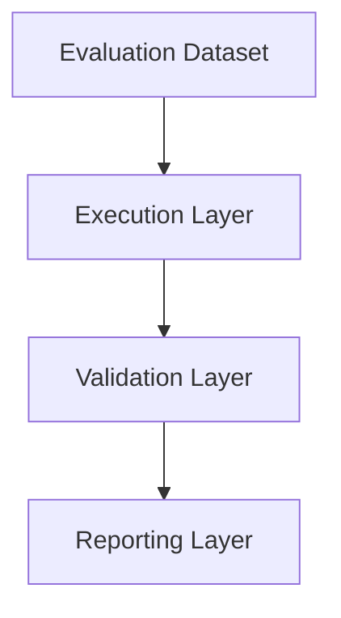
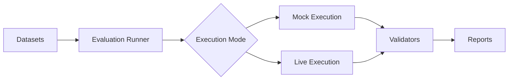
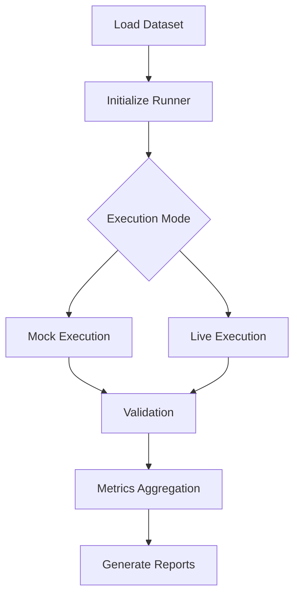
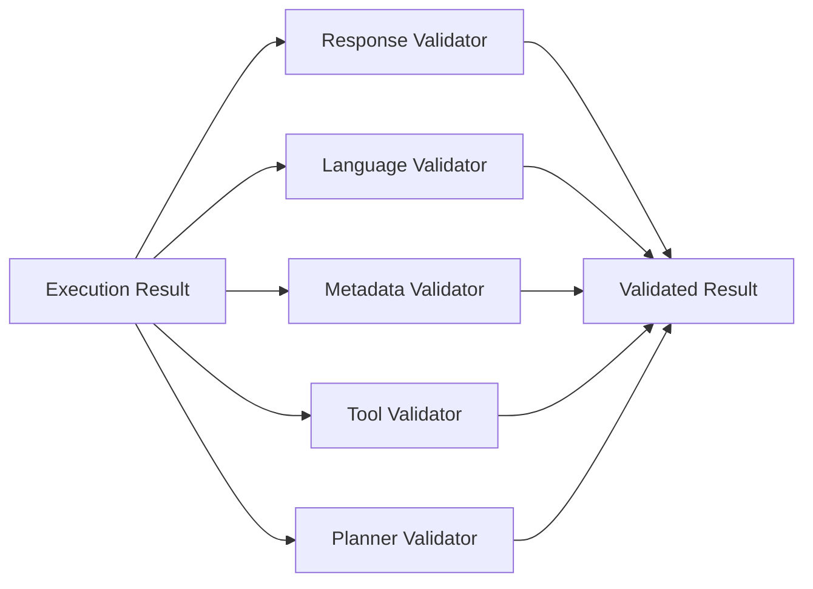
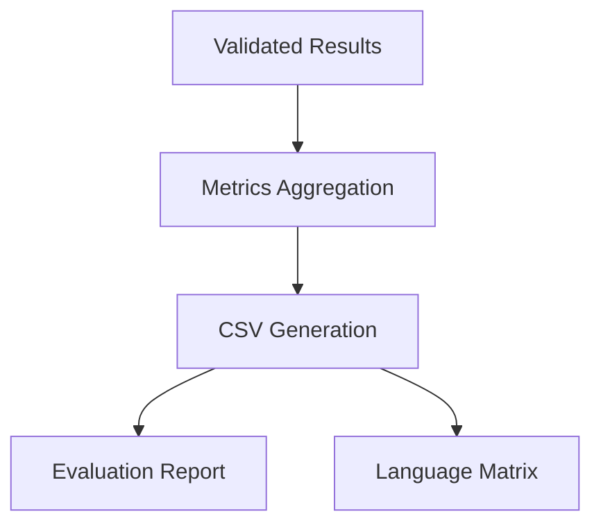
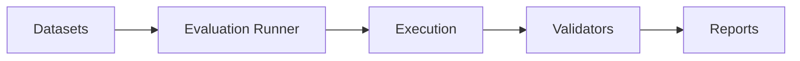
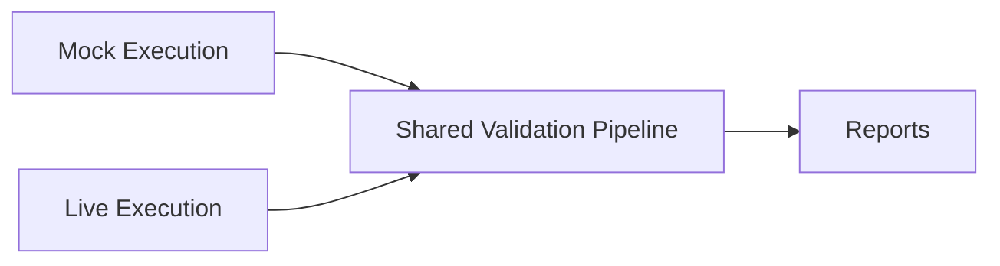
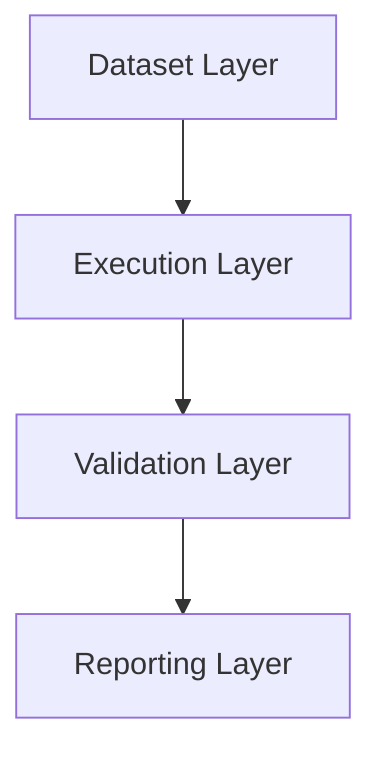

# AjraSakha Evaluation Framework Architecture

This document describes the architecture of the AjraSakha multilingual evaluation framework, including its core components, execution pipeline, validation workflow, and reporting subsystem.

The framework is designed to provide a modular, extensible, and reusable evaluation pipeline capable of validating multilingual AI responses in both mock and live execution environments.

---

# Design Goals

The architecture was designed with the following objectives:

- Modular execution pipeline
- Separation of execution and validation logic
- Support for multiple execution modes
- Extensible validator framework
- Automated report generation
- Configurable LLM providers
- Maintainable component structure

Each component has a clearly defined responsibility, minimizing coupling between different parts of the framework.

---

# System Overview

The evaluation framework consists of four major layers:

1. Dataset Layer
2. Execution Layer
3. Validation Layer
4. Reporting Layer

These layers operate independently while communicating through well-defined interfaces.



---

# Component Architecture



The framework separates execution from validation.

Regardless of whether evaluation is performed in mock mode or live mode, both execution paths ultimately pass through the same validation pipeline before reports are generated.

---

# Dataset Layer

The Dataset Layer provides multilingual evaluation cases used throughout the framework.

Responsibilities include:

- Storing multilingual queries
- Organizing evaluation scenarios
- Supporting multiple languages
- Providing consistent evaluation inputs

Because the datasets are independent of execution logic, new scenarios or languages can be added without modifying the evaluation pipeline.

---

# Execution Layer

The Execution Layer is responsible for processing evaluation cases.

Two execution modes are supported.

## Mock Execution

Mock execution generates predefined responses for testing the evaluation framework itself.

Characteristics:

- Offline execution
- Deterministic responses
- Fast execution
- No external dependencies

---

## Live Execution

Live execution submits evaluation cases to the deployed AjraSakha agent.

Characteristics:

- End-to-end evaluation
- Real AI responses
- Streaming execution
- Metadata extraction
- Tool validation

# Evaluation Runner

The Evaluation Runner serves as the central orchestration component of the framework.

Its primary responsibility is to coordinate the complete evaluation lifecycle, from loading evaluation cases to generating the final reports.

The runner performs the following operations:

1. Load evaluation datasets.
2. Select the execution mode.
3. Execute each evaluation case.
4. Invoke validation modules.
5. Aggregate evaluation metrics.
6. Generate reports.



The runner is intentionally lightweight and delegates execution, validation, and reporting to specialized components.

---

# Live Execution Architecture

During live execution, the framework interacts directly with the deployed AjraSakha agent.

```mermaid
flowchart TD
    A[Evaluation Case]
    B[run_live_case()]
    C["POST /runs/stream"]
    D[AjraSakha Agent]
    E[LangGraph]
    F[Planner]
    G[MCP Services]
    H[Streaming Events]
    I[Metadata Extraction]
    J[Validation]
    K[Reports]

    A --> B
    B --> C
    C --> D
    D --> E
    E --> F
    F --> G
    G --> H
    H --> I
    I --> J
    J --> K
```

Unlike mock execution, live execution captures streamed events and execution metadata in addition to the generated response.

---

# Validation Layer

The Validation Layer is responsible for evaluating the quality and correctness of every execution.

It is intentionally isolated from the execution layer, allowing new validators to be introduced without changing the execution pipeline.

Current validation responsibilities include:

- Response validation
- Language validation
- Execution status validation
- Metadata validation
- Tool execution validation
- Planner validation



Because validators are independent, additional validation modules can be added with minimal impact on the rest of the framework.

---

# Reporting Layer

Once validation has completed, the reporting subsystem aggregates all collected metrics into structured output files.



The reporting layer is independent of execution mode, allowing mock and live evaluations to produce reports in a consistent format.

---

# Component Interactions

The following diagram summarizes how the major components interact during a complete evaluation run.



Each layer communicates only with its immediate neighboring layer, reducing coupling and simplifying maintenance.

---

# Separation of Responsibilities

| Component | Responsibility |
|-----------|----------------|
| Dataset Layer | Stores multilingual evaluation cases |
| Evaluation Runner | Coordinates execution |
| Mock Executor | Generates predefined responses |
| Live Executor | Executes real requests against AjraSakha |
| Validators | Verify correctness and quality |
| Reporting Module | Generates evaluation reports |

This separation of responsibilities enables each component to evolve independently while maintaining a stable evaluation workflow.

---

# Extensibility

The architecture has been designed to support future expansion with minimal changes to the existing codebase.

Common extension points include:

- Adding new evaluation datasets
- Supporting additional languages
- Introducing new validators
- Adding new report formats
- Integrating additional LLM providers
- Supporting new MCP services

Because the framework follows a layered architecture, enhancements are typically localized to a single component rather than requiring changes throughout the system.

---

# Design Principles

The framework follows several software engineering principles:

- **Modularity** – Components are organized by responsibility.
- **Separation of Concerns** – Execution, validation, and reporting are isolated.
- **Reusability** – Shared validation and reporting pipelines are used across execution modes.
- **Extensibility** – New functionality can be added with minimal changes.
- **Maintainability** – Independent modules simplify debugging and future development.
- **Scalability** – The architecture supports expansion of datasets, validators, and execution backends.

These principles ensure that the evaluation framework remains adaptable as AjraSakha continues to evolve.

# Architecture Decisions

This section documents the key architectural decisions made while designing the multilingual evaluation framework.

---

## Why Separate Execution and Validation?

The framework intentionally separates execution from validation.

Execution is responsible only for obtaining responses, while validation focuses exclusively on evaluating the quality of those responses.

Benefits of this separation include:

- Independent evolution of execution and validation logic
- Easier testing of validators
- Improved maintainability
- Simplified addition of new validation modules

This design also allows both mock and live execution modes to share the same validation pipeline.

---

## Why Support Both Mock and Live Execution?

Mock execution and live execution serve different purposes.

### Mock Execution

Mock execution is intended for:

- Framework development
- Validator testing
- Regression testing
- Offline development
- Rapid experimentation

Because responses are predefined, execution is deterministic and independent of external services.

---

### Live Execution

Live execution evaluates the deployed AjraSakha agent under realistic conditions.

It validates:

- End-to-end request processing
- Real LLM responses
- LangGraph execution
- Planner behavior
- MCP tool interactions
- Streaming response handling

Supporting both execution modes enables fast local development while preserving the ability to validate production behavior.

---

## Why a Shared Validation Pipeline?

Regardless of the execution mode, every evaluation result passes through the same validation framework.



This approach provides:

- Consistent evaluation metrics
- Reusable validation logic
- Comparable reports
- Reduced code duplication

---

## Why Streaming-Based Live Evaluation?

The live evaluation framework communicates with AjraSakha using the streaming endpoint.

Streaming offers several advantages over waiting for a single final response.

The framework can:

- Observe execution progress
- Capture planner metadata
- Record graph execution
- Track tool invocations
- Collect intermediate execution events

These capabilities provide significantly greater visibility into system behavior during evaluation.

---

## Why Layered Architecture?

The framework follows a layered architecture.



Each layer has a single responsibility.

| Layer | Responsibility |
|--------|----------------|
| Dataset | Stores multilingual evaluation cases |
| Execution | Executes evaluation cases |
| Validation | Evaluates responses |
| Reporting | Generates structured reports |

This separation minimizes dependencies between components and simplifies future enhancements.

---

## Scalability Considerations

The framework has been designed to support future growth.

Potential expansion areas include:

- Additional evaluation languages
- Larger multilingual datasets
- New validation modules
- Additional report formats
- Alternative LLM providers
- New MCP services
- Automated regression pipelines

Because the architecture is modular, these enhancements can generally be implemented by extending individual components rather than redesigning the framework.

---

## Maintainability

Several design choices improve long-term maintainability.

- Modular project organization
- Reusable execution pipeline
- Shared validation framework
- Independent reporting subsystem
- Environment-based configuration
- Layered component design

These decisions reduce implementation complexity while improving readability and ease of maintenance.

---

# Summary

The AjraSakha multilingual evaluation framework adopts a modular layered architecture that separates datasets, execution, validation, and reporting into independent components.

Support for both mock and live execution enables efficient local development while providing comprehensive end-to-end validation against the deployed AjraSakha agent.

By combining configurable execution modes, reusable validators, structured reporting, and an extensible architecture, the framework provides a strong foundation for continuous multilingual quality assurance and future enhancements.