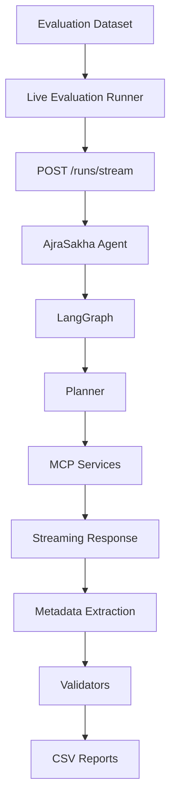
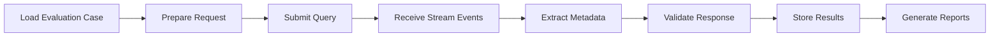
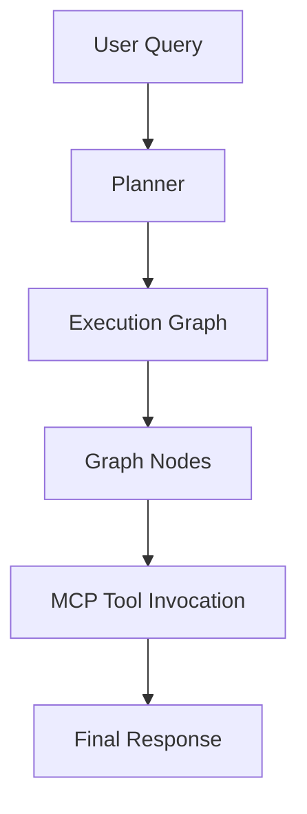
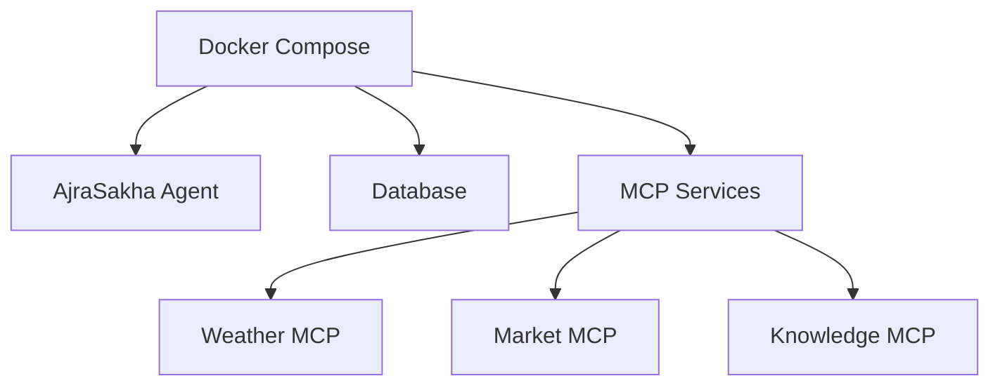

# Live Evaluation Guide

This document provides a detailed overview of the live evaluation workflow implemented for the AjraSakha multilingual evaluation framework.

Unlike mock evaluation, live evaluation executes real multilingual queries against a deployed AjraSakha agent, validating the complete execution pipeline from request submission to response generation.

---

# Overview

The live evaluation framework enables end-to-end validation of AjraSakha by executing multilingual evaluation cases against the deployed AI agent.

Rather than validating only the evaluation logic, live evaluation verifies the behaviour of the complete production pipeline, including:

- Request submission
- LangGraph execution
- Planner decisions
- MCP tool invocation
- Streaming response handling
- Metadata extraction
- Response validation
- Report generation

This execution mode provides greater confidence that multilingual queries behave correctly under real deployment conditions.

---

# Objectives

The live evaluation framework is designed to:

- Execute multilingual evaluation cases against the deployed AjraSakha agent.
- Validate real AI-generated responses.
- Capture execution metadata.
- Verify planner behaviour.
- Record graph execution.
- Validate tool execution.
- Generate detailed execution reports.
- Support regression testing against production deployments.

---

# High-Level Architecture



---

# Live Evaluation Workflow

For every evaluation case, the framework follows the same execution sequence.



Each evaluation case is processed independently, allowing failures to be isolated without interrupting the remaining evaluation run.

---

# Request Submission

Live evaluation communicates with the deployed AjraSakha agent using the streaming execution endpoint.

```
POST /runs/stream
```

Each request contains:

- Evaluation query
- Language information
- Execution configuration
- Session metadata

The streaming endpoint enables the framework to observe execution as it progresses instead of waiting for a single final response.

---

# Streaming Response Processing

Unlike standard request-response APIs, the streaming endpoint emits multiple execution events.

The evaluation framework processes these events in sequence to capture execution metadata before the final response is received.

Typical streaming events include:

- Graph execution
- Planner updates
- Tool execution
- Intermediate events
- Final AI response

Processing streamed events enables richer evaluation than validating only the generated response.

---

# Metadata Extraction

During execution, the framework extracts metadata useful for debugging and evaluation.

Captured metadata includes:

- Execution status
- Planner information
- Executed graph nodes
- Tool invocations
- Final response
- Error information (when available)

This metadata is later included in generated evaluation reports.

# Planner Execution

AjraSakha uses a planning-based execution model to determine how a user query should be processed.

Rather than invoking tools directly, the planner analyzes the incoming query and constructs an execution strategy based on the user's intent.

During live evaluation, the framework captures planner metadata whenever available. Recording planner decisions provides additional visibility into the internal reasoning process and helps identify discrepancies between the intended execution path and the actual execution.

The captured planner information can be used to:

- Verify that an execution plan was successfully generated.
- Compare planner behavior across multilingual queries.
- Investigate incorrect tool selection.
- Debug unexpected execution paths.

---

# LangGraph Execution

After the planner generates an execution strategy, the request is processed through the AjraSakha LangGraph workflow.

The evaluation framework validates this execution path by monitoring the streamed events returned by the live agent.

A simplified execution flow is illustrated below.



Recording graph execution allows developers to understand how a response was produced instead of validating only the final output.

---

# Tool Invocation

Many agricultural queries require external information retrieval.

Depending on the user query, AjraSakha may invoke one or more MCP services before generating a response.

Examples include:

- Weather information
- Agricultural market prices
- Government schemes
- Knowledge retrieval
- Soil recommendations

The evaluation framework records the tools executed during each evaluation case whenever this information is available in the streamed execution events.

Capturing tool execution enables:

- Verification of expected tool usage.
- Detection of unnecessary tool invocations.
- Identification of missing tool calls.
- Analysis of multilingual routing behaviour.

---

# Response Validation

Once the final response has been received, the evaluation framework performs a series of validation checks.

Typical validation includes:

- Successful execution
- Presence of a generated response
- Language consistency
- Expected execution metadata
- Tool execution metadata
- Planner metadata
- Graph execution metadata

These validation steps produce a structured evaluation record for every execution.

---

# Report Generation

After all evaluation cases have completed, the collected execution data is aggregated into structured reports.

Two categories of reports are produced.

## Detailed Evaluation Report

This report contains execution-level information for every evaluation case, including:

- Evaluation identifier
- Input query
- Language
- Execution status
- Generated response
- Validation results
- Captured metadata

This report is primarily intended for debugging and detailed analysis.

---

## Language Quality Matrix

The Language Quality Matrix provides an aggregated view of multilingual performance.

It enables developers to compare behaviour across languages and identify areas requiring further improvement.

Typical analyses include:

- Performance by language
- Performance by evaluation domain
- Response consistency
- Validation pass rates

---

# Docker Deployment

Live evaluation assumes that the required AjraSakha services are available within the configured deployment environment.

A typical deployment includes:



Containerization provides a reproducible execution environment while simplifying dependency management across development and testing environments.

---

# Configurable LLM Providers

The evaluation framework is independent of a specific language model provider.

Model selection is controlled through configuration, allowing the same evaluation pipeline to be executed using different supported providers without modifying evaluation logic.

This design provides several advantages:

- Simplified experimentation
- Environment-specific configuration
- Easier migration between providers
- Improved maintainability

---

# Error Handling

The live evaluation framework is designed to continue processing evaluation cases even when individual executions fail.

Common execution failures include:

- Network interruptions
- Tool execution failures
- External API errors
- LLM provider errors
- Timeout conditions

Whenever possible, execution metadata and error information are recorded in the evaluation report to simplify debugging.

---

# Current Limitations

Live evaluation depends on external services that are outside the control of the evaluation framework.

During large evaluation runs, language model providers may enforce request quotas or rate limits.

When these limits are exceeded, evaluation cases may fail even though the framework itself is functioning correctly.

Typical examples include provider responses such as:

```
429 RESOURCE_EXHAUSTED
```

These failures originate from the external provider and should not be interpreted as framework failures.

---

# Troubleshooting

## No streamed events received

Verify that:

- the AjraSakha server is running,
- the streaming endpoint is reachable,
- Docker services are active,
- network connectivity is available.

---

## Missing execution metadata

If planner information, graph nodes, or tool metadata are not available:

- verify that the deployed agent exposes the required streaming events,
- ensure metadata extraction is enabled,
- inspect the raw streamed response for missing event payloads.

---

## LLM provider failures

Confirm that:

- the configured API credentials are valid,
- provider quotas have not been exhausted,
- the selected provider is reachable.

---

## MCP communication failures

Check that:

- all MCP services are running,
- Docker networking is configured correctly,
- service endpoints are accessible.

---

# Future Enhancements

Potential improvements to the live evaluation framework include:

- Parallel execution of evaluation cases
- Automatic retry mechanisms
- Additional execution metadata capture
- Performance benchmarking
- Historical report comparison
- Dashboard-based visualization
- CI/CD integration
- Expanded multilingual datasets

---

# Summary

The live evaluation framework extends the multilingual evaluation pipeline beyond offline validation by executing real multilingual queries against the deployed AjraSakha agent.

By combining streamed execution monitoring, metadata extraction, automated validation, and structured reporting, the framework provides comprehensive visibility into both the generated responses and the internal execution behaviour of the production system.