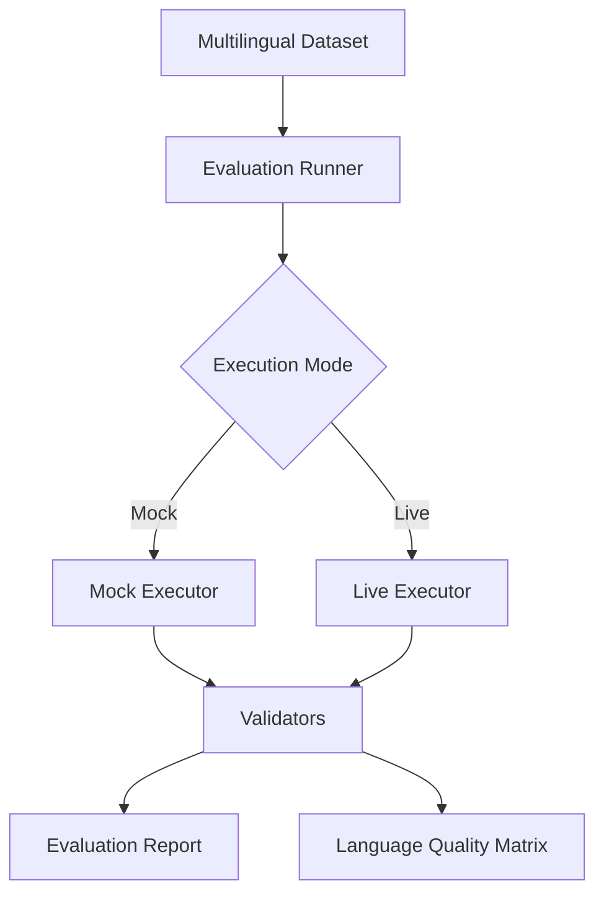
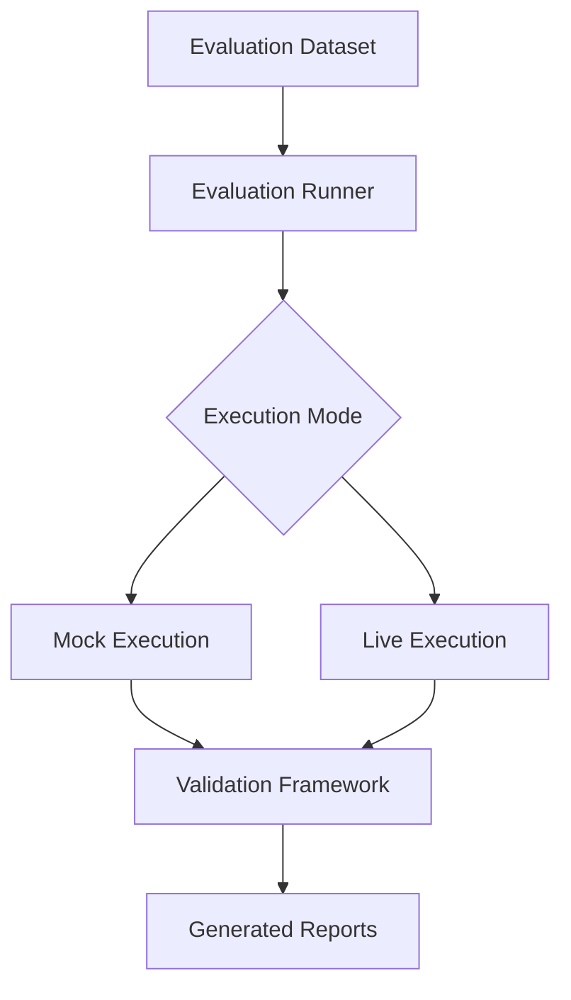
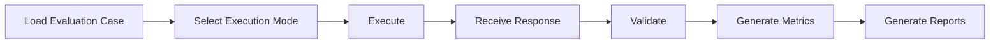
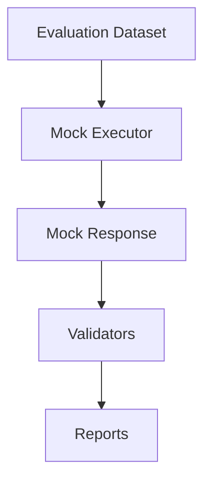
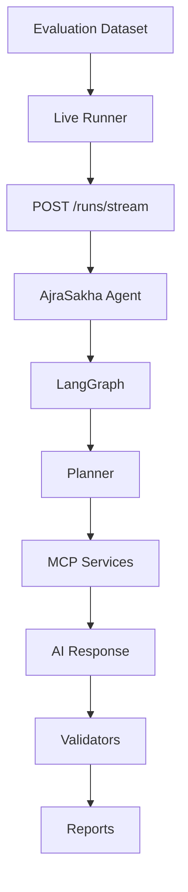
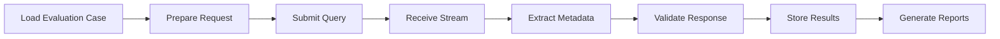
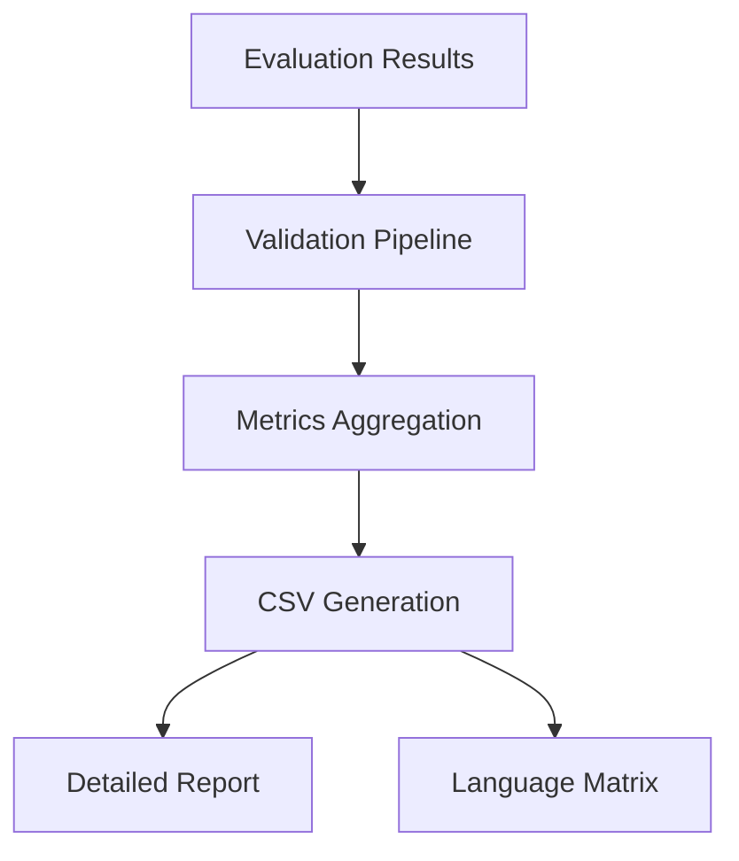
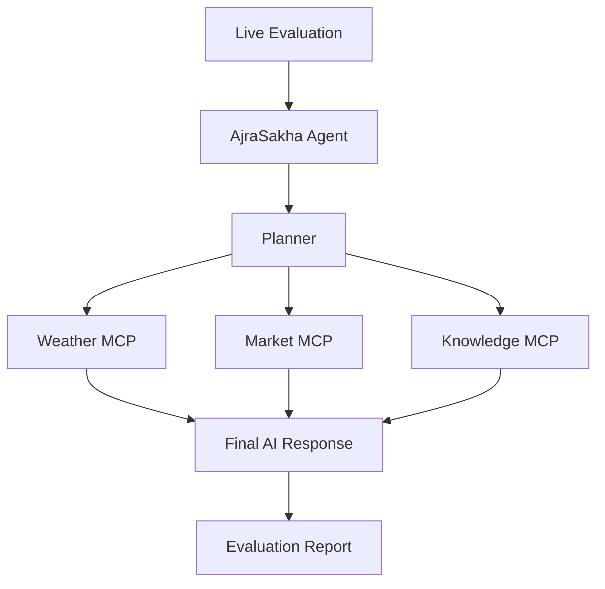

# AjraSakha Multilingual Evaluation Framework

A comprehensive evaluation framework for validating AjraSakha's multilingual agricultural assistant across multiple Indian languages using both mock and live execution modes.

---

## Overview

AjraSakha is an AI-powered agricultural assistant designed to support farmers across India's linguistic diversity. To ensure consistent response quality regardless of the language used, this evaluation framework provides a structured approach for validating multilingual responses, tool execution, and overall system behavior.

The framework supports two execution modes:

- **Mock Evaluation** – Validates the evaluation pipeline using predefined responses, enabling rapid testing without requiring a running AI agent.
- **Live Evaluation** – Executes evaluation cases against the deployed AjraSakha agent, validating complete end-to-end behavior including LangGraph execution, planner decisions, MCP tool invocation, and response generation.

Together, these execution modes enable both framework validation during development and production-level testing against the live system.

---

# Problem Statement

AjraSakha currently supports multiple Indic languages. Farmers interacting with the system should receive responses of consistent quality irrespective of the language used for their queries.

To evaluate this capability, the framework must verify that multilingual queries produce responses that are:

- Factually correct
- Delivered in the same language as the user's query
- Free from unintended language switching
- Able to retrieve the correct agricultural knowledge
- Consistent across supported languages
- Suitable for comparative quality analysis

The framework also provides automated reporting to identify language-specific performance degradation and support future model improvements.

---

# Objectives

The evaluation framework is designed to:

- Validate multilingual agricultural queries across multiple supported languages.
- Execute identical evaluation scenarios using both mock and live execution modes.
- Verify language consistency throughout generated responses.
- Validate retrieval accuracy for agricultural knowledge.
- Measure execution quality across multiple agricultural domains.
- Generate structured evaluation reports for further analysis.
- Enable regression testing for future model updates.
- Provide a scalable foundation for expanding multilingual evaluation coverage.

---

# Features

## Multilingual Evaluation

- Structured multilingual evaluation dataset.
- Support for six languages:
  - English
  - Hindi
  - Tamil
  - Telugu
  - Kannada
  - Punjabi
- Evaluation across multiple agricultural domains.
- Language consistency validation.
- Automated report generation.
- Language Quality Matrix generation.

---

## Dual Execution Modes

### Mock Evaluation

Designed for rapid framework validation without requiring a deployed AjraSakha instance.

Capabilities include:

- Validator testing
- Dataset verification
- Report generation
- Regression testing
- Offline development

---

### Live Evaluation

Runs evaluation cases against the deployed AjraSakha agent.

Capabilities include:

- End-to-end system validation
- Streaming response processing
- LangGraph execution verification
- Planner validation
- MCP tool execution validation
- Live response evaluation
- Production readiness testing

---

## Automated Validation

The framework automatically validates:

- Response correctness
- Response language
- Tool execution
- Planner execution
- Graph execution
- Language consistency
- Domain-specific behavior
- Evaluation metrics

---

# Evaluation Dataset

The framework currently contains **65 multilingual evaluation scenarios** spanning multiple agricultural and control domains. These scenarios are translated into six supported languages to validate multilingual behavior across equivalent user intents. :contentReference[oaicite:0]{index=0}

The dataset includes scenarios covering:

| Domain | Purpose |
|----------|----------|
| Weather | Current weather and forecasts |
| Market | Mandi price retrieval |
| Soil | Soil analysis and fertilizer recommendations |
| Government Schemes | Subsidy and scheme information |
| GDB | Agricultural knowledge retrieval |
| Greetings | Basic conversational behaviour |
| Control Queries | Non-agricultural and multi-tool validation |

This structure ensures that identical agricultural intents can be evaluated consistently across multiple languages.

---

# High-Level Architecture



The evaluation pipeline is designed to keep validation logic independent of the execution source. Whether responses originate from mock execution or the live AjraSakha agent, they pass through the same validation pipeline, ensuring consistent evaluation criteria across both execution modes.

---

# Key Capabilities

✔ Multilingual evaluation

✔ Mock execution

✔ Live execution

✔ Streaming response support

✔ Automated validation

✔ Language Quality Matrix generation

✔ CSV report generation

✔ Configurable LLM providers

✔ Docker-based execution support

✔ Extensible evaluation architecture

# System Architecture

The multilingual evaluation framework is designed around a modular architecture that separates **evaluation execution**, **validation**, and **report generation**. This separation allows the same validation logic to be reused across different execution modes while simplifying future extensions.

The framework consists of four primary layers:

1. Evaluation Dataset
2. Execution Engine
3. Validation Pipeline
4. Report Generation

Each layer has a well-defined responsibility and can evolve independently without impacting the rest of the framework.

---

# Architecture Overview



---

# Framework Components

## 1. Evaluation Dataset

The evaluation dataset forms the foundation of the framework.

It contains multilingual agricultural queries covering multiple real-world farming scenarios. Every evaluation case represents a specific agricultural intent that can be executed through both mock and live evaluation modes.

The dataset includes:

- Weather queries
- Market price queries
- Soil recommendation queries
- Government scheme queries
- Agricultural knowledge (GDB) queries
- Greeting and conversational queries
- Multi-tool execution scenarios
- Control scenarios

Each scenario is translated into all supported languages while preserving the original intent, allowing equivalent behavior to be evaluated across languages.

---

## 2. Evaluation Runner

The Evaluation Runner acts as the orchestration layer of the framework.

Its responsibilities include:

- Loading evaluation cases
- Selecting the execution mode
- Executing each evaluation scenario
- Collecting execution metadata
- Passing responses to validators
- Aggregating evaluation metrics
- Triggering report generation

The runner itself is independent of the execution source, making it straightforward to extend the framework with additional execution modes in the future.

---

## 3. Execution Layer

The execution layer provides two interchangeable execution modes.

### Mock Execution

Mock execution is designed for rapid framework development and validation.

Instead of communicating with a running AI system, predefined responses are generated to verify that:

- validators behave correctly,
- reports are generated successfully,
- dataset integrity is maintained, and
- evaluation logic functions as expected.

Because no external services are required, mock evaluation provides a fast and deterministic testing workflow.

---

### Live Execution

Live execution evaluates the deployed AjraSakha agent using real user queries.

Each evaluation case is submitted to the agent through the streaming execution endpoint.

Unlike mock execution, live evaluation validates the complete production pipeline, including:

- request processing,
- planner execution,
- graph execution,
- tool invocation,
- response generation, and
- returned metadata.

This execution mode measures the actual behavior experienced by end users.

---

# Live Execution Architecture

```mermaid
flowchart TD
    A[Evaluation Case]
    B[run_live_case()]
    C["POST /runs/stream"]
    D[AjraSakha Agent]
    E[LangGraph]
    F[Planner]

    G[Weather MCP]
    H[Market MCP]
    I[Knowledge MCP]

    J[AI Response]
    K[Validators]
    L[CSV Reports]

    A --> B
    B --> C
    C --> D
    D --> E
    E --> F

    F --> G
    F --> H
    F --> I

    G --> J
    H --> J
    I --> J

    J --> K
    K --> L
```

---

# Execution Workflow

Each evaluation follows the same high-level workflow regardless of execution mode.



Using a shared workflow ensures that evaluation metrics remain comparable across both execution modes.

---

# Validation Framework

Once a response has been produced, it passes through a series of independent validators.

Each validator focuses on a specific aspect of response quality.

The validation pipeline includes:

## Technical Validation

Verifies that:

- execution completed successfully,
- responses were received,
- expected metadata is present,
- execution errors are captured.

---

## Language Validation

Confirms that:

- the response language matches the query language,
- there is no unintended language switching,
- multilingual consistency is preserved.

---

## Tool Validation

Checks whether:

- the correct tools were executed,
- expected tools were skipped when appropriate,
- tool execution information was captured successfully.

---

## Graph Validation

Verifies that live evaluation successfully traversed the intended execution graph.

This includes validating:

- graph execution,
- planner execution,
- execution nodes,
- execution metadata.

---

## Domain Validation

Ensures that the generated response corresponds to the expected agricultural domain, enabling domain-wise quality analysis across multilingual evaluation cases.

---

# Design Principles

The framework was designed around several guiding principles:

- **Modularity** – Execution, validation, and reporting are independent components.
- **Extensibility** – New validators, datasets, and execution modes can be introduced with minimal changes.
- **Reusability** – Both execution modes share the same validation and reporting pipeline.
- **Scalability** – The framework supports expanding datasets, languages, and evaluation domains.
- **Maintainability** – Clear separation of responsibilities simplifies future development and debugging.

These principles ensure that the framework can continue evolving alongside AjraSakha without requiring significant architectural changes.

# Repository Structure

The evaluation framework is organized into modular components to separate datasets, execution logic, validation, and reporting.

```
evaluation/
│
├── datasets/                  # Multilingual evaluation datasets
├── validators/                # Validation modules
├── reports/                   # Generated evaluation reports
├── run.py                     # Evaluation entry point
├── README.md                  # Documentation
├── LIVE_EVALUATION.md         # Live evaluation internals
└── ARCHITECTURE.md            # System architecture
```

This structure keeps the framework modular and makes it easier to extend individual components independently.

---

# Getting Started

## Prerequisites

Before running the evaluation framework, ensure that the following dependencies are available.

### Software Requirements

- Python 3.10+
- Git
- Docker
- Docker Compose

---

### Python Dependencies

Install the required Python packages.

```bash
pip install -r requirements.txt
```

---

### Clone Repository

```bash
git clone <repository-url>

cd ai/ajrasakha/evaluation
```

---

# Configuration

The framework supports multiple execution modes and configurable LLM providers.

Configuration is managed through environment variables.

Example:

```bash
ASSISTANT_ID=ajrasakha_agent

LLM_PROVIDER=<provider>

OPENAI_API_KEY=...

GOOGLE_API_KEY=...
```

Depending on the configured provider, the framework automatically initializes the corresponding language model.

---

# Running Mock Evaluation

Mock evaluation validates the evaluation framework without requiring a running AjraSakha instance.

This execution mode is recommended during development when validating:

- datasets,
- validators,
- report generation,
- framework logic.

Run:

```bash
python run.py --mode mock
```

---

## Mock Evaluation Workflow



Since mock execution uses predefined responses, evaluations complete quickly and produce deterministic results.

---

# Running Live Evaluation

Live evaluation executes each evaluation case against the deployed AjraSakha agent.

Before running live evaluation, ensure that:

- Docker services are running.
- MCP services are available.
- The AjraSakha server is reachable.
- The configured LLM provider has sufficient API quota.

Run:

```bash
python run.py --mode live
```

---

## Live Evaluation Workflow



Unlike mock execution, live evaluation measures the complete production pipeline.

---

# Live Execution Flow

For each evaluation case, the framework performs the following sequence of operations.



This process enables detailed inspection of the internal execution path in addition to evaluating the final response.

---

# Generated Reports

After every evaluation run, the framework automatically generates structured reports.

## Evaluation Report

Contains detailed information for every evaluation case, including:

- evaluation identifier
- query
- language
- execution mode
- execution status
- generated response
- validation results
- execution metadata

---

## Language Quality Matrix

Summarizes multilingual performance across supported languages.

The matrix enables quick identification of:

- language-specific degradation,
- domain-specific weaknesses,
- consistency across languages,
- regression after future model updates.

---

# Report Workflow



The generated reports provide both detailed execution records and high-level multilingual quality metrics.

---

# Supported Evaluation Modes

| Feature | Mock | Live |
|----------|------|------|
| Dataset Validation | ✅ | ✅ |
| Language Validation | ✅ | ✅ |
| Report Generation | ✅ | ✅ |
| Response Validation | ✅ | ✅ |
| LangGraph Validation | ❌ | ✅ |
| Planner Validation | ❌ | ✅ |
| MCP Tool Validation | ❌ | ✅ |
| Streaming Responses | ❌ | ✅ |
| Production Testing | ❌ | ✅ |

This shared interface allows developers to switch between execution modes without changing the evaluation workflow.

---

# Extending the Framework

The framework has been designed to support future expansion.

Typical extension points include:

- adding new languages,
- adding new evaluation scenarios,
- introducing new validators,
- integrating additional LLM providers,
- supporting new MCP services,
- extending report generation.

Because execution, validation, and reporting are decoupled, these enhancements can typically be introduced with minimal changes to existing components.

# Infrastructure Enhancements

Supporting live multilingual evaluation required several infrastructure improvements to enable reliable end-to-end execution against the deployed AjraSakha agent.

## Configurable LLM Providers

The evaluation framework supports configurable LLM providers through environment-based configuration. This enables the same evaluation pipeline to be executed using different language models without modifying the evaluation logic.

Benefits include:

- Simplified provider switching
- Environment-specific configuration
- Improved portability
- Easier experimentation with different models

---

## Dockerized Execution Environment

Live evaluation relies on a containerized deployment to ensure consistent execution across development environments.

The Docker-based setup provides:

- Reproducible execution
- Service isolation
- Simplified dependency management
- Consistent runtime configuration

This environment allows the evaluation framework to communicate with the deployed AjraSakha agent and its supporting services without requiring manual setup.

---

## MCP Service Integration

During live execution, AjraSakha interacts with multiple Model Context Protocol (MCP) services to retrieve domain-specific agricultural information.

The evaluation framework validates responses generated after these tool interactions, allowing complete end-to-end verification of production workflows.



---

## Streaming Response Processing

Unlike mock evaluation, live evaluation processes streamed responses from the AjraSakha agent.

The framework captures execution metadata throughout the streaming lifecycle, including:

- Planner execution
- Graph execution
- Executed nodes
- Tool invocations
- Final response
- Execution status

This metadata provides additional visibility into the internal execution path beyond the generated response.

---

# Validation Results

The framework validates multiple aspects of multilingual system behaviour.

## Response Validation

Verifies that:

- responses are successfully generated,
- execution completes without unexpected failures,
- responses are returned for every evaluation case.

---

## Language Validation

Ensures that:

- responses are generated in the requested language,
- language switching does not occur unexpectedly,
- multilingual consistency is maintained.

---

## Tool Execution Validation

For live execution, the framework validates that:

- tool execution information is captured,
- execution metadata is available,
- planner decisions are recorded.

---

## Execution Metadata Validation

The framework also records execution metadata including:

- executed graph nodes,
- execution plans,
- execution status,
- tool usage.

This information supports debugging and provides greater visibility into the behaviour of the deployed agent.

---

# Generated Outputs

Each evaluation produces structured reports that can be used for further analysis.

Typical outputs include:

```
reports/

├── evaluation_report.csv
├── evaluation_report_live.csv
├── evaluation_language_matrix.csv
└── evaluation_language_matrix_live.csv
```

These reports provide both detailed evaluation results and aggregated multilingual quality metrics.

---

# Current Limitations

The multilingual evaluation framework is fully functional for both mock and live execution. However, live evaluation depends on external AI services whose availability and usage limits are outside the control of the framework.

Large evaluation runs may encounter provider-specific rate limits, resulting in request failures during graph execution.

For example, free-tier Gemini deployments may return:

```
429 RESOURCE_EXHAUSTED
```

when API quotas are exceeded.

These failures originate from the external language model provider rather than the evaluation framework itself.

Mock evaluation is not affected by these limitations.

---

# Troubleshooting

## No response received

Verify that:

- the AjraSakha server is running,
- Docker services are active,
- the configured endpoint is reachable.

---

## MCP tool failures

Ensure that:

- all required MCP services are running,
- Docker networking is configured correctly,
- service endpoints are accessible.

---

## LLM authentication errors

Confirm that:

- API keys are configured correctly,
- the selected provider is supported,
- environment variables are loaded before execution.

---

## Rate limit errors

If provider quotas are exceeded:

- wait for the quota to reset,
- reduce the evaluation batch size,
- switch to an alternative supported LLM provider if available.

---

# Backward Compatibility

The multilingual evaluation framework has been designed to remain compatible with existing evaluation workflows.

Existing mock evaluation functionality continues to operate without modification.

The introduction of live evaluation extends the framework without changing the underlying validation or reporting pipeline, allowing both execution modes to share a common architecture.

This design minimizes maintenance effort while enabling future enhancements.

---

# Future Improvements

The framework has been designed with extensibility in mind.

Potential future enhancements include:

- Support for additional Indic languages
- Expansion of multilingual evaluation scenarios
- Additional domain-specific validators
- Enhanced report visualizations
- Automated regression comparison across evaluation runs
- Performance benchmarking across LLM providers
- Dashboard-based report visualization
- CI/CD integration for automated multilingual regression testing

---

# Conclusion

The AjraSakha Multilingual Evaluation Framework provides a scalable and extensible solution for validating multilingual agricultural AI systems.

By supporting both mock and live execution modes, the framework enables rapid development, comprehensive system validation, and production-level evaluation using a shared validation pipeline.

Its modular architecture, multilingual dataset, configurable execution environment, and automated reporting capabilities establish a strong foundation for continuous quality assurance as AjraSakha evolves to support a wider range of agricultural domains, languages, and deployment environments.

---

# Acknowledgements

This evaluation framework was developed as part of **Project 4 – Cross-lingual and Multilingual Testing Suite**, with the objective of strengthening multilingual quality assurance for AjraSakha and supporting consistent agricultural assistance across India's linguistic diversity.