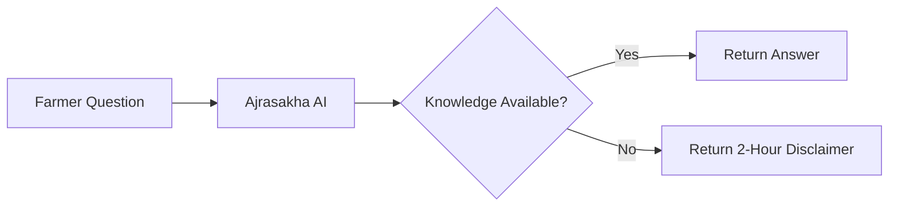
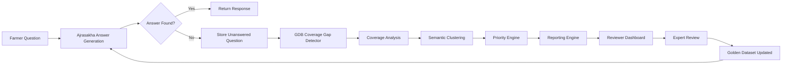
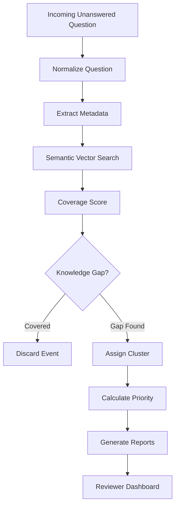
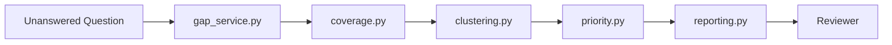
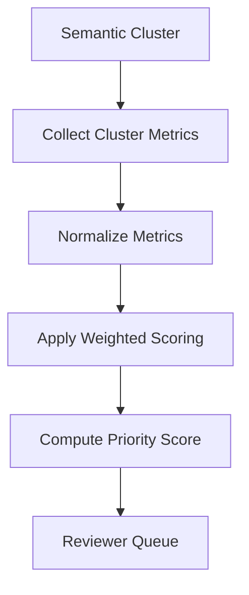
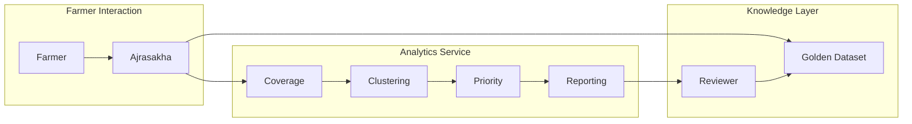

# Architecture and Design Document
## GDB Coverage Gap Detector for Ajrasakha

**Status:** Proposed Feature  
**Project:** Ajrasakha - ANNAM.AI  
**Author:** Open Source Contribution Proposal by Arfa Ahmed Ansari-VINS Intern

---

# 1. Executive Summary

The **GDB Coverage Gap Detector** is a lightweight analytics service designed to continuously monitor unanswered farmer questions and identify knowledge gaps within Ajrasakha's Golden Dataset (GDB).

Rather than modifying the existing answer generation pipeline, this feature operates as an **independent analytical layer** that observes questions which could not be confidently answered and converts them into actionable insights for reviewers.

Instead of presenting reviewers with thousands of isolated unanswered questions, the system automatically groups similar queries, determines whether they represent genuine knowledge gaps, prioritizes them based on multiple factors, and produces structured reports that assist domain experts in expanding the Golden Dataset efficiently.

The proposed architecture follows a modular microservice design that emphasizes extensibility, maintainability, and seamless integration with the existing Ajrasakha ecosystem.

---

# 2. Background

Ajrasakha provides AI-assisted agricultural guidance by retrieving information from a curated **Golden Dataset (GDB)**.

The current workflow follows this sequence:



When the AI cannot confidently answer a farmer's query, the question is stored for later review and the farmer receives a disclaimer indicating that an expert response will be provided within two hours.

Although this prevents misinformation from being delivered, the unanswered questions accumulate over time with very little automated analysis.

Current limitations include:

- No mechanism to determine whether the same unanswered question has already been asked.
- No prioritization of reviewer effort.
- No semantic grouping of related questions.
- No quantitative measurement of GDB coverage.
- No analytical reports identifying weak areas within the knowledge base.

As the platform grows, manual analysis becomes increasingly difficult and reviewer effort becomes fragmented.

---

# 3. Problem Statement

The absence of an automated gap detection mechanism introduces several operational challenges.

## Knowledge Expansion is Reactive

Reviewers discover missing information only after manually inspecting unanswered questions.

This causes valuable agricultural knowledge to be added much later than necessary.

---

## Duplicate Reviewer Effort

Consider the following farmer questions:

- How can I prevent leaf curl in chilli?
- My chilli leaves are curling. What should I spray?
- Chilli plants have curled leaves after rain.

Although phrased differently, all three questions describe the same underlying issue.

Without semantic grouping, reviewers process each independently.

---

## Lack of Coverage Metrics

There is currently no objective measurement answering questions such as:

- Which crops have poor GDB coverage?
- Which states require additional knowledge?
- Which agricultural domains receive the largest number of unanswered questions?
- Which gaps affect the highest number of farmers?

Without these metrics, future GDB expansion becomes largely intuition-driven rather than evidence-driven.

---

# 4. Proposed Solution

The proposed solution introduces an independent service named **GDB Coverage Gap Detector**.

Instead of generating answers, the service analyzes every unanswered query and transforms it into structured analytical information.

The detector performs five primary responsibilities:

1. Measure existing GDB coverage.
2. Detect genuine knowledge gaps.
3. Group semantically similar unanswered questions.
4. Rank clusters according to reviewer importance.
5. Generate actionable reports.

The service remains completely independent from the answer generation pipeline and therefore can be integrated without modifying existing production components.

---

# 5. Design Objectives

The architecture has been designed around the following objectives.

| Objective | Description |
|-----------|-------------|
| Modularity | Independent analytical components with minimal coupling |
| Scalability | Efficient processing of growing numbers of unanswered queries |
| Extensibility | New scoring algorithms or clustering strategies can be added without affecting other modules |
| Explainability | Every priority score and recommendation can be traced back to measurable signals |
| Low Integration Cost | Existing GDB answering pipeline remains unchanged |
| Maintainability | Clear separation of responsibilities across modules |

---

# 6. High-Level System Architecture



This architecture creates a continuous feedback loop in which unanswered questions directly contribute to improving the Golden Dataset.

---

# 7. System Workflow

The complete processing pipeline consists of several independent stages.



Each stage performs one well-defined responsibility.

This minimizes coupling while allowing future improvements to individual stages without affecting the remainder of the pipeline.

---

# 8. Design Philosophy

The system follows four primary architectural principles.

## Separation of Concerns

Each module performs exactly one responsibility.

For example:

- Coverage analysis never calculates priority.
- Clustering never generates reports.
- Reporting never performs semantic search.

This significantly reduces complexity while making individual components easier to test and maintain.

---

## Loose Coupling

Communication between modules occurs only through well-defined interfaces and shared data models.

For example:

```
Coverage Analysis
        │
        ▼
Gap Result

        │
        ▼
Clustering Engine

        │
        ▼
Priority Engine
```

No module directly depends on another module's internal implementation.

---

## Extensibility

Future improvements such as:

- alternative similarity algorithms,
- additional reviewer metrics,
- adaptive clustering,
- dashboard integration,

can be implemented by extending individual modules rather than rewriting the complete pipeline.

---

## Data-Driven Knowledge Expansion

Instead of expanding the Golden Dataset based solely on expert intuition, reviewer effort is guided by measurable evidence obtained directly from farmer interactions.

This transforms GDB maintenance from a reactive process into a continuously improving feedback loop.

---

# 9. Functional Requirements

The proposed service shall:

- Accept unanswered farmer questions.
- Retrieve semantically similar GDB entries.
- Compute a quantitative coverage score.
- Classify different categories of knowledge gaps.
- Assign semantic clusters.
- Calculate reviewer priority.
- Produce structured statistics.
- Generate weekly reports.
- Recommend reviewer actions.
- Support future dashboard integration.

---

# 10. Non-Functional Requirements

| Requirement | Design Goal |
|-------------|-------------|
| Scalability | Process thousands of unanswered questions efficiently |
| Reliability | Continue operating independently from answer generation |
| Performance | Minimize latency during semantic search |
| Maintainability | Modular architecture with isolated responsibilities |
| Testability | Independent modules with clear interfaces |
| Availability | Stateless API suitable for containerized deployment |
| Portability | Compatible with existing Ajrasakha infrastructure |

---

# 11. Why an Independent Microservice?

Instead of embedding gap detection directly inside the answer generation service, the proposed implementation introduces an independent analytical microservice.

This decision provides several architectural advantages.

- No changes are required to the production answer generation pipeline.
- The analytics engine can evolve independently.
- Additional reports can be generated without affecting farmer-facing latency.
- The service can be scaled independently based on workload.
- Future machine learning models can be incorporated without impacting existing APIs.

By separating analytical processing from answer generation, the architecture preserves the stability of the existing system while enabling continuous knowledge improvement.

---

# 12. Internal Processing Pipeline

The GDB Coverage Gap Detector is designed as a sequential analytical pipeline where each module performs a single responsibility before passing structured information to the next stage.

This layered architecture minimizes coupling, simplifies maintenance, and allows each component to evolve independently.



Each module receives structured input and produces deterministic output, eliminating hidden dependencies and making the system significantly easier to debug.

---

# 13. Module Responsibilities

## main.py

### Responsibility

Acts as the public interface of the microservice.

Responsibilities include:

- Exposing REST APIs
- Input validation
- Exception handling
- Health checks
- Readiness checks
- Request routing

The API layer intentionally contains **no business logic**.

Keeping the controller layer lightweight ensures that future changes to algorithms do not require modifications to the REST interface.

---

## gap_service.py

The service layer orchestrates the complete analytical workflow.

```mermaid
flowchart TD

Request

↓

Normalize

↓

Coverage

↓

Clustering

↓

Priority

↓

Recommendation

↓

Response
```

Rather than implementing any algorithm itself, the service coordinates execution between specialized modules.

This approach follows the **Service Layer Pattern**, reducing inter-module dependencies while improving readability.

---

## coverage.py

The coverage engine determines whether a farmer's question is already represented within the Golden Dataset.

Responsibilities include:

- Question normalization
- Metadata extraction
- Embedding generation
- Semantic retrieval
- Similarity scoring
- Coverage score computation
- Gap classification

The output is a structured object describing the degree of knowledge coverage.

Example:

```text
Coverage Score : 0.91

Gap Type : COVERED
```

or

```text
Coverage Score : 0.18

Gap Type : DOMAIN_GAP
```

---

## clustering.py

The clustering engine groups semantically similar uncovered questions.

Rather than treating every unanswered question independently, clustering identifies common knowledge deficiencies.

For example,

Question A

> Why are my chilli leaves curling?

Question B

> Chilli leaves became curled after rainfall.

Question C

> Leaf curl disease in chilli.

Although phrased differently, all three belong to the same semantic cluster.

This dramatically reduces reviewer workload.

---

## priority.py

The priority engine determines which knowledge gaps should be addressed first.

Instead of chronological ordering, clusters are ranked using measurable signals.

These include:

- cluster size
- geographical spread
- coverage deficiency
- growth rate
- reviewer backlog

This converts thousands of unanswered questions into an ordered review queue.

---

## reporting.py

Transforms raw analytical output into reviewer-friendly summaries.

Generated reports include:

- Weekly summaries
- Coverage statistics
- State-wise distribution
- Crop-wise distribution
- Domain distribution
- Heatmaps
- Reviewer recommendations

The reporting layer intentionally remains independent from analytical computations.

---

## models.py

Provides all shared request and response models.

Benefits include:

- centralized validation
- API consistency
- simplified serialization
- improved maintainability

Because every module communicates through common models, future schema changes require minimal code modifications.

---

# 14. Coverage Analysis Engine

Coverage analysis is the first analytical stage.

Its objective is to determine whether an unanswered farmer query actually represents missing knowledge.

The workflow is illustrated below.

```mermaid
flowchart TD

Question

↓

Normalize

↓

Extract Metadata

↓

Generate Embedding

↓

Vector Search

↓

Similarity Score

↓

Coverage Score

↓

Gap Classification
```

---

## Question Normalization

Farmer questions frequently contain:

- inconsistent capitalization
- spelling variations
- unnecessary whitespace
- punctuation differences

Normalization converts these variations into a standardized representation before semantic processing.

Benefits include:

- improved retrieval consistency
- reduced duplicate clusters
- better similarity calculations

---

## Metadata Extraction

Metadata significantly improves retrieval quality.

Extracted fields include:

| Metadata | Purpose |
|------------|-----------------------------|
| State | Geographic filtering |
| Crop | Crop-specific matching |
| Season | Seasonal recommendations |
| Domain | Agricultural categorization |
| Language | Multilingual compatibility |

Rather than searching the entire GDB, metadata narrows the search space before semantic similarity is evaluated.

---

## Semantic Vector Search

Traditional keyword matching struggles with agricultural language.

For example,

Question 1

> Leaf curl in chilli

Question 2

> My chilli leaves are curling.

Keyword overlap is minimal.

Semantic meaning is identical.

Embedding-based retrieval converts each question into a high-dimensional vector.

Similarity is then measured using vector distance rather than exact wording.

This approach is considerably more robust against:

- regional terminology
- paraphrasing
- incomplete sentences
- multilingual wording

---

## Coverage Score

The detector assigns every question a quantitative coverage score.

Example scale:

| Score | Interpretation |
|---------|----------------|
| 0.90–1.00 | Excellent coverage |
| 0.75–0.89 | Minor variation |
| 0.50–0.74 | Partial coverage |
| 0.25–0.49 | Weak coverage |
| 0.00–0.24 | Missing knowledge |

Rather than using binary decisions, continuous scoring allows reviewers to distinguish between partial and complete knowledge gaps.

---

## Gap Classification

After similarity analysis, the detector classifies the gap.

Possible categories include:

- COVERED
- LOCATION_GAP
- DOMAIN_GAP
- CROP_GAP
- COMPLETE_KNOWLEDGE_GAP

Each category produces different reviewer recommendations.

For example,

A LOCATION_GAP may only require adding state-specific practices.

A COMPLETE_KNOWLEDGE_GAP requires entirely new expert knowledge.

This distinction improves reviewer efficiency.

---

# 15. Semantic Clustering Engine

Coverage analysis identifies individual gaps.

The clustering engine identifies relationships between those gaps.

Without clustering:

```
1200 unanswered questions

↓

1200 reviewer tasks
```

With clustering:

```
1200 unanswered questions

↓

74 semantic clusters

↓

74 reviewer tasks
```

The reduction in manual effort is substantial.

---

## Clustering Workflow

```mermaid
flowchart TD

Gap Question

↓

Embedding

↓

Similarity Comparison

↓

Existing Cluster?

Yes --> Update Cluster

No --> Create Cluster

↓

Recalculate Statistics
```

---

## Cluster Registry

Every semantic cluster maintains aggregated information.

Example:

```text
Cluster

ID

Representative Question

Number of Questions

States

Domains

Average Coverage

Priority

Growth Rate
```

This enables reporting and prioritization without repeatedly analyzing individual questions.

---

## Incremental Updates

Rather than rebuilding all clusters after every question, the detector performs incremental updates.

Benefits include:

- lower computational cost
- reduced latency
- improved scalability
- better responsiveness

Only affected clusters are recalculated.

---

## Why Semantic Clustering?

Keyword clustering often separates identical concepts because wording differs.

Semantic clustering groups questions according to meaning rather than vocabulary.

Advantages include:

- fewer duplicate reviews
- improved knowledge discovery
- language independence
- better scalability

As the Golden Dataset grows, semantic grouping becomes increasingly valuable for maintaining reviewer productivity.

---

# 16. Design Decisions

Several architectural decisions were made intentionally to maximize long-term maintainability.

| Decision | Rationale |
|-----------|-----------|
| Independent microservice | Avoids modifications to production answer generation |
| FastAPI | Lightweight, asynchronous, easy integration |
| Modular architecture | Independent evolution of analytical components |
| Vector search | Better semantic retrieval than keyword matching |
| Service layer | Central orchestration without business logic duplication |
| Shared models | Consistent communication across modules |
| Reporting isolation | Future dashboards require no algorithm changes |

These decisions collectively produce an architecture that is extensible, testable, and easy to integrate into the existing Ajrasakha ecosystem.

---

# 17. Priority Engine

Once unanswered questions have been grouped into semantic clusters, the next challenge is determining **which knowledge gaps should be addressed first**.

A chronological review strategy does not necessarily maximize impact. For example, a question submitted today by hundreds of farmers across multiple districts may be significantly more important than an isolated question submitted several days earlier.

The Priority Engine transforms raw clusters into a ranked review queue.

Its objective is to ensure that reviewer effort is allocated where it produces the greatest improvement in Golden Dataset coverage.

---

## Priority Workflow



---

## Priority Signals

The overall priority score is computed from several measurable characteristics of a cluster.

| Signal | Purpose |
|----------|---------|
| Cluster Size | Indicates farmer demand |
| Growth Rate | Measures how quickly the cluster is expanding |
| Geographic Spread | Determines impact across regions |
| Coverage Score | Lower coverage implies higher priority |
| Pending Reviews | Prevents reviewer overload |
| Recent Activity | Prioritizes emerging agricultural issues |

Rather than relying on a single metric, the weighted approach balances multiple indicators to produce a more representative ranking.

---

## Why Weighted Prioritization?

Alternative approaches such as FIFO (First In, First Out) or simple frequency counting fail to capture the broader context of unanswered questions.

Weighted scoring provides several advantages:

- Prioritizes widespread issues over isolated incidents.
- Prevents reviewer effort from being dominated by duplicate questions.
- Adapts naturally as new questions are received.
- Allows scoring strategies to evolve without modifying other modules.

The weighting configuration is intentionally separated from the scoring logic, enabling future tuning based on reviewer feedback or production analytics.

---

# 18. Reporting Engine

The Reporting Engine converts processed analytical data into actionable information for reviewers and project maintainers.

Unlike the previous stages, which focus on computation, this component focuses on **communication and decision support**.

---

## Reporting Workflow

```mermaid
flowchart TD

Clusters

↓

Aggregate Statistics

↓

Generate Summaries

↓

Produce Heatmaps

↓

Generate Weekly Report

↓

Reviewer Dashboard
```

---

## Generated Reports

The engine currently supports:

- Overall gap statistics
- Weekly coverage reports
- Top priority clusters
- State-wise summaries
- Crop-wise summaries
- Domain-wise summaries
- Coverage heatmaps
- Reviewer recommendations

These reports provide visibility into areas where the Golden Dataset requires expansion.

---

## Benefits to Reviewers

Without reporting:

- Reviewers inspect individual unanswered questions manually.
- Duplicate effort is common.
- Trends are difficult to identify.

With reporting:

- Reviewers work on prioritized knowledge clusters.
- Trends become immediately visible.
- Knowledge expansion becomes measurable.
- Review cycles become significantly shorter.

---

# 19. Integration with Ajrasakha

A key design objective was ensuring that the GDB Coverage Gap Detector integrates seamlessly into the existing Ajrasakha architecture.

The detector does **not** replace or modify the answer generation service.

Instead, it operates alongside existing components as an independent analytics service.

```mermaid
flowchart LR

Farmer

↓

Ajrasakha

↓

GDB Search

↓

Disclaimer

↓

Gap Detector

↓

Reports

↓

Reviewer

↓

Golden Dataset

↓

Ajrasakha
```

This design minimizes integration risk while allowing the detector to evolve independently.

---

# 20. Advantages of the Proposed Architecture

The proposed design offers several structural and operational benefits.

### Modular Design

Each module performs a single well-defined responsibility.

This improves readability, testing, and future maintenance.

---

### Independent Evolution

Coverage analysis, clustering, prioritization, and reporting can all evolve independently.

Future improvements to one component do not require changes to the remaining pipeline.

---

### Improved Reviewer Productivity

Semantic clustering converts hundreds of duplicate questions into a manageable number of actionable review tasks.

This significantly reduces manual effort.

---

### Data-Driven Knowledge Expansion

Reviewer decisions are based on measurable evidence rather than intuition.

Knowledge expansion becomes proactive rather than reactive.

---

### Scalability

The architecture supports increasing question volumes without requiring fundamental design changes.

Additional analytical modules can be integrated with minimal impact on the existing system.

---

# 21. Performance Considerations

The service is designed with scalability in mind.

## Computational Efficiency

Semantic search narrows candidate questions before clustering, reducing unnecessary comparisons.

Incremental cluster updates avoid rebuilding the entire clustering structure whenever new questions arrive.

---

## Horizontal Scalability

Since the detector is implemented as an independent FastAPI microservice, multiple instances can be deployed behind a load balancer without affecting the primary answer generation pipeline.

---

## Future Optimizations

Potential improvements include:

- Cached embedding generation
- Background batch processing
- Scheduled cluster rebuilding
- Incremental report generation
- Persistent cluster storage
- Reviewer notification pipelines

These enhancements can be implemented independently without redesigning the overall architecture.

---

# 22. Future Roadmap

The current implementation establishes the analytical foundation for automated GDB improvement.

Future enhancements may include:

- MongoDB persistence for gap events and clusters
- Real-time analytics dashboard
- Automatic reviewer assignment
- Trend forecasting
- Reviewer workload balancing
- Adaptive clustering algorithms
- LLM-assisted reviewer recommendations
- Automatic GDB expansion suggestions
- Continuous monitoring and alerting

The modular architecture was intentionally designed to accommodate these additions with minimal refactoring.

---

# 23. Conclusion

The GDB Coverage Gap Detector introduces a structured, scalable, and maintainable approach to identifying knowledge deficiencies within Ajrasakha's Golden Dataset.

Rather than treating unanswered farmer questions as isolated events, the system transforms them into meaningful analytical insights by combining semantic retrieval, clustering, prioritization, and reporting.

The modular architecture ensures clear separation of responsibilities, promotes maintainability, and allows future enhancements to be implemented incrementally.

Most importantly, the detector integrates with the existing Ajrasakha ecosystem without modifying the core answer generation workflow, making it a low-risk yet high-impact addition to the platform.

By enabling evidence-driven knowledge expansion, the proposed system has the potential to improve reviewer productivity, reduce duplicate effort, and accelerate the continuous growth of the Golden Dataset.

---

# 24. Deployment Overview



---

# 25. Final Architectural Summary

| Aspect | Design Choice |
|---------|---------------|
| Architecture | Independent FastAPI Microservice |
| Pattern | Layered Service Architecture |
| Knowledge Retrieval | Semantic Vector Search |
| Gap Detection | Coverage Score + Classification |
| Grouping | Semantic Clustering |
| Prioritization | Weighted Multi-Factor Scoring |
| Reporting | Aggregated Analytics Engine |
| Integration | Non-invasive Addition to Ajrasakha |
| Extensibility | High |
| Maintainability | High |
| Scalability | Horizontal & Modular |

---

## Final Note

This implementation represents an architectural proposal for introducing automated Golden Dataset coverage analysis into the Ajrasakha ecosystem. By separating analytics from answer generation, the solution enables continuous knowledge improvement while preserving the stability of the existing production workflow. The design emphasizes modularity, explainability, and extensibility, providing a foundation for future enhancements such as persistent storage, intelligent reviewer assistance, and real-time analytical dashboards.