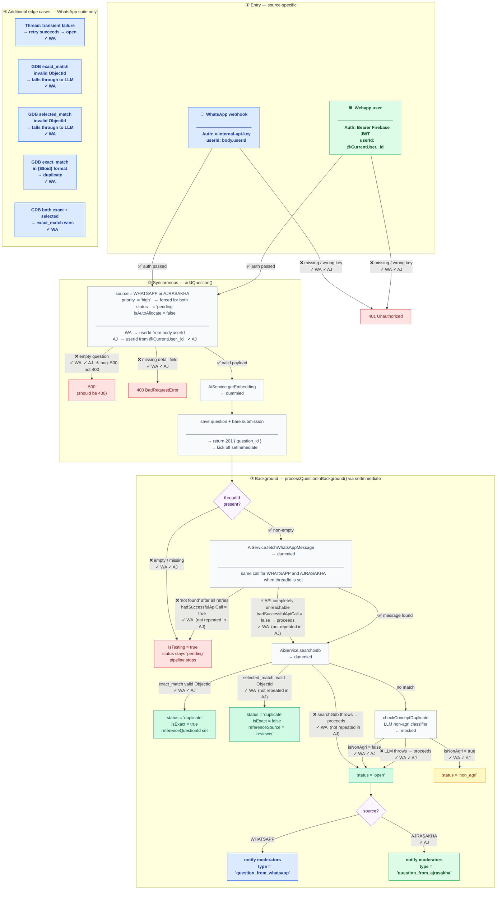

# Question Ingestion — E2E Test Flow

Covers `WhatsAppQuestion.e2e.test.ts` (**WA**, 18 tests) and `AjrasakhaQuestion.e2e.test.ts` (**AJ**, 9 tests).

> **To preview this diagram locally:** install the VS Code extension  
> **"Markdown Preview Mermaid Support"** then press `Ctrl+Shift+V`.  
> It also renders natively on GitHub.

---



---

## Coverage table

| Step | WA | AJ | Note |
|------|:--:|:--:|------|
| Auth: no header / wrong key → 401 | ✓ | ✓ | Different auth mechanism per source |
| Payload: missing detail field → 400 | ✓ | ✓ | |
| Payload: empty question → 500 (bug) | ✓ | ✓ | Should be 400; same root cause |
| userId from `@CurrentUser` (not body) | — | ✓ | AJRASAKHA-specific |
| source / priority / isAutoAllocate values | — | ✓ | AJRASAKHA-specific |
| Thread: empty threadId → isTesting | ✓ | ✓ | |
| Thread: fetchWhatsAppMessage succeeds → pipeline runs | ✓ | ✓ | Confirms shared wiring per source |
| Thread: "not found" after all retries → isTesting | ✓ | — | Retry logic is source-agnostic |
| Thread: API completely unreachable → open | ✓ | — | Source-agnostic |
| Thread: transient failure, retry succeeds → open | ✓ | — | Source-agnostic |
| GDB: exact_match → duplicate, isExact=true | ✓ | ✓ | |
| GDB: selected_match → duplicate, isExact=false | ✓ | — | Source-agnostic |
| GDB: both exact+selected → exact wins | ✓ | — | Source-agnostic |
| GDB: invalid exact_match ObjectId → LLM fallthrough | ✓ | — | Source-agnostic |
| GDB: invalid selected_match ObjectId → LLM fallthrough | ✓ | — | Source-agnostic |
| GDB: exact_match in `{$oid}` format → duplicate | ✓ | — | Source-agnostic |
| GDB: throws → open | ✓ | — | Source-agnostic |
| LLM: non-agri → non_agri | ✓ | ✓ | |
| LLM: agri → open | ✓ | ✓ | |
| LLM: throws → open (degrade) | ✓ | ✓ | |
| Notification: `question_from_whatsapp` | ✓ | — | |
| Notification: `question_from_ajrasakha` | — | ✓ | |

---

## How to run

```bash
# From backend/

# WhatsApp (18 tests, ~59 s — three long retry tests dominate)
pnpm exec vitest run src/e2e/whatsapp/WhatsAppQuestion.e2e.test.ts

# Ajrasakha (9 tests, ~7 s)
pnpm exec vitest run src/e2e/ajrasakha/AjrasakhaQuestion.e2e.test.ts

# Both together
pnpm exec vitest run src/e2e/whatsapp/WhatsAppQuestion.e2e.test.ts src/e2e/ajrasakha/AjrasakhaQuestion.e2e.test.ts
```
