# Feature Name

Ajrasakha (Webapp) Question Ingestion — End-to-End

---

# Module

```text
src/e2e/ajrasakha        (test)
src/modules/question     (system under test)
```

Ajrasakha questions enter through the **shared** question-ingestion endpoint
used by all sources. The `src/modules/whatsapp` module is unrelated (it handles
read-only WhatsApp threads / users / send-message). The `src/e2e/question/`
directory has an older test that hits a live server at `localhost:4000` — this
suite replaces it with an in-process pattern for the AJRASAKHA source.

---

# Purpose

Verify the complete backend journey of a question submitted from the Ajrasakha
web app (`source='AJRASAKHA'`), end-to-end, against the **real Mongo database
in `.env`** (`DB_URL` / `DB_NAME`), with every service outside the backend
replaced by a dummy.

This suite focuses on what is **specific to AJRASAKHA** and not covered by the
WhatsApp suite (`src/e2e/whatsapp/`). The WhatsApp suite already exhaustively
tests all shared pipeline edge cases (GDB/LLM degradation, retry backoff, all
duplicate paths). Only representative pipeline cases are retested here.

## What is DIFFERENT from WhatsApp

| Aspect | WhatsApp | Ajrasakha (webapp) |
|--------|----------|-------------------|
| Auth | `x-internal-api-key` (FlexibleAuth) | Firebase JWT Bearer token (FlexibleAuth) |
| `userId` origin | `body.userId` (service resolves from body) | `@CurrentUser()._id` (authenticated user) |
| `source` | `'WHATSAPP'` | `'AJRASAKHA'` |
| Notification type | `'question_from_whatsapp'` | `'question_from_ajrasakha'` |
| Thread validation | `fetchWhatsAppMessage` (required threadId) | Same call when threadId set; empty threadId → isTesting |

## SCOPE — what is intentionally NOT covered here

**All shared GDB/LLM/thread-retry edge cases** are covered in
`src/e2e/whatsapp/WhatsAppQuestion.e2e.test.ts` and are not repeated:

- GDB invalid ObjectId (exact_match / selected_match)
- GDB `$oid` format
- GDB both exact + selected → exact wins
- Thread API "not found" after all retries → isTesting
- Thread API completely unreachable → open
- Transient thread failure then retry succeeds

**Expert allocation** (reallocateTimeBoundQuestions, cron-driven) is
intentionally out of scope — it is the common path shared by WHATSAPP and
AJRASAKHA and belongs in a dedicated common-path test.

---

# Flow Diagram

> **To preview this diagram locally:** install the VS Code extension
> **"Markdown Preview Mermaid Support"** then press `Ctrl+Shift+V`.
> It also renders natively on GitHub.

This suite only re-tests representative pipeline cases (the shared GDB/LLM/thread
logic is exhaustively covered by `WhatsAppQuestion.e2e.md` instead) — this diagram
highlights what is AJRASAKHA-specific and grays out the parts already proven
by the WhatsApp suite.

```mermaid
%%{init: {'flowchart': {'nodeSpacing': 50, 'rankSpacing': 60}}}%%
flowchart TD
  classDef entry  fill:#ede9fe,stroke:#7c3aed,color:#3b0764,font-weight:bold
  classDef bg     fill:#dbeafe,stroke:#2563eb,color:#1e3a8a
  classDef ok     fill:#d1fae5,stroke:#059669,color:#064e3b
  classDef warn   fill:#fef9c3,stroke:#d97706,color:#78350f
  classDef err    fill:#fee2e2,stroke:#dc2626,color:#7f1d1d
  classDef decide fill:#faf5ff,stroke:#7c3aed,color:#3b0764
  classDef shared fill:#f1f5f9,stroke:#94a3b8,color:#334155
  classDef fail   fill:#fdba74,stroke:#ea580c,color:#7c2d12,font-weight:bold

  ROOT["POST /api/questions
  source = 'AJRASAKHA'
  auth: Firebase JWT Bearer token (FlexibleAuth)"]:::entry

  AUTH{"auth header
  present and valid?"}:::decide
  A401["401 Unauthorized
  (no header, or wrong internal API key
  when a test simulates a bad token)"]:::err

  CURUSER["@CurrentUser()
  resolved from verified Firebase user
  -> userId comes from THIS, not body.userId"]:::entry

  PAYLOAD{"payload valid?"}:::decide
  P400["400 - missing district field
  (class-validator on QuestionDetailsDto)"]:::err
  P500["empty question text
  KNOWN BUG - returns 500 instead of 400
  (same root cause as WhatsApp BUG-001)"]:::fail

  SAVE["addQuestion()
  status='pending', priority='high' (forced)
  isAutoAllocate=false, userId=@CurrentUser()._id
  question + bare submission inserted"]:::ok

  ASYNC["setImmediate to
  processQuestionInBackground()"]:::bg

  ROOT --> AUTH
  AUTH -- no --> A401
  AUTH -- yes --> CURUSER --> PAYLOAD
  PAYLOAD -- "missing district" --> P400
  PAYLOAD -- "empty question" --> P500
  PAYLOAD -- ok --> SAVE --> ASYNC

  subgraph THREAD["Thread validation - same code as WhatsApp"]
    T1{"threadId
    empty?"}:::decide
    T2["isTesting = true
    status stays 'pending'
    (THREAD_ID_MISSING)"]:::warn
    T3["fetchWhatsAppMessage(threadId)
    same shared AiService boundary as WhatsApp
    (all retry/backoff edge cases: see
    WhatsAppQuestion.e2e.md, not repeated here)"]:::shared
    T1 -- yes --> T2
    T1 -- no --> T3
  end

  subgraph DUP["Duplicate-check pipeline - runDuplicateCheckPipeline (shared code)"]
    D1["searchGdb(embedding)"]:::shared
    D2{"GDB result?"}:::decide
    D3["exact_match -> status='duplicate'
    isExact=true, referenceQuestionId recorded
    (all GDB edge cases - $oid, invalid id, both-match -
    already proven in WhatsAppQuestion.e2e.md)"]:::ok
    D8["no GDB match"]:::shared

    D9["checkPendingDuplicate(embedding)
    added 2026-07-01 - Gate Keeper / Auditor workflow"]:::entry
    D10{"pending-duplicate
    result?"}:::decide
    D11["FOUND: duplicate_question_id returned
    -> status='queue_duplicate'
    referenceQuestionId/referenceQuestion/similarityScore
    recorded, isAutoAllocate=false
    LLM NOT consulted
    -> see GatekeeperAuditor.e2e.md"]:::ok
    D12["no duplicate_question_id in response (miss)
    -> falls through to the LLM"]:::warn
    D13["checkPendingDuplicate throws
    -> DEGRADATION: falls through to the LLM
    exactly as before this feature existed"]:::warn

    D14["checkConceptDuplicate (LLM)"]:::shared
    D15{"LLM verdict?"}:::decide
    D16["non-agri -> status='non_agri'"]:::ok
    D17["agri -> status='open'
    isAutoAllocate flipped TRUE"]:::ok
    D18["LLM throws
    -> DEGRADATION: still resolves to 'open'"]:::warn

    D1 --> D2
    D2 -- "exact_match" --> D3
    D2 -- "no match" --> D8
    D8 --> D9 --> D10
    D10 -- FOUND --> D11
    D10 -- MISS --> D12 --> D14
    D10 -- THROWS --> D13 --> D14
    D14 --> D15
    D15 -- "non-agri" --> D16
    D15 -- "agri" --> D17
    D15 -- "throws" --> D18 --> D17
  end

  NOTIFY["notify moderators
  type='question_from_ajrasakha'
  (NOT 'question_from_whatsapp' - source-specific)
  only reached by the 'open' path"]:::ok

  ASYNC --> T1
  T3 --> D1
  T2 -.-> STOP["pending / isTesting
  (no further processing)"]:::err
  D17 --> NOTIFY
```



**Not covered here** (see `WhatsAppQuestion.e2e.md` instead, shared/grayed-out above):
GDB invalid ObjectId, `{$oid}` format, both exact+selected match priority, thread
API "not found"/unreachable/transient-retry cases. **Not covered by either suite**:
expert allocation (`reallocateTimeBoundQuestions`, cron-driven, common path).

---

# Main Files

```text
src/e2e/ajrasakha/AjrasakhaQuestion.e2e.test.ts     # the test
src/modules/question/controllers/QuestionController.ts # POST /questions (addQuestion)
src/modules/question/services/QuestionService.ts     # addQuestion + processQuestionInBackground
src/shared/functions/flexibleAuth.ts                 # FlexibleAuth middleware (Firebase JWT / internal key)
src/modules/ai/services/AiService.ts                 # the ONLY external boundary (dummied)
src/modules/question/aiservice/checkConceptDuplicate.ts # LLM non-agri classifier (mocked)
```

---

# Main API Endpoints

| Method | Endpoint | Purpose |
| ------ | -------- | ------- |
| POST | /api/questions | Ingest a question (all sources; Ajrasakha uses `source: "AJRASAKHA"` + Firebase JWT) |

Ajrasakha webapp authenticates via `FlexibleAuth` (Firebase JWT Bearer token).
`@CurrentUser()` is populated from the verified Firebase user — `userId` in the
saved question document comes from this resolved user, NOT from the request body.

---

# Main Service Functions

| Function | Purpose |
| -------- | ------- |
| `addQuestion` | Validates, embeds, inserts question (`pending`) + bare submission, kicks off background processing. Forces `priority='high'` and `isAutoAllocate=false` for AJRASAKHA. |
| `processQuestionInBackground` | Thread validation → duplicate-check pipeline → sets terminal status → notifies moderators with `type='question_from_ajrasakha'` |
| `validateTimeBoundQuestionThread` | Confirms the chatbot thread exists (else marks `isTesting`). Retries 3x with 3/6/12 s backoff. |
| `runDuplicateCheckPipeline` | GDB search → LLM non-agri check; decides `duplicate` / `non_agri` / `open` |

---

# Database Collections Used

```text
questions
question_submissions
notifications
duplicate_questions
users           (read: fetch test user by email in beforeAll; moderators for notifications)
```

---

# External Services (all DUMMIED in the test)

- AI embedding server — `AiService.getEmbedding`
- Thread state (shared with WhatsApp) — `AiService.fetchWhatsAppMessage`
- Golden-dataset search — `AiService.searchGdb`
- LLM duplicate / non-agri classifier — `checkConceptDuplicate`

The test rebinds `CORE_TYPES.AIService` to a vi.fn() double and `vi.mock`s
`checkConceptDuplicate`. Nothing leaves the process.

---

# Important Business Logic

```text
- AJRASAKHA questions are time-bound: forced priority='high', status='pending',
  isAutoAllocate=false on ingestion (same as WHATSAPP). When the pipeline resolves
  the question to status='open', isAutoAllocate is flipped to true
  (QuestionService.ts:1545, commit 03c55740). 'duplicate'/'non_agri'/isTesting
  outcomes keep isAutoAllocate=false.
- userId is taken from @CurrentUser(), NOT body.userId. A webapp user must be
  authenticated; questions have a real userId linked to their account.
- Thread validation: same validateTimeBoundQuestionThread as WHATSAPP.
  Empty threadId → isTesting=true immediately (THREAD_ID_MISSING).
  Non-empty threadId → fetchWhatsAppMessage is called (shared AiService boundary).
- Notifications sent with type='question_from_ajrasakha' (not 'question_from_whatsapp').
- Expert allocation is NOT done at ingestion — cron-driven, out of scope here.
```

---

# Possible Error Cases

```text
- No auth header                          → 401 (FlexibleAuth)        [tested]
- Wrong internal API key                  → 401 (FlexibleAuth)        [tested]
- Missing required detail fields (district) → 400 (class-validator)   [tested]
- Empty question text                     → 500 (KNOWN BUG, see below)[tested]
- Empty threadId                          → question flagged isTesting [tested]
- LLM classifier throws                   → degrades gracefully to open[tested]
- GDB returns exact_match                 → duplicate                  [tested]
- LLM says non-agri                       → non_agri                   [tested]
```

---

# Test Cases (11 total)

```text
AUTH
  ✓  no auth header → 401
  ✓  wrong internal API key → 401

HAPPY PATH
  ✓  valid auth, thread valid, no GDB match, agri → open
       - source='AJRASAKHA', priority='high', isAutoAllocate=true (flipped on 'open')
       - userId from @CurrentUser() (not from body)
       - notification type='question_from_ajrasakha'

DUPLICATE CHECK
  ✓  FOUND: GDB exact_match → status='duplicate', isExact=true, referenceQuestionId recorded
  ✓  NON-AGRI: LLM says non-agri → status='non_agri'

QUEUE-DUPLICATE (GDB pending-duplicate queue) — added 2026-07-01
  ✓  FOUND: checkPendingDuplicate returns duplicate_question_id → status='queue_duplicate',
       referenceQuestionId/referenceQuestion/similarityScore recorded, isAutoAllocate=false.
       LLM not consulted (Gate Keeper / Auditor workflow — see GatekeeperAuditor.e2e.md)
  ✓  DEGRADATION: checkPendingDuplicate throws → falls through to the LLM → status='open',
       exactly as before this feature existed

INVALID PAYLOAD
  ✓  missing district field → 400 (class-validator on QuestionDetailsDto)
  ✗  empty question text → 400 [KNOWN BUG — returns 500, see below]

THREAD VALIDATION
  ✓  empty threadId → isTesting=true, status stays 'pending', no external calls made

DEGRADATION
  ✓  LLM classifier throws → degrades gracefully to status='open'
```

---

# Last Test Run Results

## 2026-06-11 (baseline — all passing)

**Vitest version:** 3.2.4
**Total:** 9 tests — **9 passed, 0 failed**
**Duration:** ~7 s

| # | Test | Result | Time |
|---|------|--------|------|
| 1 | AUTH: no auth header → 401 | ✅ pass | 17 ms |
| 2 | AUTH: wrong internal API key → 401 | ✅ pass | 2 ms |
| 3 | HAPPY PATH: open, source/userId/priority/isAutoAllocate/notification verified | ✅ pass | 1241 ms |
| 4 | FOUND: GDB exact_match → duplicate, isExact=true | ✅ pass | ~250 ms |
| 5 | NON-AGRI: LLM says non-agri → non_agri | ✅ pass | ~280 ms |
| 6 | PAYLOAD: missing district → 400 | ✅ pass | 15 ms |
| 7 | PAYLOAD: empty question → 500 (known bug) | ✅ pass | 22 ms |
| 8 | THREAD: empty threadId → isTesting=true, no pipeline calls | ✅ pass | ~240 ms |
| 9 | LLM FAILURE: classifier throws → open (graceful degrade) | ✅ pass | 1016 ms |

---

## 2026-06-16 (addQuestion regression — 5 failed)

**Total:** 9 tests — **4 passed, 5 failed**

| # | Test | Result | Error |
|---|------|--------|-------|
| 1 | AUTH: no auth header → 401 | ✅ | — |
| 2 | AUTH: wrong internal API key → 401 | ✅ | — |
| **3** | **HAPPY PATH: open question created** | ❌ FAIL | 400 — `Cannot read properties of undefined (reading 'data')` at `QuestionController.addQuestion:467` |
| **4** | **FOUND: GDB exact_match → duplicate** | ❌ FAIL | 400 — same regression |
| **5** | **NON-AGRI: LLM says non-agri → non_agri** | ❌ FAIL | 400 — same regression |
| 6 | PAYLOAD: missing district → 400 | ✅ | Blocked by class-validator before service |
| 7 | PAYLOAD: empty question → 500 (known bug) | ✅ | Still returns 500 as expected |
| **8** | **THREAD: empty threadId → isTesting=true** | ❌ FAIL | 400 — same regression (never reaches isTesting logic) |
| **9** | **LLM FAILURE: classifier throws → open** | ❌ FAIL | 400 — same regression |

Same failure as WhatsApp, QuestionCreate, AutoAllocation G1-G3: expected 201, got 400
(`"Cannot read properties of undefined (reading 'data')"`) for every call that reaches the
question-save path.

The isTesting failure (test #8) was a pre-existing bug from 2026-06-15. In this run it
returns 400 before the isTesting logic is even reached, so the bug is masked by the regression.

---

## 2026-06-15 (1 new failure)

**Total:** 9 tests — **8 passed, 1 failed**

| # | Test | Result | Error |
|---|------|--------|-------|
| 1 | AUTH: no auth header → 401 | ✅ | — |
| 2 | AUTH: wrong internal API key → 401 | ✅ | — |
| 3 | HAPPY PATH: open, source/userId/priority/notification verified | ✅ | — |
| 4 | FOUND: GDB exact_match → duplicate, isExact=true | ✅ | — |
| 5 | NON-AGRI: LLM says non-agri → non_agri | ✅ | — |
| 6 | PAYLOAD: missing district → 400 | ✅ | — |
| 7 | PAYLOAD: empty question → 500 (known bug) | ✅ | — |
| **8** | **THREAD: empty threadId → isTesting=true** | ❌ FAIL | `isTesting` not set on the saved question document |
| 9 | LLM FAILURE: classifier throws → open (graceful degrade) | ✅ | — |

### Failure detail (test #8)

`threadValidation` correctly returns `{ isValid: false, reason: 'THREAD_ID_MISSING' }` and
logs "Npt valid" (existing log statement). The submit returns `201`. But the question document
retrieved after the submit does NOT have `isTesting: true`.

The WhatsApp source equivalent (same test in `WhatsAppQuestion.e2e.test.ts`) **passes** and
returns `{ status: 'pending', isTesting: true }`. This means the `isTesting=true` write path
is specific to how AJRASAKHA source handles the `THREAD_ID_MISSING` case.

Likely cause: a recent change in `processQuestionInBackground` (or `addQuestion`) conditioned
the `isTesting=true` branch on `source === 'WHATSAPP'` instead of applying it to all time-bound
sources (`WHATSAPP` | `AJRASAKHA`). Or the AJRASAKHA source path now skips
`validateTimeBoundQuestionThread` entirely for empty `threadId`.

---

# How To Run

```bash
# Uses the DB in .env. Run from backend/.
pnpm exec vitest run src/e2e/ajrasakha/AjrasakhaQuestion.e2e.test.ts
```

Notes:
- Forces `NODE_ENV=development` so the Atlas TLS client stays enabled.
- A moderator user is fetched from DB by `MODERATOR_EMAIL` (from `.env.test`)
  and injected via `currentUserChecker` stub — no Firebase token exchange needed.
- Background processing runs via `setImmediate`; tests SUBMIT then POLL.
- All documents created during a run are deleted in `afterAll` (tracked by `RUN_TAG`).
- TEARDOWN RACE (handled): `processQuestionInBackground` sets status='open' and
  THEN writes moderator notifications in the same async chain
  (`QuestionService.ts:1555-1576`); duplicate/non_agri/isTesting branches return
  before that block, so only 'open' questions notify. The LLM-failure open-path
  test asserted on status and returned, leaving the notification write in flight
  to race `afterAll`'s `db.disconnect()` and log a swallowed
  `Cannot read properties of null (reading 'collection')`. Both open-path tests
  now `await waitForNotification(questionId, 'question_from_ajrasakha')` to drain
  the pipeline before ending. (The WhatsApp suite has more open-path tests and
  drains once in `afterAll` via `drainOpenQuestionNotifications` instead.) Root
  cause of the null deref is in `MongoDatabase`: after `disconnect()` nulls
  `this.database`, a re-`connect()` returns the cached `connectingPromise`
  without repopulating `this.database`, so `getCollection()` dereferences null.
  Not fixed here — infra change, and only reachable when disconnect races
  in-flight work (production never disconnects mid-request).

---

# Known Bugs

## BUG-001 — empty question text returns 500 instead of 400

Inherited from the shared ingestion pipeline (same root cause as WhatsApp BUG-001).

`QuestionService.addQuestion` throws `BadRequestError('Question is required')` for
empty question text, but the outer `catch` block wraps ALL errors in
`InternalServerError` → controller returns HTTP 500 instead of 400.

**Fix:** In the outer `catch` of `addQuestion`, re-throw `HttpError` instances
(those with `httpCode < 500`) directly rather than wrapping them.

See `src/e2e/whatsapp/WhatsAppQuestion.e2e.md` BUG-001 for the full analysis.

---

## Last Run

**Date:** 2026-07-04 &nbsp;|&nbsp; **Result:** ❌ 3 failed / 8 passed &nbsp;|&nbsp; **Duration:** 1.4 min

| # | Test | Result | Failure reason |
|---|------|:------:|----------------|
| 1 | Ajrasakha ingestion — authentication (FlexibleAuth) > rejects ingestion when no auth he... | ✅ | — |
| 2 | Ajrasakha ingestion — authentication (FlexibleAuth) > rejects ingestion when an incorre... | ✅ | — |
| 3 | Ajrasakha ingestion — happy path (open, agri, thread valid) > creates an open question ... | ❌ | expected "spy" to be called at least once |
| 4 | Ajrasakha ingestion — question FOUND (GDB exact match → duplicate) > marks the question... | ✅ | — |
| 5 | Ajrasakha ingestion — question matches the GDB pending-duplicate queue > marks the ques... | ✅ | — |
| 6 | Ajrasakha ingestion — pending-duplicate-queue check throws → degrades gracefully to ope... | ❌ | Timed out waiting for question 6a48fbe28b3494025fa96212. Last status='pending', isTesting=undefined |
| 7 | Ajrasakha ingestion — non-agricultural question (LLM filter) > marks the question as no... | ✅ | — |
| 8 | Ajrasakha ingestion — invalid payload (missing required detail field) > rejects with 40... | ✅ | — |
| 9 | Ajrasakha ingestion — invalid payload (empty question text) > rejects when the question... | ✅ | — |
| 10 | Ajrasakha ingestion — invalid thread (empty threadId → isTesting) > flags the question ... | ❌ | Timed out waiting for question 6a48fc0b8b3494025fa9621b. Last status='open', isTesting=undefined |
| 11 | Ajrasakha ingestion — LLM failure degrades gracefully to open > still opens the questio... | ✅ | — |
