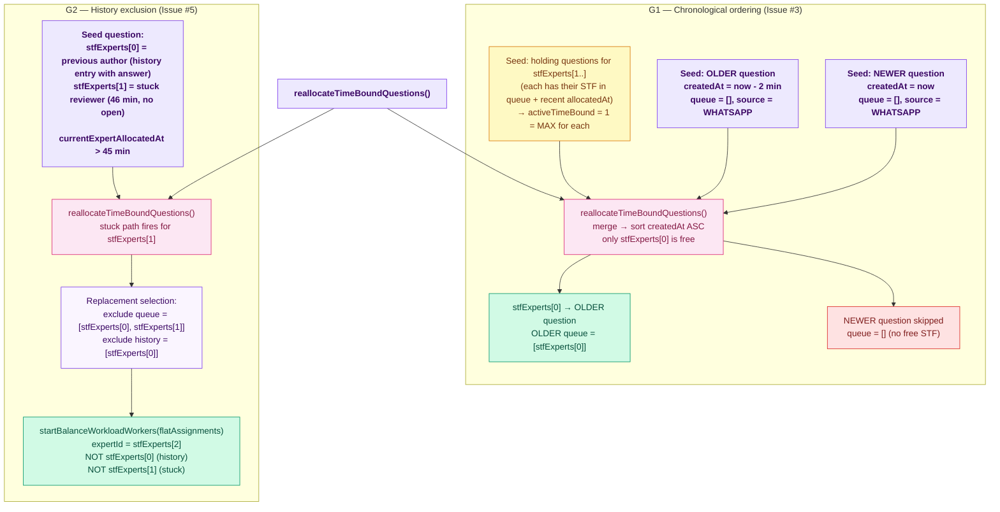

# Allocation Ordering — E2E Test Documentation

**File:** `src/e2e/allocation-ordering/AllocationOrdering.e2e.test.ts`  
**Related:** `src/e2e/auto-allocation/AutoAllocation.e2e.test.ts`

> **To preview diagrams locally:** install the VS Code extension  
> **"Markdown Preview Mermaid Support"** then press `Ctrl+Shift+V`.  
> Diagrams also render natively on GitHub.

---

## What this covers

Two correctness properties of `questionService.reallocateTimeBoundQuestions()` that
address specific production-reported bugs:

| Group | Issue | What it tests |
|-------|-------|---------------|
| G1 | Issue #3 | Older questions are allocated before newer ones (createdAt ASC sort) |
| G2 | Issue #5 | Expert already in history is excluded from replacement selection |

---

## Issues addressed

### Issue #3 — "Previously entered questions not getting allocated; newer questions allocated first"

`reallocateTimeBoundQuestions()` merges all eligible time-bound question sets and
sorts by `createdAt ASC` before processing. When the number of eligible questions
exceeds the number of free STF experts, the **oldest** questions must receive the
experts — not the newest.

**Root cause if broken:** the sort step is incorrect (e.g., `DESC` instead of `ASC`,
or absent entirely), so newer questions in the merged list are processed first and
consume the limited STF capacity before older questions are reached.

### Issue #5 — "Same question getting assigned to a single person twice"

The stuck/idle reallocation path selects a replacement expert who is **not** in
`queue` and **not** in `history`. An expert who previously authored the question
(has a `history` entry with an answer) must never appear as the replacement when
the current reviewer becomes stuck.

**Root cause if broken:** the expert-exclusion predicate checks `queue` but not
`history`, allowing a previous author to be re-assigned as the replacement.

---

## What is NOT capturable in the current test framework

| Issue | Reason not capturable |
|-------|----------------------|
| #4 — Expert attends question but not in history/audit trail | "Attending" sets `currentExpertOpenedAt` with no corresponding API endpoint. The attend-without-answer state cannot be triggered via the HTTP harness. |
| #6 — One question assigned to two people simultaneously | True HTTP-level concurrency (two requests firing at the exact same instant) is not reliably producible in a single-threaded test runner. The cron-level concurrent guard is covered by AutoAllocation G9. |
| #8 — Training model single moderator allocation | "Training model" is not a documented code path; the relevant business logic was not identifiable for testing. |
| #10 — Display of submissions during blocked period | No documented API or repository method for "submissions during a user's blocked window" was identified. |

---

## Flow diagram



---

## Strategy

**In-process harness** — identical to `AutoAllocation.e2e.test.ts`:
- Real Atlas DB (`.env` / `.env.test`)
- `loadAppModules('all')` builds the production DI container
- No HTTP server — only direct `questionService.reallocateTimeBoundQuestions()` calls
- `startBalanceWorkloadWorkers` mocked so G2 does not spawn Worker threads
- **STF auto-promotion**: ensures at least 3 STF experts exist (same `MIN_STF=3` logic as AutoAllocation)
- **Leftover cleanup**: same two-pass closure of leftover time-bound questions as AutoAllocation

---

## Setup — G1 holding questions

G1 needs exactly 1 free STF expert so the ordering test is meaningful. If all N STF
experts were free, both OLD and NEW questions would be allocated (1 each) and ordering
could not be determined. Instead:

```
stfExperts[0]   → free  (no active time-bound question)
stfExperts[1..] → busy  (each has a "holding" WHATSAPP question with queue=[stfExpert])
```

Holding questions are seeded with `currentExpertAllocatedAt = new Date()` (not stuck)
so the cron does not try to reallocate them. They simply count against each expert's
`MAX_TIME_BOUND = 1` capacity, blocking them from being selected for the test questions.

G1's `afterAll` closes both test questions and all holding questions.

---

## Setup — G2 stuck-reviewer question

```
submission = {
  queue: [stfExperts[0]._id, stfExperts[1]._id],
  history: [
    { updatedBy: stfExperts[0], answer: "...", status: "reviewed" },  // past author
    { updatedBy: stfExperts[1], answer: null,  status: "in-review" }, // stuck reviewer
  ],
  currentExpertAllocatedAt: 46 min ago,  // triggers stuck detection
  // currentExpertOpenedAt absent         // reviewer never opened
}
```

G2 requires `stfExperts.length >= 3` (past author, stuck reviewer, and a third for
replacement). Self-skips with a console warning if fewer than 3 STF experts exist.

---

## Test cases (8 total)

### Group 1 — Chronological ordering (4 tests)

| # | What | Expected |
|---|------|----------|
| 1 | Cron reports at least 1 question allocated | `reallocated >= 1` |
| 2 | Older question has a non-empty queue | `queue.length === 1` |
| 3 | Newer question is skipped — queue stays empty when only stfExperts[0] is free | `queue.length === 0` |
| 4 | Expert allocated to older question has `special_task_force=true` | `expert.special_task_force === true` |

### Group 2 — Expert-in-history excluded from replacement (4 tests)

| # | What | Expected |
|---|------|----------|
| 5 | Cron detects the stuck reviewer and reports at least 1 reallocated | `reallocated >= 1` |
| 6 | `startBalanceWorkloadWorkers` was called for the stuck submission | `workerAssignments.length >= 1` |
| 7 | Replacement `expertId` ≠ `stfExperts[0]._id` (previous author in history) | distinct from history entry |
| 8 | Replacement `expertId` ≠ `stfExperts[1]._id` (the stuck reviewer being replaced) | distinct from stuck expert |

---

## Cleanup

`afterAll` (global): deletes all entries from `questions`, `question_submissions`,
and `notifications` keyed on `createdQuestionIds`.

`afterAll` (per-group): closes test questions and holding questions (G1) to release
STF capacity before the next group runs.

`temporarilyClosedIds`: questions from previous incomplete test runs that were
closed in `beforeAll` are restored to `status: 'open'` in `afterAll`.

---

## How to run

```bash
# From backend/  (~20 s against the real Atlas DB in .env)
pnpm exec vitest run src/e2e/allocation-ordering/AllocationOrdering.e2e.test.ts
```

---

## Last Run

**Date:** — &nbsp;|&nbsp; **Result:** not yet run &nbsp;|&nbsp; **Duration:** —
