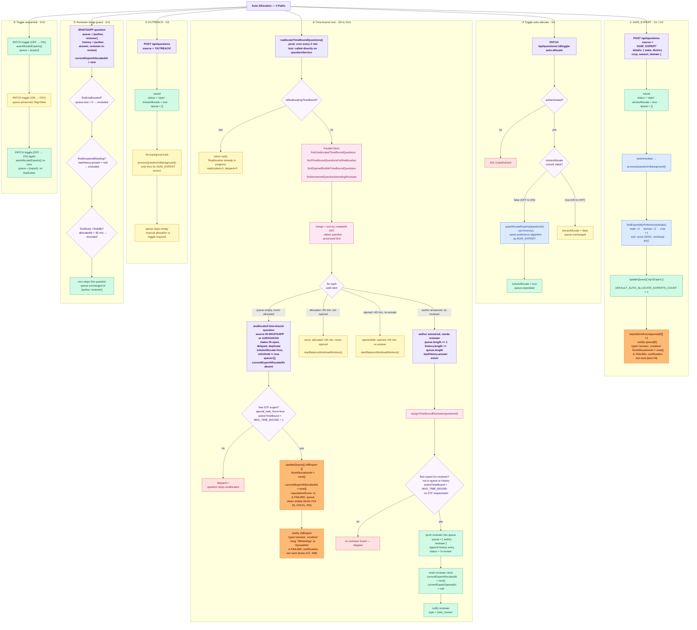

# Auto Allocation — E2E Test Documentation

**File:** `src/e2e/auto-allocation/AutoAllocation.e2e.test.ts`  
**Related:** `src/e2e/manual-allocation/ManualAllocation.e2e.test.ts`

> **To preview diagrams locally:** install the VS Code extension  
> **"Markdown Preview Mermaid Support"** then press `Ctrl+Shift+V`.  
> Diagrams also render natively on GitHub.

---

## What this covers

Four allocation paths tested against the **real Atlas DB** (`.env`):

| Path | Groups | Method / Function | Description |
|------|--------|-------------------|-------------|
| AGRI_EXPERT | G1–G2 | `POST /api/questions` (source=`AGRI_EXPERT`) | Creates question → `setImmediate` kicks off background expert assignment |
| OUTREACH | G3 | `POST /api/questions` (source=`OUTREACH`) | Creates question — queue stays empty; no background allocation |
| Toggle | G4 | `PATCH /api/questions/:id/toggle-auto-allocate` | Moderator flips flag; OFF→ON calls `autoAllocateExperts` synchronously |
| Time-bound cron | G5–G10 | `questionService.reallocateTimeBoundQuestions()` | Cron (every 2 min in prod) assigns STF experts to WHATSAPP/AJRASAKHA questions |
| Reviewer-stage guard | G11 | `questionService.reallocateTimeBoundQuestions()` | Cron does not re-process a question already in the reviewer stage |
| Toggle sequential | G12 | `PATCH /api/questions/:id/toggle-auto-allocate` | ON→OFF→ON on the same question — no duplicate experts, queue preserved on OFF |

---

## Flow diagram



**Questions excluded from the unallocated time-bound query (G7 negative cases):**

| Condition | Why excluded |
|-----------|-------------|
| `isAutoAllocate=false` | filter requires `isAutoAllocate=true` |
| `isOnHold=true` | filter excludes on-hold questions |
| `status='closed'` | only `open/delayed/duplicate` eligible |
| `status='non_agri'` | only `open/delayed/duplicate` eligible |
| `source='OUTREACH'` | source must be `WHATSAPP` or `AJRASAKHA` |
| `source='AGRI_EXPERT'` | source must be `WHATSAPP` or `AJRASAKHA` |
| `queue` non-empty | filter requires `queue.size=0` |

---

## Key differences at a glance

| Dimension | AGRI_EXPERT | OUTREACH | Toggle | Time-bound cron |
|-----------|-------------|----------|--------|----------------|
| **Source** | `AGRI_EXPERT` | `OUTREACH` | Any | `WHATSAPP`, `AJRASAKHA` |
| **Trigger** | `setImmediate` at creation | — | `PATCH` endpoint | Cron every 2 min |
| **Expert selection** | `findExpertsByPreference` (score + workload) | N/A | Same as AGRI_EXPERT | `findExpertsByReputationScore` (workload only) |
| **STF required?** | No | N/A | No | YES — initial only. No for reviewer |
| **MAX active cap** | No | N/A | No | 1 per expert (`MAX_TIME_BOUND`) |
| **Queue size** | 1 | 0 | 1 | 1 initially; grows as reviewers added |
| **Async?** | Yes (`setImmediate`) — tests poll | N/A | No — synchronous | No — awaited directly |
| **Notification** | `answer_creation` | None | `answer_creation` | `answer_creation` / `peer_review` (reviewer) |

---

## Strategy

**In-process server** — `loadAppModules('all')` builds the real production DI container against
the real Atlas DB. Users are fetched from the DB by email using `.env.test` credentials.
A `currentTestUser` variable is swapped per test; both `authorizationChecker` and
`currentUserChecker` read from it.

`InternalApiAuth` is a global `@Middleware({ type: 'before' })` that checks `x-internal-api-key`
on every route. The test sets `process.env.INTERNAL_API_KEY = 'e2e-auto-alloc-key'` and attaches
that header to all requests via `apiPost`/`apiPatch` helpers.

**Polling:** AGRI_EXPERT background processing runs via `setImmediate`, so the submission queue
is populated asynchronously. Tests poll every 300 ms (up to 10 s) using `pollUntil()`.

**Toggle is synchronous:** `toggleAutoAllocate` awaits `autoAllocateExperts` directly — no polling needed.

**Time-bound is synchronous:** `reallocateTimeBoundQuestions()` is awaited directly. The cron
wrapper is gated by `if (!appConfig.isDevelopment)` and never fires when `NODE_ENV=development`.

**STF auto-promotion:** `beforeAll` checks how many experts have `special_task_force=true`. If
fewer than 3, it promotes the shortfall number of non-STF experts (lowest `reputation_score` first)
via a `$set` update so Groups 5–8 always have enough STF experts to run. Groups 5, 6, and 8 still
guard with `if (!stfExperts.length) return;` as a last-resort fallback if promotion itself fails.

---

## Test setup

- `.env` loaded first → real Atlas DB URL / DB_NAME
- `.env.test` loaded second (dotenv does NOT override existing vars) → test user credentials
- `process.env.NODE_ENV = 'development'` set before any module load → Atlas TLS stays enabled
- AnswerService warm-up import before `loadAppModules` → circular-import workaround
- AiService dummied via `container.rebindSync(CORE_TYPES.AIService)`
- `questionService = container.get(CORE_TYPES.QuestionService)` fetched in `beforeAll`
- **STF auto-promotion:** if fewer than 3 experts have `special_task_force=true`, the shortfall is
  promoted via `users.updateMany(...)` before tests run (lowest `reputation_score` first, so
  preference-scoring test #5 is not disturbed)
- **Leftover cleanup:** `getTimeBoundActiveCountPerExpert` is a full DB scan — leftover open
  WHATSAPP/AJRASAKHA questions from incomplete previous runs make STF experts appear busy before
  any test data is seeded. `beforeAll` finds all submissions with STF experts in queue whose
  questions are still `open`/`delayed`, temporarily sets those questions to `closed`, and tracks
  them in `temporarilyClosedIds` for restoration in `afterAll`
- STF experts fetched after promotion and cleanup:
  `users.find({ role: 'expert', isBlocked: false, special_task_force: true })`

---

## Cleanup (afterAll)

Removes from the real DB (keyed on `createdQuestionIds`):
- `questions`
- `question_submissions`
- `notifications`

Restores any questions that were temporarily closed in `beforeAll` to `status: 'open'`
(keyed on `temporarilyClosedIds`).

`reputation_score` increments are NOT reversed — acceptable in the test DB.

---

## Test cases (44 total)

### Group 1 — AGRI_EXPERT background allocation (4 tests)

| # | What | Expected |
|---|------|----------|
| 1 | Question is immediately open with `isAutoAllocate=true` | `status='open'`, `isAutoAllocate=true` |
| 2 | Background process populates queue with exactly 1 expert | `queue.length === 1` (after `pollUntil`) |
| 3 | `firstAllocationAt` stamped after background runs | `instanceof Date` |
| 4 | `answer_creation` notification sent to `queue[0]` | notif found in DB |

### Group 2 — AGRI_EXPERT preference scoring (1 test)

| # | What | Expected |
|---|------|----------|
| 5 | `queue[0]` is `experttest1` (Punjab + Crop Protection + Brinjal = 6 pts) | `queue[0] === expertUser1._id` |

### Group 3 — OUTREACH: no background allocation (3 tests)

| # | What | Expected |
|---|------|----------|
| 6 | Question open with `isAutoAllocate=true` | `status='open'`, `isAutoAllocate=true` |
| 7 | Queue empty immediately after creation | `queue.length === 0` |
| 8 | Queue still empty after 1 s wait | `queue.length === 0` |

### Group 4 — Toggle auto-allocate (3 tests)

| # | What | Expected |
|---|------|----------|
| 9 | No user → 401 | `res.status === 401` |
| 10 | OFF→ON: flag flips, queue filled synchronously | `200`, `isAutoAllocate=true`, `queue.length >= 1` |
| 11 | ON→OFF: flag flips, queue untouched | `200`, `isAutoAllocate=false`, queue unchanged |

### Group 5 — WHATSAPP time-bound initial allocation (6 tests)

*`beforeAll` auto-promotes experts to STF so this normally runs. Self-skips only if promotion itself finds no eligible experts.*

| # | What | Expected |
|---|------|----------|
| 12 | `reallocateTimeBoundQuestions()` reports `reallocated >= 1` | ✓ |
| 13 | Queue has exactly 1 expert | `queue.length === 1` |
| 14 | Allocated expert has `special_task_force=true` | STF requirement enforced |
| 15 | `question.firstAllocationAt` stamped | `instanceof Date` |
| 16 | `submission.currentExpertAllocatedAt` set | `instanceof Date` |
| 17 | `answer_creation` notification sent to allocated expert | notif found |

### Group 6 — AJRASAKHA time-bound initial allocation (4 tests)

*Same pipeline as WHATSAPP — different source label. Self-skips only if STF promotion fails.*

| # | What | Expected |
|---|------|----------|
| 18 | `reallocateTimeBoundQuestions()` reports `reallocated >= 1` | ✓ |
| 19 | Queue has 1 STF expert | `queue.length === 1`, `expert.special_task_force === true` |
| 20 | Notification message mentions "Ajrasakha" | `notif.message` matches `/ajrasakha/i` |
| 21 | `firstAllocationAt` stamped | `instanceof Date` |

### Group 7 — Negative cases: questions NOT picked up (7 tests)

| # | Seed condition | Expected |
|---|---------------|----------|
| 22 | `isAutoAllocate=false` WHATSAPP | queue stays empty |
| 23 | `isOnHold=true` WHATSAPP | queue stays empty |
| 24 | `status='closed'` WHATSAPP | queue stays empty |
| 25 | `status='non_agri'` WHATSAPP | queue stays empty |
| 26 | `source='OUTREACH'` | queue stays empty |
| 27 | `source='AGRI_EXPERT'` | queue stays empty |
| 28 | Already allocated (non-empty queue) | queue unchanged at 1 expert |

### Group 8 — MAX_TIME_BOUND=1 capacity enforcement (3 tests)

*Self-skips only if STF promotion fails. Tests #30 and #31 are mutually exclusive on `stfExperts.length`.*

| # | What | Expected |
|---|------|----------|
| 29 | Busy STF expert NOT assigned to the new question | `queue[0] ≠ busyExpert._id` |
| 30 | Only 1 STF expert (now busy) → new question skipped | `queue=[]`, `skipped >= 1` |
| 31 | 2+ STF experts → new question goes to a different free one | `queue=[differentExpert]` |

### Group 11 — Reviewer-stage question not re-processed by cron (3 tests)

*Guards against the cron resetting or extending the queue when a reviewer is already mid-review.*

| # | What | Expected |
|---|------|----------|
| 39 | Queue still has exactly 2 members after cron run | `queue.length === 2` |
| 40 | `queue[0]` is still the original author | unchanged |
| 41 | `queue[1]` is still the original reviewer — no third expert added | unchanged |

### Group 12 — Toggle sequential ON → OFF → ON same question (3 tests)

*Documents toggle semantics and guards against unbounded queue growth on repeated flips.*

| # | What | Expected |
|---|------|----------|
| 42 | OFF→ON: `isAutoAllocate=true`, queue populated with 1 expert | `queue.length >= 1` |
| 43 | ON→OFF: `isAutoAllocate=false`, queue length preserved (not cleared) | queue same length as after ON |
| 44 | Second OFF→ON: no duplicate expert IDs in queue | all IDs unique |

### Group 9 — Concurrent run guard (1 test)

| # | What | Expected |
|---|------|----------|
| 32 | Second call (before first `await`) returns early | `message === 'Reallocation already in progress'`, `reallocated=0`, `skipped=0` |

### Group 10 — Reviewer assignment (6 tests)

| # | What | Expected |
|---|------|----------|
| 33 | `reallocateTimeBoundQuestions()` reports `reallocated >= 1` | ✓ |
| 34 | Queue grows from 1 to 2 | `queue.length === 2` |
| 35 | Reviewer is a different expert from the author | `queue[1] ≠ expertUser1._id` |
| 36 | History has new `in-review` entry for reviewer | `history.length === 2`, `history[1].status === 'in-review'` |
| 37 | `peer_review` notification sent to reviewer | notif found in DB |
| 38 | `currentExpertAllocatedAt` reset, `currentExpertOpenedAt` cleared to `null` | both updated |

---

## Critical constraints

### STF-only for initial time-bound allocation

```ts
for (const expert of allExperts) {
  if (expert?.special_task_force !== true) continue;  // ← STF ONLY
```

If no STF expert has capacity, the question is **skipped indefinitely**. Likely root cause of
WHATSAPP/AJRASAKHA questions not getting allocated in production.

### MAX_TIME_BOUND = 1

Each expert holds at most 1 active time-bound question. "Active" = in queue with no answer yet,
or in queue with `history[n].status === 'in-review'`.

### Reviewer has no STF requirement

`assignTimeBoundReviewer` selects any free expert — not STF-gated.

### Concurrent guard fires synchronously

`isReallocatingTimeBound = true` is set **before** the first `await`, so a second call fired
immediately always sees it as `true`.

### Cron does not run in development

`timeBoundReAllocateCron.ts` is gated by `if (!appConfig.isDevelopment)` — never fires in tests.

### Stuck/idle branches spawn worker threads

`startBalanceWorkloadWorkers()` targets `build/workers/balanceWorkload.worker.js`. Not reliable
when running tests against source. Those branches are not tested in this suite.

---

## Known assumption: preference test (#5)

Asserts `experttest1` is allocated for `state=Punjab, domain=Crop Protection, crop=Brinjal`
(6-point score). Non-deterministic if another expert also scores 6 points — shuffle within tiers.

---

---

## Last Test Run Results

**Date:** 2026-06-15  
**Total:** 44 tests — **33 passed, 11 failed**

| # | Group | Test | Result | Error |
|---|-------|------|--------|-------|
| 1 | G1 | question is immediately open with `isAutoAllocate=true` | ✅ | — |
| 2 | G1 | background populates queue with exactly 1 expert | ✅ | — |
| 3 | G1 | `firstAllocationAt` stamped after background allocation | ✅ | — |
| 4 | G1 | `answer_creation` notification sent to queue[0] | ❌ FAIL | `expected null not to be null` — notification not created |
| 5 | G2 | `queue[0]` is `experttest1` (preference scoring) | ✅ | — |
| 6-8 | G3 | OUTREACH: queue empty at creation and after wait | ✅ | — |
| 9 | G4 | No user → 401 | ✅ | — |
| 10 | G4 | OFF→ON: flag flips, queue filled | ✅ | — |
| 11 | G4 | ON→OFF: flag flips, queue untouched | ✅ | — |
| 12 | G5 | WHATSAPP time-bound: `reallocateTimeBoundQuestions` reports ≥1 allocated | ✅ | — |
| 13 | G5 | WHATSAPP time-bound: queue has exactly 1 expert | ❌ FAIL | `expected [] to have a length of 1 but got +0` |
| 14 | G5 | WHATSAPP time-bound: allocated expert has `special_task_force=true` | ❌ FAIL | `Cannot read properties of undefined (reading 'toString')` |
| 15 | G5 | WHATSAPP time-bound: `firstAllocationAt` stamped | ❌ FAIL | `expected undefined to be an instance of Date` |
| 16 | G5 | WHATSAPP time-bound: `currentExpertAllocatedAt` set | ❌ FAIL | `expected undefined to be an instance of Date` |
| 17 | G5 | WHATSAPP time-bound: `answer_creation` notification sent | ❌ FAIL | `expected null not to be null` |
| 18 | G6 | AJRASAKHA time-bound: reports ≥1 initially allocated | ❌ FAIL | `expected 0 to be greater than or equal to 1` |
| 19 | G6 | AJRASAKHA time-bound: queue has 1 STF expert | ❌ FAIL | `expected [] to have a length of 1 but got +0` |
| 20 | G6 | AJRASAKHA time-bound: notification mentions "Ajrasakha" | ❌ FAIL | `expected null not to be null` |
| 21 | G6 | AJRASAKHA time-bound: `firstAllocationAt` stamped | ❌ FAIL | `expected undefined to be an instance of Date` |
| 22-28 | G7 | Negative cases: questions NOT picked up | ✅ (all 7) | — |
| 29 | G8 | Busy STF expert NOT assigned to new question | ✅ | — |
| 30 | G8 | Only 1 STF expert (now busy) → new question skipped | ✅ | — |
| 31 | G8 | 2+ STF experts → new question allocated to different free one | ❌ FAIL | `expected [] to have a length of 1 but got +0` |
| 32 | G9 | Concurrent guard returns early with "in progress" | ✅ | — |
| 33-38 | G10 | Reviewer assignment path (6 tests) | ✅ (all 6) | — |
| 39-41 | G11 | Reviewer-stage question not re-processed by cron (3 tests) | ✅ (all 3) | — |
| 42-44 | G12 | Toggle sequential ON→OFF→ON (3 tests) | ✅ (all 3) | — |

---

## Failing Paths (2026-06-15)

### 1. AGRI_EXPERT `answer_creation` notification not sent (test #4)

Path: `A5 → A6`. `firstAllocationAt` IS stamped (test #3 passes) and queue IS populated (test #2 passes), but the `answer_creation` notification is not created in the DB.

Root cause investigation: `processQuestionInBackground` allocates the expert and stamps timestamps, but the notification write (`NotificationService.addNotification` or similar) is either silently throwing or the notification type/userId lookup is failing.

### 2. Time-bound STF initial allocation fails for WHATSAPP and AJRASAKHA (tests #13-21, #31)

Path: `E2 → E4 → E5` — the "free STF expert found" branch is never taken.

The `beforeAll` closed 3 leftover active questions to free STF experts, and `STF experts: 3` was logged. Yet after calling `reallocateTimeBoundQuestions()`:
- WHATSAPP: the cron reports "≥1 allocated" (test #12 passes) but the actual test question's queue stays empty. This suggests the cron allocated a **different** pre-existing question, not the one seeded by this test.
- AJRASAKHA: the cron reports "0 allocated" — the AJRASAKHA question was not picked up at all.

The `freeSTF=0` in later diagnostic output (G9) confirms that by the time G9 runs, all STF experts are busy — they consumed their `MAX_TIME_BOUND=1` capacity on earlier questions.

Likely root cause: the `beforeAll` cleanup only closed questions already in the DB before the run. If the current test session's own earlier allocations (from G5, G6, G8) used up STF capacity, later STF tests within the same run fail. A more robust cleanup would reassert free status after each group.

### 3. WHATSAPP test #12 passes but tests #13-17 fail (paradox)

`reallocateTimeBoundQuestions()` returns `reallocated >= 1`, but the queue of the **test-seeded question** is empty. The cron is allocating a pre-existing unallocated question (leftover from a prior test run) and counting that as "initially allocated." The test question is being skipped ("No eligible expert" log) because all STF experts are already at capacity.

---

## How to run

```bash
# From backend/  (~25 s against the real Atlas DB in .env)
pnpm exec vitest run src/e2e/auto-allocation/AutoAllocation.e2e.test.ts
```
