# Auto Allocation — E2E Test Documentation

**File:** `src/e2e/auto-allocation/AutoAllocation.e2e.test.ts`  
**Related:** `src/e2e/manual-allocation/ManualAllocation.e2e.test.ts`

> **To preview diagrams locally:** install the VS Code extension  
> **"Markdown Preview Mermaid Support"** then press `Ctrl+Shift+V`.  
> It also renders natively on GitHub.

---

## What this covers

Two auto-allocation paths exercised against the real Mongo DB (`.env`):

| Method | Endpoint | What it does |
|--------|----------|--------------|
| `POST` | `/api/questions` | Creates an AGRI_EXPERT question — triggers background expert allocation via `setImmediate` |
| `POST` | `/api/questions` | Creates an OUTREACH question — queue stays empty until manually or toggle-allocated |
| `PATCH` | `/api/questions/:questionId/toggle-auto-allocate` | Moderator flips the `isAutoAllocate` flag; OFF→ON calls `autoAllocateExperts` synchronously |

---

## Auto Allocation Flowchart

```mermaid
flowchart TD

  classDef entry  fill:#ede9fe,stroke:#7c3aed,color:#3b0764,font-weight:bold
  classDef bg     fill:#dbeafe,stroke:#2563eb,color:#1e3a8a
  classDef ok     fill:#d1fae5,stroke:#059669,color:#064e3b
  classDef warn   fill:#fef9c3,stroke:#d97706,color:#78350f
  classDef err    fill:#fee2e2,stroke:#dc2626,color:#7f1d1d
  classDef decide fill:#faf5ff,stroke:#7c3aed,color:#3b0764

  %% ── AGRI_EXPERT PATH ─────────────────────────────────────────────────

  subgraph AGRI ["AGRI_EXPERT — auto-allocation at creation"]
    AE_CREATE["POST /api/questions
    source = 'AGRI_EXPERT'
    details: { state, district, crop, season, domain }"]:::entry

    AE_CREATE --> AE_SAVE["question saved
    status = 'open'
    isAutoAllocate = true
    queue = []  ← bare submission"]:::ok

    AE_SAVE --> AE_BG["setImmediate →
    processQuestionInBackground()"]:::bg

    AE_BG --> AE_PREF["findExpertsByPreference(details)
    ─────────────────────────────────────────
    score each non-blocked expert:
    state match  → +3 pts
    domain match → +2 pts
    crop match   → +1 pt
    ─────────────────────────────────────────
    sort: matched (score>0) first
          within group: score DESC,
          workload (reputation_score) ASC
    unmatched: workload ASC"]:::bg

    AE_PREF --> AE_Q["updateQueue(questionId, [top1Expert])
    DEFAULT_AUTO_ALLOCATE_EXPERTS_COUNT = 1"]:::ok

    AE_Q --> AE_EFFECTS["① updateReputationScore(queue[0], +1)
    ② notify queue[0]  type='answer_creation'
    ③ question.firstAllocationAt = now()"]:::ok
  end

  %% ── TOGGLE PATH ──────────────────────────────────────────────────────

  subgraph TOGGLE ["Toggle auto-allocate  —  PATCH /:id/toggle-auto-allocate"]

    T_IN{"isAutoAllocate
    current value?"}:::decide

    T_IN -- "false (OFF → ON)" --> T_ALLOC["autoAllocateExperts(questionId)
    — called synchronously —
    scores all experts (same preference algorithm),
    fills queue up to DEFAULT limit"]:::bg

    T_ALLOC --> T_ON["isAutoAllocate = true
    queue populated (if eligible)"]:::ok

    T_IN -- "true (ON → OFF)" --> T_OFF["isAutoAllocate = false
    queue unchanged"]:::warn

    T_NO_USER["no user → 401"]:::err
  end
```



---

## Auto vs Manual Allocation — Comparison

```mermaid
flowchart LR

  classDef auto   fill:#dbeafe,stroke:#2563eb,color:#1e3a8a
  classDef manual fill:#dcfce7,stroke:#16a34a,color:#14532d
  classDef common fill:#f8fafc,stroke:#94a3b8,color:#334155
  classDef ok     fill:#d1fae5,stroke:#059669,color:#064e3b
  classDef decide fill:#faf5ff,stroke:#7c3aed,color:#3b0764

  subgraph AUTO ["🤖  Auto Allocation"]
    direction TB
    A1["Trigger: question creation
    (AGRI_EXPERT source)"]:::auto
    A2["Actor: the system
    findExpertsByPreference()"]:::auto
    A3["Selection: preference score
    state+3, domain+2, crop+1
    workload tiebreak"]:::auto
    A4["Queue size on creation: 1
    DEFAULT_AUTO_ALLOCATE_EXPERTS_COUNT"]:::auto
    A5["firstAllocationAt: set by background"]:::auto
    A6["answer_creation notification
    sent to queue[0]"]:::auto
    A1 --> A2 --> A3 --> A4 --> A5 --> A6
  end

  subgraph MANUAL ["👤  Manual Allocation"]
    direction TB
    M1["Trigger: moderator calls
    POST /:id/allocate-experts"]:::manual
    M2["Actor: the moderator
    picks specific expert IDs"]:::manual
    M3["Selection: none — moderator
    chooses by knowledge / context"]:::manual
    M4["Queue size: grows with each call
    moderator adds 1+ experts at a time"]:::manual
    M5["firstAllocationAt: set on first
    successful allocate-experts call"]:::manual
    M6["allocation notification sent
    per expert added"]:::manual
    M1 --> M2 --> M3 --> M4 --> M5 --> M6
  end

  subgraph COMMON ["Shared outcome"]
    direction TB
    C1["submission.queue = [e1, e2, ...]"]:::common
    C2["PostAllocation review workflow:
    e1 authors → peers review → moderator closes"]:::common
    C1 --> C2
  end

  A6 --> COMMON
  M6 --> COMMON
```



---

## Key differences at a glance

| Dimension | Auto (AGRI_EXPERT) | Manual (OUTREACH / any) |
|-----------|-------------------|------------------------|
| **Who triggers** | System (at question creation) | Moderator (explicit API call) |
| **Who selects expert** | `findExpertsByPreference` algorithm | Human moderator |
| **Selection criterion** | Preference score + workload | Moderator's discretion |
| **Initial queue size** | 1 (DEFAULT_AUTO_ALLOCATE_EXPERTS_COUNT) | 0; grows per `allocate-experts` call |
| **Question status at creation** | `open` immediately | `open` immediately |
| **isAutoAllocate on creation** | `true` | `true` (OUTREACH flag; but cron doesn't auto-alloc OUTREACH) |
| **firstAllocationAt set by** | Background process (async) | `allocateExperts` service (sync) |
| **Notification to expert** | `answer_creation` (background) | `answer_creation` (sync) |
| **Can duplicate experts?** | No (filtered by queue + history) | Yes (known BUG-001 in manual alloc) |

---

## Strategy

**In-process server** — `loadAppModules('all')` builds the real production DI
container against the real Atlas DB. Users are fetched from the DB by email using
`.env.test` credentials (no Firebase token exchange needed). A `currentTestUser`
variable is swapped per test; both `authorizationChecker` and `currentUserChecker`
read from it.

`InternalApiAuth` is a global `@Middleware({ type: 'before' })` that checks
`x-internal-api-key` on every route. The test sets
`process.env.INTERNAL_API_KEY = 'e2e-auto-alloc-key'` and attaches that header
to all requests via `apiPost`/`apiPatch` helpers.

**Polling:** AGRI_EXPERT background processing runs via `setImmediate`, so the
submission queue is populated asynchronously. Tests poll the `question_submissions`
collection every 300 ms (up to 10 s) using `pollUntil()`.

**Toggle is synchronous:** `toggleAutoAllocate` awaits `autoAllocateExperts`
directly — no polling needed for toggle tests.

---

## Test setup

- `.env` loaded first → real Atlas DB URL
- `.env.test` loaded second (dotenv doesn't override existing vars) → test user credentials
- `process.env.NODE_ENV = 'development'` set before any module load → Atlas TLS stays enabled
- AnswerService warm-up import before `loadAppModules` → circular-import workaround
- AiService dummied via `container.rebindSync(CORE_TYPES.AIService)` (same pattern as PostAllocation)

---

## Cleanup (afterAll)

Removes from the real DB:
- `questions` — all questions seeded or created during the run
- `question_submissions` — matching submission rows
- `notifications` — allocation notifications created during the run

Note: `reputation_score` increments on experts (from `updateReputationScore`) are
not reversed — acceptable in a test environment. The test DB is not production.

---

## Test cases (10 total)

| # | Group | What | Expected |
|---|-------|------|----------|
| 1 | AGRI_EXPERT | Question is open with isAutoAllocate=true immediately | ✓ |
| 2 | AGRI_EXPERT | Background populates queue with exactly 1 expert | `queue.length === 1` |
| 3 | AGRI_EXPERT | firstAllocationAt stamped after background runs | not null, instanceof Date |
| 4 | AGRI_EXPERT | answer_creation notification sent to queue[0] | notif found in DB |
| 5 | Preference | queue[0] is experttest1 (highest-scoring match) | queue[0] === expertUser1._id |
| 6 | OUTREACH | Question open with isAutoAllocate=true | ✓ |
| 7 | OUTREACH | Submission queue empty immediately after creation | `queue.length === 0` |
| 8 | OUTREACH | Queue still empty after 1 s (no cron in test) | `queue.length === 0` |
| 9 | Toggle | No user → 401 | 401 |
| 10 | Toggle | OFF→ON: flag flips, queue populated via autoAllocateExperts | 200, isAutoAllocate=true, queue≥1 |
| 11 | Toggle | ON→OFF: flag flips, queue untouched | 200, isAutoAllocate=false, queue unchanged |

---

## Known assumption: preference test (case #5)

The test asserts that `experttest1` (EXPERT_EMAIL) is allocated for a question
with `state=Punjab`, `domain=Crop Protection`, `crop=Brinjal`. This holds only
when experttest1's stored `preference` in the DB matches all three fields,
giving them 6 preference points — the maximum. If another expert also has a
6-point match, the shuffle inside `findExpertsByPreference` can make the result
non-deterministic.

`findExpertsByPreference` shuffles all experts BEFORE scoring, then sorts within
each score tier. Experts with the same score and similar workload may appear in
any order between runs.

---

## How to run

```bash
# From backend/  (~10 s against the real Atlas DB in .env)
pnpm exec vitest run src/e2e/auto-allocation/AutoAllocation.e2e.test.ts
```
