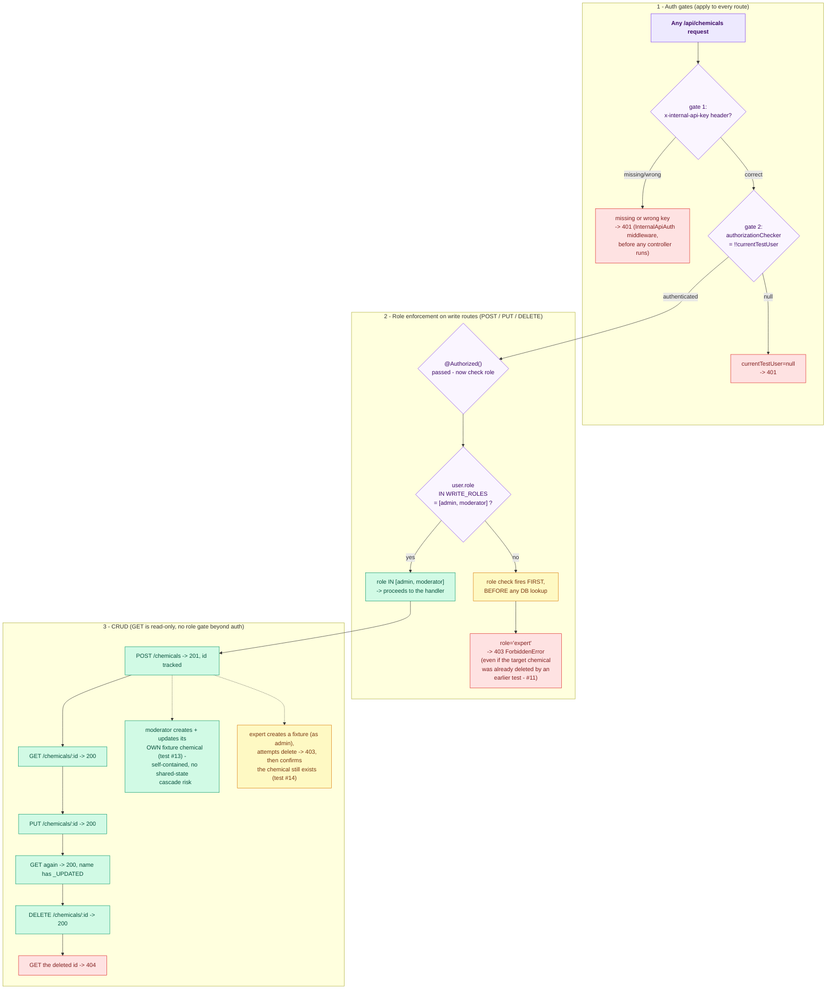

# Chemical CRUD — E2E Test Documentation

**File:** `src/e2e/chemical/ChemicalCrud.e2e.test.ts`

---

## What this covers

Full CRUD lifecycle for the Chemical resource, exercised against the **real Mongo DB**
configured in `.env` (`DB_URL` / `DB_NAME`) using the in-process harness.

| Method | Endpoint | Purpose |
|--------|----------|---------|
| `GET` | `/api/chemicals` | List chemicals (auth gate) |
| `POST` | `/api/chemicals` | Create chemical |
| `GET` | `/api/chemicals/:id` | Get by ID |
| `PUT` | `/api/chemicals/:id` | Update chemical |
| `DELETE` | `/api/chemicals/:id` | Delete chemical |

---

## Strategy

**In-process server** — same harness as `ManualAllocation.e2e.test.ts`.
`loadAppModules('all')` builds the real production DI container against the real DB.
Users are fetched from the DB by email (no Firebase token exchange needed). A
`currentTestUser` variable is swapped per test; both `authorizationChecker` and
`currentUserChecker` read from it.

`InternalApiAuth` is a global `@Middleware({ type: 'before' })` that checks the
`x-internal-api-key` header on every route. The test sets
`process.env.INTERNAL_API_KEY = 'e2e-chemical-crud-key'` and attaches that header to
all requests via `apiGet`/`apiPost`/`apiPut`/`apiDelete` helpers.

---

## Auth strategy

Auth in the in-process harness works through two gates:

1. **`InternalApiAuth`** (global middleware) — checks `x-internal-api-key` header.
   Missing or wrong key → **401** before any controller runs.
2. **`authorizationChecker`** — returns `!!currentTestUser`. `null` → **401**.

The three auth smoke tests cover all branches of gate 1.

---

## Role enforcement

`ChemicalController` uses `@Authorized()` (no args) plus an explicit role check inside
each write handler: `if (!WRITE_ROLES.includes(user.role)) throw ForbiddenError`.

`WRITE_ROLES = ['admin', 'moderator']` — experts are blocked from create / update /
delete. The role check fires **before any DB lookup**, so a 403 is returned even when
the target chemical has already been deleted.

---

## Flow diagram

> **To preview this diagram locally:** install the VS Code extension
> **"Markdown Preview Mermaid Support"** then press `Ctrl+Shift+V`.
> Diagrams also render natively on GitHub.



## Test cases (15 total)

### Authentication Smoke Tests (3 tests)

| # | Test | Expected |
|---|------|----------|
| 1 | Missing `x-internal-api-key` header | 401 |
| 2 | Wrong `x-internal-api-key` value | 401 |
| 3 | Correct key + admin user | 200 |

### Chemical CRUD E2E (12 tests)

| # | Test | Actor | Expected |
|---|------|-------|----------|
| 4 | Admin creates chemical | admin | 201 |
| 5 | Admin gets chemical by ID | admin | 200 |
| 6 | Admin updates chemical | admin | 200 |
| 7 | Admin gets chemical after update | admin | 200, `_UPDATED` in name |
| 8 | Admin deletes chemical | admin | 200 |
| 9 | Admin gets 404 for deleted chemical | admin | 404 |
| 10 | Expert cannot create chemical | expert | 403 |
| 11 | Expert cannot update chemical (role check fires before DB lookup → 403 even on deleted resource) | expert | 403 |
| 12 | Moderator creates chemical | moderator | 201 |
| 13 | Moderator can update chemical (creates own fixture, updates it, verifies, cleans up) | admin→moderator | 200 |
| 14 | Expert cannot delete chemical (creates fixture, confirms it still exists post-attempt) | admin→expert | 403 |
| 15 | Moderator can delete chemical | moderator | 200, 404 after |

Tests #13 and #14 each create their own fixture chemicals (inline cleanup or `afterAll` as safety net)
so they don't depend on any shared state from earlier tests.

---

## Cleanup

`afterAll` iterates `createdChemicalIds` and calls `chemicals.deleteOne` for each.
404s (already deleted by a test) are silently ignored. Tests #10 and #11 reuse the
already-deleted chemical from the admin sequence — no extra cleanup needed.

---

## Last Test Run Results

### Pre-conversion (2026-06-15) — old live-server pattern

**Prerequisite:** live server running at `localhost:4000` + Firebase JWT tokens  
**Total:** 14 tests — **10 passed, 4 failed**

| # | Test | Result | Error |
|---|------|--------|-------|
| 1 | No token → 401 | ✅ | — |
| **2** | **Invalid token → 401** | ❌ FAIL | Firebase auth config change; server returned non-401 |
| 3 | Valid admin token → 200 | ✅ | — |
| 4 | Admin creates chemical → 201 | ✅ | — |
| 5 | Admin gets by ID → 200 | ✅ | — |
| 6 | Admin updates → 200 | ✅ | — |
| 7 | Admin gets after update → 200 | ✅ | — |
| 8 | Admin deletes → 200 | ✅ | — |
| 9 | Admin gets 404 for deleted | ✅ | — |
| 10 | Expert cannot create → 403 | ✅ | — |
| 11 | Expert cannot update → 403 | ✅ | — |
| 12 | Moderator creates → 201 | ✅ | — |
| **13** | **Moderator can update → 200** | ❌ FAIL | `ForbiddenError` — moderator was not in `WRITE_ROLES` for update |
| **14** | **Expert cannot delete → 403** | ❌ FAIL | Cascade — `chemicalId` undefined after #13 fixture broke |
| **15** | **Moderator can delete → 200** | ❌ FAIL | Cascade from #13 |

### Post-conversion (2026-06-16) — in-process harness

**Converted:** No live server needed. Firebase tokens replaced with `currentTestUser` +
`x-internal-api-key`. Tests #13 and #14 each create their own fixture chemicals to
eliminate shared-state cascades.

**Total:** 15 tests — **all 15 passed** ✅ (confirmed 2026-06-16)

| # | Test | Result | Notes |
|---|------|--------|-------|
| 1 | Missing API key → 401 | ✅ | `InternalApiAuth` blocks |
| 2 | Wrong API key → 401 | ✅ | `InternalApiAuth` blocks |
| 3 | Correct key + admin → 200 | ✅ | — |
| 4 | Admin creates chemical → 201 | ✅ | — |
| 5 | Admin gets by ID → 200 | ✅ | — |
| 6 | Admin updates → 200 | ✅ | — |
| 7 | Admin gets after update → 200 | ✅ | — |
| 8 | Admin deletes → 200 | ✅ | — |
| 9 | Admin gets 404 for deleted | ✅ | — |
| 10 | Expert cannot create → 403 | ✅ | Role check before any DB call |
| 11 | Expert cannot update → 403 | ✅ | Role check fires on deleted resource too |
| 12 | Moderator creates → 201 | ✅ | — |
| 13 | Moderator can update → 200 | ✅ | Creates own fixture; no cascade risk |
| 14 | Expert cannot delete → 403 | ✅ | Creates own fixture; verifies chemical survives |
| 15 | Moderator can delete → 200 | ✅ | — |

---

## How to run

```bash
# From backend/  (no live server needed — in-process against real Atlas DB in .env)
NODE_ENV=test pnpm exec vitest run src/e2e/chemical/ChemicalCrud.e2e.test.ts
```

---

## Last Run

**Date:** 2026-07-04 &nbsp;|&nbsp; **Result:** ✅ all 15 passed &nbsp;|&nbsp; **Duration:** 4.7 s

> ⚠ Vitest only printed 1 of 15 test lines (passing suites are truncated in the output).

| # | Test | Result | Failure reason |
|---|------|:------:|----------------|
| 1 | Chemical CRUD E2E > moderator can update chemical | ✅ | — |
