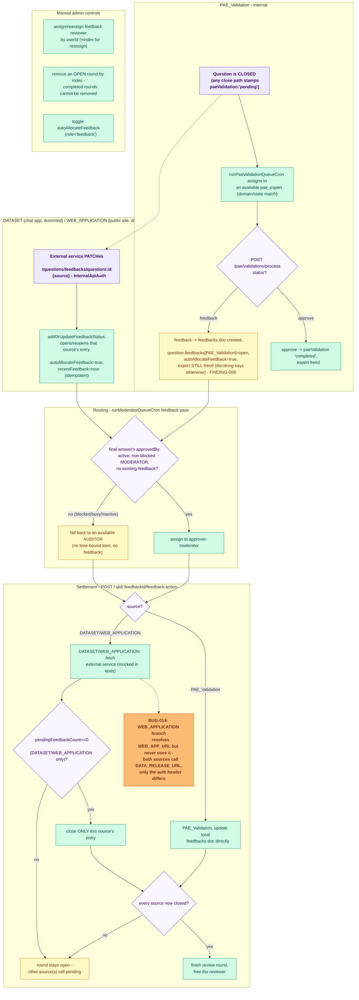

# Feedback Workflow — E2E Test Documentation

**File:** `src/e2e/feedback/Feedback.e2e.test.ts`

**Introduced:** 2026-08-19, as a new suite covering a mechanism that had zero prior e2e coverage.

## What this covers

A CLOSED question can receive feedback from three independent sources, tracked per-source on
`question.feedbacks[]` (`{source, status}`):

| Source | Origin | How it opens |
|--------|--------|---------------|
| `PAE_Validation` | Internal — a real `pae_expert`-role user | Every close path stamps `paeValidation:'pending'`. `runPaeValidationQueueCron` assigns pending questions to available `pae_expert` users. `POST /pae/validations/process` with `status:'feedback'` creates a `feedbacks` collection doc + opens the question's `PAE_Validation` entry. |
| `DATASET` | External — the chat-app's downstream data-release service ("chat app" in the user's framing) | `PATCH /questions/feedbacks/question/:questionId` (`InternalApiAuth`) with `{source:'DATASET'}`. Dummied here by calling that internal webhook directly, since the chat app itself is out of this backend's scope. |
| `WEB_APPLICATION` | External — the public web app ("general public site") | Same webhook, `{source:'WEB_APPLICATION'}`. Also dummied. |

**Routing** (`QuestionService.runModeratorQueueCron`'s "feedback pass", ~`QuestionService.ts:7245`):
an open feedback is a time-bound item competing for the moderator's single slot. Target = the
final answer's `approvedBy` moderator IF active, non-blocked, role=`moderator`, and not already
holding a feedback; **else** an available auditor (`role='auditor'`, no time-bound item, no
existing feedback) — this is the "moderator busy → auditor" fallback.

**Settlement** (`POST /:questionId/:feedbackId/feedback-action` → `handleFeedbackAction`): for
`PAE_Validation` it updates the local `feedbacks` collection doc directly. For
`DATASET`/`WEB_APPLICATION` it calls OUT to an external service and only closes the source
locally once that response reports `pendingFeedbackCount <= 0`. A question is released from
feedback (reviewer's `feedbacksAssigned` cleared, review round finished) only once **every** open
source is closed — a question can have all 3 sources open at once.

**Manual admin controls**: `assignFeedbackReviewerManually` / `removeFeedbackReviewer` (one-at-a-
time claim rules mirroring the cron) and the `autoAllocateFeedback` toggle
(`PATCH /:questionId/role-allocation {role:'feedback'}`).

**Not covered here:** the paginated feedback DISPLAY endpoint (`GET /:questionId/feedbacks`,
merging local PAE feedbacks with the external data-release service's DATASET/WEB_APPLICATION
feedback content) and the chatbot-side feedback analytics/report endpoints
(`ChatbotService.getFeedbackUsers`, `getFeedbackByLocation`, dataset listings) — those are
read/reporting surfaces layered on top of this mechanism, not part of the routing/settlement logic
itself. Also not covered: PAE expert domain/state preference MATCHING
(`isQuestionMatchForPaeExpert`) — exercised only incidentally (fixtures carry no preference, so
match-anything).

## Flow diagram

> **To preview this diagram locally:** install the VS Code extension
> **"Markdown Preview Mermaid Support"** then press `Ctrl+Shift+V`.
> Diagrams also render natively on GitHub.

## Strategy

Same in-process harness as `PostAllocation.e2e.test.ts` / `GatekeeperAuditor.e2e.test.ts`: real
Atlas DB from `.env`, `NODE_ENV='development'` (TLS), production DI container, `currentTestUser`
swapped per request (no Firebase), global `InternalApiAuth` via `x-internal-api-key`. `AiService`
is dummied for safety. Roles used here (`pae_expert`/`moderator`/`auditor`/`admin`/`expert`) have
no fixed `.env.test` fixtures beyond the moderator/admin already reused by other suites, so fresh
`RUN_TAG`-tagged users are inserted directly (`gatekeeper-auditor`'s `makeUser` pattern) — this
also gives full control over `isBlocked`/`status`/`feedbacksAssigned` for the routing-fallback
tests, and guarantees a deterministic pool member since the shared DB may hold other real/leftover
moderators and auditors.

The PAE validation cron (`runPaeValidationQueueCron`) sorts pending questions by `createdAt`
ascending and assigns to whichever available `pae_expert` it iterates to first — the identity of
the actual assignee is read back from the DB after the cron runs, not assumed, and the seeded
question's `createdAt` is stamped to the Unix epoch so it is guaranteed the global oldest match
regardless of any other pending PAE validations that may exist in the shared DB.

`handleFeedbackAction`'s outbound call to the external data-release/web-app service isn't behind
an injectable seam (unlike `AiService`), so it's mocked directly via `vi.spyOn(global, 'fetch')`,
scoped per-test with `mockResolvedValueOnce`.

## Findings

### FINDING-009 (documentation-only mismatch, not a functional bug) — `processPaeValidation`'s docstring is stale

Both the service method's own comment (`QuestionService.ts:11186-11188`) and the controller
endpoint's `@OpenAPI` description (`QuestionController.ts:3602-3604`) say a `status:'feedback'`
decision leaves the question "assigned to the PAE expert for further work". The actual
implementation calls `removePaeValidationAssigned` in **both** the `'approve'` and `'feedback'`
branches — the PAE expert is freed either way. The only real difference `'feedback'` makes is that
it additionally opens a `PAE_Validation` feedback entry that later routes to a moderator/auditor.
Pinned in Group 1's `[FINDING-009]` test.

### BUG-014 — `WEB_APPLICATION` feedback settlement is sent to the DATASET service, not the web app

`handleFeedbackAction` (`QuestionService.ts:9945-9995`) resolves `WEB_APP_Url =
process.env.WEB_APP_URL` but never references that variable. Both the `DATASET` and
`WEB_APPLICATION` branches call `fetch(`${dataReleaseUrl}/feedbacks/${feedbackId}/status`, ...)`
— identical URL — and only the `Authorization` header differs (`authKey` vs `webAuthKey`). Any
real public-site (`WEB_APPLICATION`) accept/reject is therefore sent to the chat-app's
data-release service instead of the intended web app backend. Pinned in Group 4's `[BUG-014]`
test, which asserts the actual (buggy) URL so the suite documents current behavior rather than
silently passing on a wrong assumption. Not fixed here — QA-only role.

## Test cases (23 total, all passing)

| # | Group | What | Expected |
|---|-------|------|----------|
| 1 | PAE_Validation | `runPaeValidationQueueCron` assigns an ancient pending question | question `paeValidation='in-progress'`, submission gets a `paeValidation[]` entry, expert's `paeValidationAssigned` contains the question |
| 2 | PAE_Validation | `[FINDING-009]` PAE expert submits `status='feedback'` | `feedbacks` doc created (`type:'PAE_VALIDATION'`, `status:'open'`), `question.feedbacks[PAE_Validation]` open, `autoAllocateFeedback=true`, `paeValidation='completed'`, expert freed despite the docstring |
| 3 | Routing | active, free approver-moderator | gets the feedback assigned directly (`feedbackReviews[0].reviewerId === approver`) |
| 4 | Routing | `isBlocked=true` approver-moderator | falls back to an available auditor |
| 5 | Routing | approver-moderator already holding another feedback (`feedbacksAssigned` non-empty) | falls back to an available auditor |
| 6 | Routing | approver-moderator `status='in-active'` | falls back to an available auditor |
| 7 | DATASET/WEB_APPLICATION | missing/invalid `x-internal-api-key` on the intake webhook | 401 |
| 8 | DATASET/WEB_APPLICATION | `PATCH /feedbacks/question/:id {source:'DATASET'}` (simulated chat-app feedback) | opens the source, `autoAllocateFeedback=true`, `recentFeedback` stamped, routes to approver-moderator via the cron |
| 9 | DATASET/WEB_APPLICATION | same webhook with `{source:'WEB_APPLICATION'}` (simulated public-site feedback) | opens the source the same way |
| 10 | DATASET/WEB_APPLICATION | re-notifying an already-open DATASET source | idempotent — reopens the same entry, never duplicates it |
| 11 | Settlement | PAE_Validation accept (single source) | local `feedbacks` doc → `status:'accept'`, question source entry `closed`, review round `finishedAt` set, reviewer freed |
| 12 | Settlement | DATASET accept, external service reports `pendingFeedbackCount:0` | source closed, round finished, `fetch` called with `DATA_RELEASE_URL` + `Bearer REVIEW_SYSTEM_AUTH_KEY` |
| 13 | Settlement | DATASET reject, external service reports `pendingFeedbackCount:3` | source stays `open`, round stays open, reviewer still assigned |
| 14 | Settlement | `[BUG-014]` WEB_APPLICATION accept | `fetch` called with `DATA_RELEASE_URL` (not `WEB_APP_URL`) + `Bearer WEB_WEBHOOK_API_KEY` |
| 15 | Settlement | question with `PAE_Validation` AND `DATASET` both open | closing one alone leaves the round open (other source still open); closing both finishes the round and frees the reviewer |
| 16 | Manual admin | assign a reviewer to a waiting (unassigned) feedback | round opened, reviewer's `feedbacksAssigned` updated |
| 17 | Manual admin | reassign an open round to a different reviewer by index | round repointed, old reviewer released |
| 18 | Manual admin | assign a reviewer once the feedback is already fully closed | 400 "This feedback is already closed." |
| 19 | Manual admin | remove an open round | round removed, reviewer released |
| 20 | Manual admin | remove a COMPLETED round | 400 "A completed feedback review cannot be removed." |
| 21 | Manual admin | toggle `autoAllocateFeedback` OFF then ON (`role='feedback'`) | OFF: cron's auto-only pass skips the question; ON: cron picks it up |
| 22 | Read endpoints | `GET /feedback/queue-details` + `/feedback/reviewers` for a non-expert | 200, expected `FeedbackQueueDetails` shape (`waitingAuto`, `assigned`, ...) |
| 23 | Read endpoints | expert calls `/feedback/queue-details` | 403 |

## Coverage notes

- **Three feedback sources, one routing/settlement mechanism**: `PAE_Validation` is the only
  source with a real internal producer (a genuine `pae_expert` user going through the actual
  cron + submission endpoint); `DATASET`/`WEB_APPLICATION` are external in origin per the
  application's own design (an external data-release / web-app service is the source of truth for
  the feedback content), so per the explicit scoping decision for this suite they're exercised by
  calling the internal intake webhook directly rather than standing up a fake external app.
- **"Moderator busy → auditor" fallback** is tested via three independent unavailability reasons
  (`isBlocked`, existing `feedbacksAssigned`, `status:'in-active'`) rather than one representative
  case, since each is a distinct branch of the `approverEligible` check in
  `QuestionService.ts:7309-7315`.
- **Settlement mocking**: `handleFeedbackAction`'s outbound `fetch` for DATASET/WEB_APPLICATION
  isn't behind an injectable seam, so it's mocked per-test via `vi.spyOn(global, 'fetch')` rather
  than a DI container rebind (the pattern every other suite uses for `AiService`) — this was an
  explicit scoping decision (see session log) given the codebase has no existing precedent for
  raw `fetch` mocking.
- **Not exhaustively covering** the paginated feedback DISPLAY endpoint or chatbot-side feedback
  analytics — those are read/reporting surfaces, not part of the routing/settlement mechanism this
  suite exists to verify (see "What this covers" above).

---

## Last Run

**Date:** 2026-08-19 &nbsp;|&nbsp; **Result:** ✅ all 23 passed &nbsp;|&nbsp; **Duration:** 52.3 s

> ⚠ Vitest only printed 22 of 23 test lines (passing suites are truncated in the output).

| # | Test | Result | Failure reason |
|---|------|:------:|----------------|
| 1 | Feedback — Group 1: PAE_Validation (internal) > runPaeValidationQueueCron assigns an an... | ✅ | — |
| 2 | Feedback — Group 1: PAE_Validation (internal) > [FINDING-009] PAE expert submitting sta... | ✅ | — |
| 3 | Feedback — Group 2: routing (runModeratorQueueCron feedback pass) > an active, free app... | ✅ | — |
| 4 | Feedback — Group 2: routing (runModeratorQueueCron feedback pass) > a BLOCKED approver-... | ✅ | — |
| 5 | Feedback — Group 2: routing (runModeratorQueueCron feedback pass) > an approver-moderat... | ✅ | — |
| 6 | Feedback — Group 2: routing (runModeratorQueueCron feedback pass) > an INACTIVE approve... | ✅ | — |
| 7 | Feedback — Group 3: DATASET / WEB_APPLICATION intake webhook > rejects the internal fee... | ✅ | — |
| 8 | Feedback — Group 3: DATASET / WEB_APPLICATION intake webhook > DATASET webhook (simulat... | ✅ | — |
| 9 | Feedback — Group 3: DATASET / WEB_APPLICATION intake webhook > WEB_APPLICATION webhook ... | ✅ | — |
| 10 | Feedback — Group 3: DATASET / WEB_APPLICATION intake webhook > re-notifying an already-... | ✅ | — |
| 11 | Feedback — Group 4: accept/reject settlement > PAE_Validation accept closes the source,... | ✅ | — |
| 12 | Feedback — Group 4: accept/reject settlement > DATASET accept (external service reports... | ✅ | — |
| 13 | Feedback — Group 4: accept/reject settlement > DATASET reject with pendingFeedbackCount... | ✅ | — |
| 14 | Feedback — Group 4: accept/reject settlement > [BUG-014] WEB_APPLICATION accept still c... | ✅ | — |
| 15 | Feedback — Group 4: accept/reject settlement > a question with PAE_Validation AND DATAS... | ✅ | — |
| 16 | Feedback — Group 5: manual admin controls > admin manually assigns a feedback reviewer ... | ✅ | — |
| 17 | Feedback — Group 5: manual admin controls > admin reassigns an already-open round to a ... | ✅ | — |
| 18 | Feedback — Group 5: manual admin controls > assigning a reviewer is rejected once the f... | ✅ | — |
| 19 | Feedback — Group 5: manual admin controls > admin removes an open feedback-review round... | ✅ | — |
| 20 | Feedback — Group 5: manual admin controls > removing a COMPLETED round is rejected | ✅ | — |
| 21 | Feedback — Group 5: manual admin controls > toggling autoAllocateFeedback OFF then ON (... | ✅ | — |
| 22 | Feedback — Group 6: feedback-tab read endpoints > GET /feedback/queue-details and /feed... | ✅ | — |
