# Gate Keeper / Auditor Workflow — E2E Test Documentation

**File:** `src/e2e/gatekeeper-auditor/GatekeeperAuditor.e2e.test.ts`

**Introduced by:** merge `origin/copy/gatekeeper-auditor-workflow` → `testing-e2e-new` (commit `baeaaedd`), adding the `gate_keeper` and `auditor` roles and the associated triage/finalize workflow.

## What this covers

| Step | Endpoint | What it does |
|------|----------|---------------|
| 1. Push to Auditor | `PUT /api/questions/:questionId` `{status:'auditor_review'}` | Gate Keeper hand-off for a `dynamic`/`duplicate` question. Stamps `auditorReviewType`, audit trail `PUSH_TO_AUDITOR` (comment audit-only). |
| 2. Auditor finalize | `PUT /api/answers` `{questionId, answer, sources}` | Same endpoint as the legacy moderator-closes-a-duplicate flow. `auditorReviewType='dynamic'` → closes `dynamic_closed` ("Notify User"); `'duplicate'` → closes `closed` ("Push to GDB"). A plain `duplicate` question (never routed through the Auditor) still works the same way (back-compat). |
| 3. Cancel Duplicate | `PUT /api/questions/:questionId` `{isDuplicateCancelled:true}` | Gate Keeper reopens a `queue_duplicate` question to `open`; reason/auto-allocate choice recorded in the audit trail only, `CANCEL_DUPLICATE`. |
| 4. Close-propagation | (side-effect of step 2) | Approving/closing any question auto-closes every `queue_duplicate` question referencing it: replicates the final answer, stamps `closedBy:'System'`, clears the moderator assignment, fires each child's own customer webhook. |

**Not covered here:** ingestion-time detection of `queue_duplicate` (`AiService.checkPendingDuplicate`, called from `runDuplicateCheckPipeline`) — see the "GDB pending-duplicate queue" describe blocks in `WhatsAppQuestion.e2e.test.ts` and `AjrasakhaQuestion.e2e.test.ts` instead. This suite seeds terminal/pre-terminal questions directly and only drives the gate-keeper/auditor/close-propagation transitions.

## Flow diagram

> **To preview this diagram locally:** install the VS Code extension
> **"Markdown Preview Mermaid Support"** then press `Ctrl+Shift+V`.
> Diagrams also render natively on GitHub.

```mermaid
%%{init: {'flowchart': {'nodeSpacing': 50, 'rankSpacing': 60}}}%%
flowchart TD
  classDef entry  fill:#ede9fe,stroke:#7c3aed,color:#3b0764,font-weight:bold
  classDef ok     fill:#d1fae5,stroke:#059669,color:#064e3b
  classDef warn   fill:#fef9c3,stroke:#d97706,color:#78350f
  classDef err    fill:#fee2e2,stroke:#dc2626,color:#7f1d1d
  classDef decide fill:#faf5ff,stroke:#7c3aed,color:#3b0764
  classDef tb     fill:#fce7f3,stroke:#db2777,color:#831843
  classDef fail   fill:#fdba74,stroke:#ea580c,color:#7c2d12,font-weight:bold

  START["Question already 'dynamic' or 'duplicate'
  (or, via the ingestion pipeline, already
  'queue_duplicate' - see WhatsApp/Ajrasakha docs)"]:::entry

  subgraph GK["1 - Gate Keeper - Push to Auditor - PUT /questions/:id {status:'auditor_review'}"]
    G1{"prevQuestion.status?"}:::decide
    G2["dynamic -> auditorReviewType='dynamic'"]:::ok
    G3["duplicate -> auditorReviewType='duplicate'"]:::ok
    G4["KNOWN GAP: ANY other prior status (e.g. 'open')
    is silently accepted too -> mislabeled
    auditorReviewType='duplicate' by default
    (no transition-validation anywhere) - FINDING-004"]:::fail
    G5["stamps auditorReviewType, PUSH_TO_AUDITOR
    audit trail (comment is audit-only,
    not persisted on the question)"]:::ok
    G6["KNOWN GAP: NO role check on this endpoint -
    only @UseBefore(FlexibleAuth). Any authenticated
    non-tester role (e.g. 'expert') can call it -
    frontend-only enforcement - FINDING-002"]:::fail
    START --> G1
    G1 -- dynamic --> G2 --> G5
    G1 -- duplicate --> G3 --> G5
    G1 -- "anything else" --> G4 --> G5
    G5 -.-> G6
  end

  G5 --> AUDIT_REVIEW["status = 'auditor_review'"]:::entry

  subgraph AUD["2 - Auditor finalize - PUT /answers"]
    A1{"answerId in
    request body?"}:::decide
    A2["no answerId -> 'create new answer' fast-path
    (this is the ONLY way to finalize
    an auditor_review question)"]:::ok
    A3["answerId of an EXISTING answer
    -> reroutes to the 'normal approval flow'
    which only accepts status in-review/pae_submitted
    -> 400 for auditor_review (documented, not a bug,
    FINDING-006: a pre-existing draft can never be
    approved through this path)"]:::warn
    A4{"answerId well-formed
    but no such document?"}:::decide
    A5["BUG: AnswerRepository.getById does
    answer._id BEFORE the ?. check on a null
    result -> TypeError -> re-wrapped as
    InternalServerError -> 500 instead of a
    clean 400 'answer not found' - FINDING-005"]:::fail
    A6{"auditorReviewType?"}:::decide
    A7["'dynamic' -> closes 'dynamic_closed'
    webhook status='dynamic_closed'
    'Notify User' - isCustomerNotified=true"]:::ok
    A8["'duplicate' -> closes 'closed'
    webhook status='closed' via Browser channel
    'Push to GDB'"]:::ok
    A9["BUG: closes via questionRepo.updateQuestion
    directly, bypassing QuestionService.updateQuestion
    -> isClosed stays undefined, not true, even though
    a matching unit test asserts it IS true in isolation
    - FINDING-001"]:::fail
    A10["plain 'duplicate'/'dynamic' question
    (never pushed through Gate Keeper)
    -> same closing behaviour (back-compat)"]:::ok
    A11["KNOWN GAP: role check is a BLACKLIST of
    role==='expert' only - 'call_agent' (no business
    reason to finalize) also passes - extends
    FINDING-002"]:::fail

    AUDIT_REVIEW --> A1
    A1 -- no --> A2 --> A4
    A1 -- "yes (existing)" --> A3
    A4 -- "exists" --> A6
    A4 -- "missing" --> A5
    A6 -- dynamic --> A7 --> A9
    A6 -- duplicate --> A8
    A10 -.-> A6
    A2 -.-> A11
  end

  subgraph CANCEL["3 - Gate Keeper - Cancel Duplicate - PUT /questions/:id {isDuplicateCancelled:true}"]
    C1["queue_duplicate question"]:::entry
    C2["status forced to 'open' UNCONDITIONALLY -
    no check that prior status was actually
    queue_duplicate - FINDING-003 (documented,
    not confirmed harmful, but unguarded)"]:::warn
    C3["reason / auto-allocate choice recorded
    in audit trail only, action=CANCEL_DUPLICATE"]:::ok
    C4["KNOWN GAP: same missing role check as
    Push to Auditor (FINDING-002) - any
    non-tester role can cancel directly"]:::fail
    C1 --> C2 --> C3
    C2 -.-> C4
  end

  subgraph CLOSE["4 - Close-propagation - side-effect of Auditor finalize (step 2)"]
    P1["Approve/close a parent question
    that has queue_duplicate children
    referencing it (via referenceQuestionId)"]:::entry
    P2["for EACH queue_duplicate child:
    replicate the final answer
    closedBy='System', moderator assignment cleared
    fires the child's OWN customer webhook
    (own messageId/threadId)"]:::tb
    P3["BUG: child status is hardcoded to plain
    'closed' regardless of what the PARENT closed
    as - if parent closed 'dynamic_closed', the
    child still becomes 'closed' - status mismatch
    - FINDING-007"]:::fail
    P4["unrelated queue_duplicate questions
    (different parent) are left untouched"]:::ok
    A7 -.-> P1
    A8 -.-> P1
    A9 -.-> P1
    P1 --> P2 --> P3
    P1 -.-> P4
  end
```



## Strategy

Same in-process harness as `PostAllocation.e2e.test.ts` / `ManualAllocation.e2e.test.ts`: real Atlas DB from `.env`, `NODE_ENV='development'` (TLS), production DI container via `loadAppModules('all')`, `currentTestUser` swapped per request (no Firebase token exchange), global `InternalApiAuth` via `x-internal-api-key`.

**New for this suite:**
- No `.env.test` fixtures exist for `gate_keeper`/`auditor` — real user docs are inserted directly in `beforeAll` (`RUN_TAG`-tagged, cleaned up in `afterAll`) instead of reused from an existing pool.
- `#root/modules/answer/utils/triggerWebhook.js` is `vi.mock`'d (unlike the other suites, which let the real — likely failing — fetch happen) so the exact payload sent to each question's customer (status / messageId / threadId) can be asserted directly, which matters here because close-propagation fires one webhook per child question.

## Findings

### FINDING-001 — `dynamic_closed` questions never get `isClosed=true` in the real flow

`QuestionService.updateQuestion` has a branch (added by this merge) that stamps `isClosed=true` + `closedAt` when `updates.status === 'dynamic_closed'`, and `dynamicClosed.test.ts` (unit test) exercises exactly that branch in isolation.

However, the real "Notify User" action never goes through `QuestionService.updateQuestion`. `AnswerService.approveAnswer` (the actual handler behind `PUT /answers`) closes the question by calling `questionRepo.updateQuestion(...)` **directly**, bypassing `QuestionService.updateQuestion` entirely, and it never sets `isClosed` itself (only `status` and `closedAt`, which it does set explicitly).

**Effect:** in production, a question closed via the Auditor's "Notify User" button ends up with `status: 'dynamic_closed'`, `closedAt` set, but `isClosed: undefined` — not `true`. The unit test's green result doesn't reflect the behavior of the code path actually wired to the UI action.

Pinned in the test `Auditor — Notify User ... > closes a dynamic auditor_review question as dynamic_closed, stamps closedAt, and notifies the customer with status=dynamic_closed` — asserts `q.isClosed` is `undefined`, not `true`.

Not fixed (QA-only role) — if this needs fixing, either add the `isClosed` stamp directly in `AnswerService.approveAnswer`'s close-question update object, or route that close through `QuestionService.updateQuestion` instead of `questionRepo.updateQuestion` directly.

### FINDING-002 (KNOWN GAP) — No backend role guard on Gate Keeper actions

`PUT /api/questions/:questionId` only has `@UseBefore(FlexibleAuth)` — no role check restricts who may set `status:'auditor_review'` or `isDuplicateCancelled:true`. The frontend hides these buttons behind `currentUser.role === 'gate_keeper'`, but any authenticated non-tester role (confirmed with `expert`, the least-privileged role in the app) can call them directly and succeed.

By contrast, `PUT /api/answers` (the Auditor-finalize step) **does** have a role check — `AnswerService.approveAnswer` throws `UnauthorizedError` for `role==='expert'` — so only the Gate-Keeper-side question-update actions are affected, not the Auditor-finalize step.

Pinned in the `[KNOWN GAP] no backend role guard on Gate Keeper / Auditor actions` describe block. Not fixed — would need an `@Authorized(['gate_keeper', 'moderator', 'admin'])`-style guard (or an in-body role check) on the `auditor_review` and `isDuplicateCancelled` branches of `QuestionController.updateQuestion`.

### FINDING-003 (documented, not a bug) — Cancel Duplicate has no precondition on current status

The `isDuplicateCancelled === true` branch in `QuestionController.updateQuestion` sets `status: 'open'` unconditionally, without first checking the question is actually `queue_duplicate`. Confirmed: cancelling on an already-`closed` question silently reopens it. Not necessarily wrong (there may be no other place `isDuplicateCancelled` is ever sent from besides the one queue_duplicate button), but noted so it isn't assumed to be guarded.

### FINDING-004 (KNOWN GAP) — Push to Auditor has NO precondition on current status either

Unlike FINDING-003 (which is on the same controller but the Cancel Duplicate branch), Push to Auditor is *worse*: `QuestionController.updateQuestion`'s `auditor_review` branch derives `auditorReviewType` via `prevQuestion?.status === 'dynamic' ? 'dynamic' : 'duplicate'` (line ~1435-1436) — there's no check that the question was actually `dynamic` or `duplicate` at all. Any other prior status (`open`, `closed`, `answered`, ...) is silently accepted and pushed to `auditor_review`, mislabeled `auditorReviewType: 'duplicate'` by default. `QuestionVaidators.ts` only enum-validates the final `status` value, not the transition; `QuestionService.updateQuestion` has no transition-validation logic either.

Pinned in `Gate Keeper — Push to Auditor > [KNOWN GAP] pushes a question to auditor_review from an unrelated prior status (open)...`. Not fixed — would need a check that `prevQuestion.status` is one of `('dynamic','duplicate')` before allowing the transition.

### FINDING-005 (BUG) — `PUT /answers` with a non-existent `answerId` 500s instead of 400

Found while probing what happens when the Auditor tries to finalize by pointing at an existing answer. `AnswerRepository.getById` (`src/shared/database/providers/mongo/repositories/AnswerRepository.ts:177-191`) does:
```ts
const answer = await this.AnswerCollection.findOne({_id: new ObjectId(answerId)}, {session});
return { ...answer, _id: answer._id?.toString(), ... };
```
When the Mongo lookup returns `null` (well-formed ObjectId, no such document), `answer._id` is evaluated **before** the `?.` — that's `null._id`, which throws `TypeError: Cannot read properties of null (reading '_id')`. The optional chaining is one property too late (`answer?._id` would have been safe). The repo's own catch block re-wraps it as `InternalServerError('Failed to fetch answers, More/ ' + error)`, which `AnswerController.approveAnswer` re-throws unchanged (it only intercepts `InternalServerError` to preserve it, everything else becomes a 400) — so the caller sees a 500, not a clean 400 "answer not found".

**Effect:** any client of `PUT /answers` (not gate-keeper/auditor-specific — this is a general answer-approval bug) that sends a stale/deleted/typo'd `answerId` gets an opaque 500 instead of a validation error.

Pinned in `Auditor — Notify User ... > [BUG] PUT /answers with a well-formed but non-existent answerId 500s instead of a clean 400`. Not fixed (QA-only role) — the fix is a one-line reorder: `answer?._id?.toString()` (and guard the whole spread — spreading a `null` silently produces `{_id: undefined, ...}` with no other fields, which would then fail differently downstream).

### FINDING-006 (documented, not a bug) — an *existing* answerId can never finalize an `auditor_review` question

Sending an `answerId` that DOES exist reroutes the request past the duplicate/dynamic/auditor_review "create a new answer" fast-path (that branch explicitly requires `!answerId`) into the "normal approval flow", which only accepts `question.status` of `'in-review'`/`'pae_submitted'` — so it rejects `auditor_review` with a 400. In practice this means the Auditor-finalize UI action can only ever create a brand-new final answer from the typed text, never approve a pre-existing draft answer. Noted so it isn't mistaken for a supported path if a future UI change tries to reuse an existing answer.

Pinned in `Auditor — Notify User ... > [documented] rejects PUT /answers with an existing answerId on an auditor_review question`.

### FINDING-007 (documented, not fixed) — close-propagation always closes children as plain `closed`, never `dynamic_closed`

The child-close code in `AnswerService.approveAnswer` (~line 2092) hardcodes `status: 'closed'` for every `queue_duplicate` child, regardless of what the **parent** actually closed as. When the parent is a `dynamic` question (closes `dynamic_closed`), its children still end up plain `closed` — a status mismatch between the parent and the replica that received the exact same answer content.

Pinned in `Close-propagation ... > [FINDING] when the parent closes as dynamic_closed, its queue_duplicate children still close as plain closed (status mismatch)`.

### Extends FINDING-002 — the missing role check isn't gate_keeper/auditor-specific

`AnswerService.approveAnswer`'s role check (line ~1797) is a **blacklist of only `role==='expert'`** — every other role, including `call_agent` (a role with no obvious business reason to finalize/close questions), is let through `PUT /answers` too. Confirmed directly rather than just inferred from the code. Pinned in `[KNOWN GAP] no backend role guard ... > [KNOWN GAP] a call_agent user (not auditor/moderator/admin) can also finalize via PUT /answers`.

## Test cases (17 total, all passing)

| # | Group | What | Expected |
|---|-------|------|----------|
| 1 | Push to Auditor | `dynamic` → `auditor_review` | `auditorReviewType='dynamic'`, `PUSH_TO_AUDITOR` audit trail, comment not persisted on the question |
| 2 | Push to Auditor | `duplicate` → `auditor_review` | `auditorReviewType='duplicate'` |
| 3 | Push to Auditor | `[KNOWN GAP]` `open` → `auditor_review` | 200, silently mislabeled `auditorReviewType='duplicate'` (FINDING-004) |
| 4 | Auditor finalize | `auditor_review`+dynamic → `PUT /answers` | `dynamic_closed`, `closedAt` set, webhook `status='dynamic_closed'`, `isCustomerNotified=true`; `isClosed` **undefined** (FINDING-001) |
| 5 | Auditor finalize | `auditor_review`+duplicate → `PUT /answers` | `closed`, webhook `status='closed'` via Browser channel |
| 6 | Auditor finalize | plain `duplicate` (never pushed) → `PUT /answers` | `closed` (back-compat) |
| 7 | Auditor finalize | plain `dynamic` (never pushed) → `PUT /answers` | `dynamic_closed`, webhook `status='dynamic_closed'` (back-compat, symmetric to #6) |
| 8 | Auditor finalize | `[BUG]` `auditor_review` + non-existent `answerId` → `PUT /answers` | 500 `InternalServerError` instead of 400 (FINDING-005) |
| 9 | Auditor finalize | `[documented]` `auditor_review` + an *existing* `answerId` → `PUT /answers` | 400, unchanged (FINDING-006) |
| 10 | Cancel Duplicate | `queue_duplicate` → cancel | `open`, `isDuplicateCancelled=true`, `isAutoAllocate` per body, `CANCEL_DUPLICATE` audit trail |
| 11 | Cancel Duplicate | `[KNOWN GAP]` cancel on a `closed` question | silently reopens to `open` (FINDING-003) |
| 12 | Close-propagation | approve a `duplicate` parent with 2 `queue_duplicate` children (WHATSAPP + AJRASAKHA) + 1 unrelated `queue_duplicate` (different parent) | both children `closed`/`closedBy='System'`/answer replicated/own webhook fired with own messageId/threadId; unrelated child untouched |
| 13 | Close-propagation | `[FINDING]` approve a `dynamic` parent (closes `dynamic_closed`) with 1 `queue_duplicate` child | parent `dynamic_closed`; child still plain `closed` (FINDING-007) |
| 14 | KNOWN GAP | `expert` pushes to auditor directly | 200 (FINDING-002) |
| 15 | KNOWN GAP | `expert` cancels a duplicate directly | 200 (FINDING-002) |
| 16 | KNOWN GAP contrast | `expert` tries `PUT /answers` | 400 (role guard exists here, unlike the questions endpoint) |
| 17 | KNOWN GAP | `call_agent` (not gate_keeper/auditor/moderator/admin) finalizes via `PUT /answers` | 200 (extends FINDING-002 — blacklist is `expert`-only, not a role allow-list) |

## Coverage notes

- **Ingestion-time `queue_duplicate` detection** (`AiService.checkPendingDuplicate`) is intentionally covered in `WhatsAppQuestion.e2e.test.ts` / `AjrasakhaQuestion.e2e.test.ts` instead of here, matching this repo's existing convention of splitting ingestion-time behavior from later-stage workflow behavior (e.g. allocation lives in `ManualAllocation.e2e.test.ts` / `AutoAllocation.e2e.test.ts`, review/approval in `PostAllocation.e2e.test.ts`). This suite owns everything from `auditor_review` onward. No restructuring needed — the split mirrors how every other multi-stage question flow in this codebase is already tested.
- **Role coverage is deliberately broad, not exhaustive**: `USER_ROLES` (`src/shared/constants/roles.ts`) also includes `pae_expert`, `district_coordinator`, `block_coordinator`, `village_volunteer` — none of these are separately tested here, since FINDING-002 and its extension already establish that literally *any* non-tester role passes both endpoints (there is no allow-list anywhere in `src/`, confirmed by a full-codebase grep for `gate_keeper`/`auditor` role-string references — none exist outside this file, `roles.ts`, and audit-trail actor metadata). Testing every remaining role would be redundant given the check is a blacklist, not a matrix.
- **Not covered, and out of scope for an e2e suite**: exhaustive combinations of `auditorReviewType` values with all possible prior `status` values (FINDING-004 shows the acceptance is unconditional, so further combinations wouldn't reveal new behavior, only restate the same missing check).

## Last Run

**Date:** 2026-07-01 | **Result:** ✅ all 17 passed | **Duration:** ~23 s (up from 11 tests / ~19s)

Full e2e suite run alongside `WhatsAppQuestion.e2e.test.ts` / `AjrasakhaQuestion.e2e.test.ts` (which own the ingestion-time `queue_duplicate` coverage) confirmed no regressions from the 6 added test cases.
