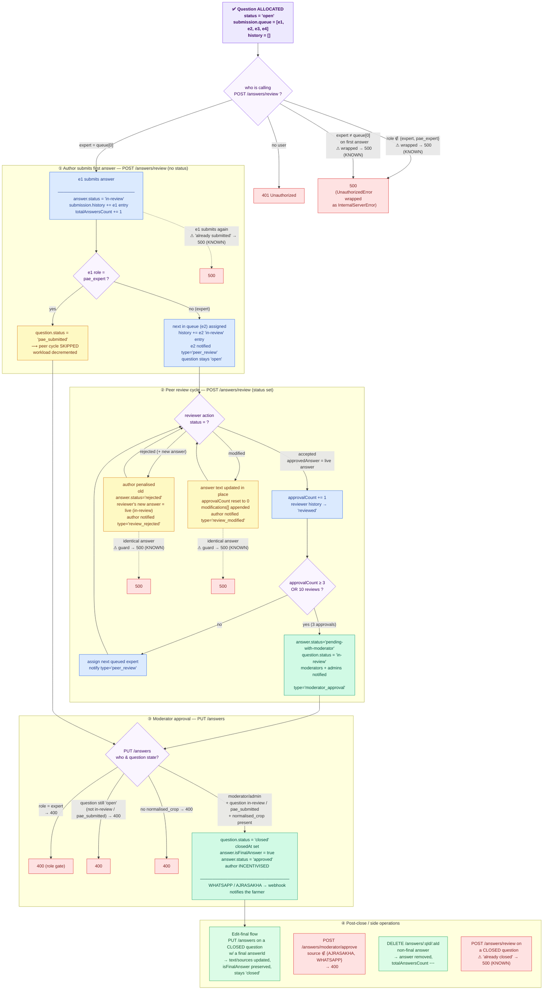

# Post-Allocation Review Workflow — E2E Test Flow

Covers `PostAllocation.e2e.test.ts` (**24 tests**). This suite begins where
allocation ends — a question whose submission already has a populated `queue`
(manual allocation → `ManualAllocation.e2e.test.ts`, auto allocation →
`QuestionAutoAllocation.e2e.test.ts`) — and drives it through the full
expert peer-review → moderator-approval state machine.

> **To preview this diagram locally:** install the VS Code extension
> **"Markdown Preview Mermaid Support"** then press `Ctrl+Shift+V`.
> It also renders natively on GitHub.

---



---

## The reviewAnswer error-mapping quirk (KNOWN)

`AnswerService.reviewAnswer` wraps its **entire** body in a `try/catch` and
rethrows every error as `InternalServerError`. The controller then re-throws
`InternalServerError` as HTTP **500**. So *every* failure inside the peer-review
endpoint (wrong role, wrong reviewer, duplicate submission, identical-answer
guard, closed question…) surfaces as **500** — never 400/401/403.

`approveAnswer` (PUT `/answers`) does **not** have this quirk: its role/state
guards correctly surface as **400**.

These are pinned as expected results in the suite and flagged `KNOWN`.

---

## Coverage table

| # | Scenario | Endpoint | Expected |
|---|----------|----------|:--------:|
| 1 | No user logged in | `POST /answers/review` | 401 |
| 2 | Moderator tries to author/review | `POST /answers/review` | 500 (KNOWN) |
| 3 | Expert not at `queue[0]` submits first | `POST /answers/review` | 500 (KNOWN) |
| 4 | `queue[0]` submits first answer → in-review, `queue[1]` assigned | `POST /answers/review` | 201 |
| 5 | Same author submits twice | `POST /answers/review` | 500 (KNOWN) |
| 6 | `queue[1]` accepts → approvalCount 1, `queue[2]` assigned | `POST /answers/review` | 201 |
| 7 | `queue[2]` accepts → approvalCount 2, `queue[3]` assigned | `POST /answers/review` | 201 |
| 8 | `queue[3]` accepts → 3 approvals → question `in-review` | `POST /answers/review` | 201 |
| 9 | Expert attempts final approval | `PUT /answers` | 400 |
| 10 | Moderator approves → `closed`, final answer, author incentivised | `PUT /answers` | 200 |
| 11 | Add answer to a closed question | `POST /answers/review` | 500 (KNOWN) |
| 12 | Reject with identical answer | `POST /answers/review` | 500 (KNOWN) |
| 13 | Reject with new answer → old rejected, author penalised, notified | `POST /answers/review` | 201 |
| 14 | Author notified `review_rejected` | (DB) | ✓ |
| 15 | Modify with identical answer | `POST /answers/review` | 500 (KNOWN) |
| 16 | Modify → text updated in place, approvalCount reset 0 | `POST /answers/review` | 201 |
| 17 | Author notified `review_modified` | (DB) | ✓ |
| 18 | Approve when question still `open` | `PUT /answers` | 400 |
| 19 | Approve when no `normalised_crop` | `PUT /answers` | 400 |
| 20 | LLM approve with non AJRASAKHA/WHATSAPP source | `POST /answers/moderator/approve` | 400 |
| 21 | Edit already-finalised answer on closed question | `PUT /answers` | 200 |
| 22 | PAE expert submits → `pae_submitted` (peer skipped)¹ | `POST /answers/review` | 201 |
| 23 | Moderator approves a `pae_submitted` question → `closed`¹ | `PUT /answers` | 200 |
| 24 | Delete non-final answer → removed, count decremented | `DELETE /answers/:qId/:aId` | 200 |

¹ PAE cases self-`skip()` if no `pae_expert` user exists in the DB.

---

## How to run

```bash
# From backend/  (~19 s against the real Atlas DB in .env)
pnpm exec vitest run src/e2e/post-allocation/PostAllocation.e2e.test.ts
```

The suite seeds every question it needs (tagged `E2E_PA_<ts>`) and deletes all
seeded questions, submissions, answers, reviews and notifications in `afterAll`.
