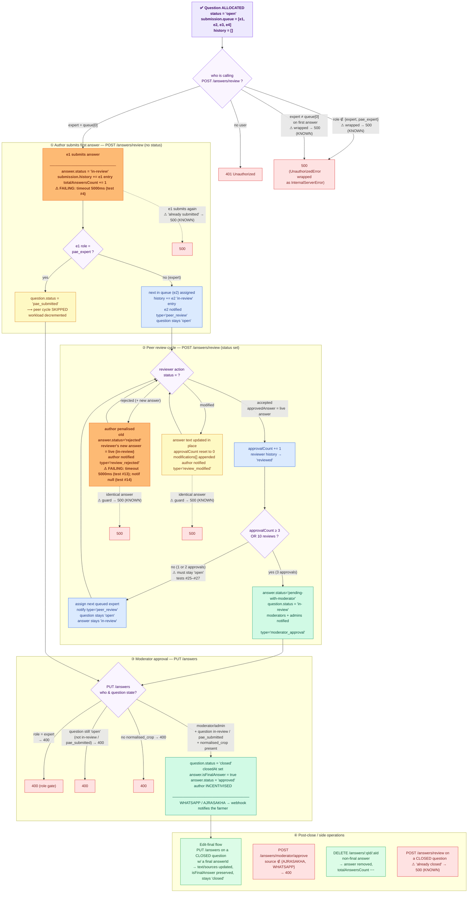

# Post-Allocation Review Workflow — E2E Test Flow

Covers `PostAllocation.e2e.test.ts` (**24 tests**). This suite begins where
allocation ends — a question whose submission already has a populated `queue`
(manual allocation → `ManualAllocation.e2e.test.ts`, auto allocation →
`QuestionAutoAllocation.e2e.test.ts`) — and drives it through the full
expert peer-review → moderator-approval state machine.

> **To preview this diagram locally:** install the VS Code extension
> **"Markdown Preview Mermaid Support"** then press `Ctrl+Shift+V`.
> It also renders natively on GitHub.

---



---

## The reviewAnswer error-mapping quirk (KNOWN)

`AnswerService.reviewAnswer` wraps its **entire** body in a `try/catch` and
rethrows every error as `InternalServerError`. The controller then re-throws
`InternalServerError` as HTTP **500**. So *every* failure inside the peer-review
endpoint (wrong role, wrong reviewer, duplicate submission, identical-answer
guard, closed question…) surfaces as **500** — never 400/401/403.

`approveAnswer` (PUT `/answers`) does **not** have this quirk: its role/state
guards correctly surface as **400**.

These are pinned as expected results in the suite and flagged `KNOWN`.

---

## Coverage table

| # | Scenario | Endpoint | Expected |
|---|----------|----------|:--------:|
| 1 | No user logged in | `POST /answers/review` | 401 |
| 2 | Moderator tries to author/review | `POST /answers/review` | 500 (KNOWN) |
| 3 | Expert not at `queue[0]` submits first | `POST /answers/review` | 500 (KNOWN) |
| 4 | `queue[0]` submits first answer → in-review, `queue[1]` assigned | `POST /answers/review` | 201 |
| 5 | Same author submits twice | `POST /answers/review` | 500 (KNOWN) |
| 6 | `queue[1]` accepts → approvalCount 1, `queue[2]` assigned | `POST /answers/review` | 201 |
| 7 | `queue[2]` accepts → approvalCount 2, `queue[3]` assigned | `POST /answers/review` | 201 |
| 8 | `queue[3]` accepts → 3 approvals → question `in-review` | `POST /answers/review` | 201 |
| 9 | Expert attempts final approval | `PUT /answers` | 400 |
| 10 | Moderator approves → `closed`, final answer, author incentivised | `PUT /answers` | 200 |
| 11 | Add answer to a closed question | `POST /answers/review` | 500 (KNOWN) |
| 12 | Reject with identical answer | `POST /answers/review` | 500 (KNOWN) |
| 13 | Reject with new answer → old rejected, author penalised, notified | `POST /answers/review` | 201 |
| 14 | Author notified `review_rejected` | (DB) | ✓ |
| 15 | Modify with identical answer | `POST /answers/review` | 500 (KNOWN) |
| 16 | Modify → text updated in place, approvalCount reset 0 | `POST /answers/review` | 201 |
| 17 | Author notified `review_modified` | (DB) | ✓ |
| 18 | Approve when question still `open` | `PUT /answers` | 400 |
| 19 | Approve when no `normalised_crop` | `PUT /answers` | 400 |
| 20 | LLM approve with non AJRASAKHA/WHATSAPP source | `POST /answers/moderator/approve` | 400 |
| 21 | Edit already-finalised answer on closed question | `PUT /answers` | 200 |
| 22 | PAE expert submits → `pae_submitted` (peer skipped)¹ | `POST /answers/review` | 201 |
| 23 | Moderator approves a `pae_submitted` question → `closed`¹ | `PUT /answers` | 200 |
| 24 | Delete non-final answer → removed, count decremented | `DELETE /answers/:qId/:aId` | 200 |
| 25 | After approvalCount=1: `question.status` is still `'open'` | `POST /answers/review` | `status='open'` |
| 26 | After approvalCount=2: `question.status` is STILL `'open'` (NOT `'in-review'`) | `POST /answers/review` | `status='open'` |
| 27 | After approvalCount=2: no `moderator_approval` notification sent | (DB) | notif absent |

¹ PAE cases self-`skip()` if no `pae_expert` user exists in the DB.

---

---

## Last Test Run Results

### 2026-06-16

**Total:** 27 tests — **25 passed, 2 failed**

Significant improvement over 2026-06-15 (20 passed → 25 passed). The reviewer-rejection
timeout (#13) and its cascades (#14) are resolved. One pre-existing failure (first-answer
timeout #4) persists, and one new regression appeared in the normalised_crop edge case (#19).

| # | Test | Result | Error |
|---|------|--------|-------|
| 1 | 401 when no user is logged in | ✅ | — |
| 2 | Moderator cannot author/review → 500 (KNOWN) | ✅ | — |
| 3 | Expert not at queue[0] cannot submit first answer → 500 (KNOWN) | ✅ | — |
| **4** | **e1 (queue[0]) submits first answer → in-review, e2 assigned** | ❌ **FAIL** | **Timeout 5009ms** — answer IS saved (server completes the write), but response exceeds the 5 s vitest timeout |
| 5 | e1 submits again → 500 (KNOWN: already submitted) | ✅ | Passes because #4's write completed despite timeout |
| 6 | e2 accepts → approvalCount 1, e3 assigned | ✅ | — |
| 7 | e3 accepts → approvalCount 2, e4 assigned | ✅ | — |
| 8 | e4 accepts → 3 approvals → question in-review | ✅ | — |
| 9 | Expert cannot do final approval → 400 | ✅ | — |
| 10 | Moderator approves → question closed, answer finalised | ✅ | — |
| 11 | Add answer to already-closed question → 500 (KNOWN) | ✅ | — |
| 12 | Reject with identical answer → 500 (KNOWN) | ✅ | — |
| 13 | e2 rejects with new answer → author penalised | ✅ | Previously timed out — now resolved |
| 14 | Author notified review_rejected | ✅ | — |
| 15 | Modify with identical answer → 500 (KNOWN) | ✅ | — |
| 16 | e2 modifies → text updated, approvalCount reset | ✅ | — |
| 17 | Author notified review_modified | ✅ | — |
| 18 | Approve when question still open → 400 | ✅ | — |
| **19** | **Approve with no normalised_crop → 400** | ❌ **FAIL** | **2030ms — NEW regression**: returned non-400 status; previously passed |
| 20 | LLM approve with non AJRASAKHA/WHATSAPP source → 400 | ✅ | — |
| 21 | Edit finalised answer on closed question → 200 | ✅ | — |
| 22 | PAE expert submits → `pae_submitted` | ✅ | — |
| 23 | Moderator approves `pae_submitted` → closed | ✅ | — |
| 24 | Delete non-final answer → removed, count decremented | ✅ | — |
| 25 | approvalCount=1: question still `'open'` | ✅ | — |
| 26 | approvalCount=2: question still `'open'` (not `'in-review'`) | ✅ | — |
| 27 | approvalCount=2: no `moderator_approval` notification sent | ✅ | — |

**Open issues (2026-06-16):**

**Test #4 (first-answer timeout):** `handleFirstSubmission` exceeds 5 s. The write completes
server-side (downstream tests pass), so this is likely a slow notification dispatch or push
notification lookup (`No subscription found for user …` appears in stderr). Investigate
`AnswerService.handleFirstSubmission` for blocking awaits on notification paths.

**Test #19 (normalised_crop regression):** `POST /answers/moderator/approve` no longer returns 400
when `question.normalised_crop` is absent. A recent commit (`fix #819` navigation, `fix #814`
account sync) may have altered the crop-normalisation guard in `approveAnswer`. Investigate
`AnswerService.approveAnswer` validation of `normalised_crop`.

---

### 2026-06-15

**Total:** 27 tests — **20 passed, 7 failed**

| # | Test | Result | Error |
|---|------|--------|-------|
| 1 | 401 when no user is logged in | ✅ | — |
| 2 | Moderator cannot author/review → 500 (KNOWN) | ✅ | — |
| 3 | Expert not at queue[0] cannot submit first answer → 500 (KNOWN) | ✅ | — |
| **4** | **e1 (queue[0]) submits first answer → in-review, e2 assigned** | ❌ **FAIL** | **Test timed out in 5000ms** |
| 5 | e1 submits again → 500 (KNOWN: already submitted) | ✅ | — |
| **6** | **e2 accepts → approvalCount 1, e3 assigned** | ❌ FAIL | `expected 400 to be 201` — cascade from #4 |
| **7** | **e3 accepts → approvalCount 2, e4 assigned** | ❌ FAIL | `expected 400 to be 201` — cascade from #4 |
| **8** | **e4 accepts → 3 approvals → question in-review** | ❌ FAIL | `expected 400 to be 201` — cascade from #4 |
| 9 | Expert cannot do final approval → 400 | ✅ | — |
| **10** | **Moderator approves → question closed, answer finalised** | ❌ FAIL | `expected 400 to be 200` — cascade from #4 |
| 11 | Add answer to already-closed question → 500 (KNOWN) | ✅ | — |
| 12 | Reject with identical answer → 500 (KNOWN) | ✅ | — |
| **13** | **e2 rejects with new answer → author penalised** | ❌ FAIL | **Test timed out in 5000ms** |
| **14** | **Author notified review_rejected** | ❌ FAIL | `expected null not to be null` — cascade from #13 |
| 15 | Modify with identical answer → 500 (KNOWN) | ✅ | — |
| 16 | e2 modifies → text updated, approvalCount reset | ✅ | — |
| 17 | Author notified review_modified | ✅ | — |
| 18 | Approve when question still open → 400 | ✅ | — |
| 19 | Approve with no normalised_crop → 400 | ✅ | — |
| 20 | LLM approve with non AJRASAKHA/WHATSAPP source → 400 | ✅ | — |
| 21 | Edit finalised answer on closed question → 200 | ✅ | — |
| 22 | PAE expert submits → `pae_submitted` | ✅ | — |
| 23 | Moderator approves `pae_submitted` → closed | ✅ | — |
| 24 | Delete non-final answer → removed, count decremented | ✅ | — |
| 25 | approvalCount=1: question still `'open'` | ✅ | — |
| 26 | approvalCount=2: question still `'open'` (not `'in-review'`) | ✅ | — |
| 27 | approvalCount=2: no `moderator_approval` notification sent | ✅ | — |

---

## Failing Paths (2026-06-15)

### 1. e1 first-answer submission times out (test #4) — cascades to tests #6-8 and #10

`POST /answers/review` (no status, first submission) hangs and never returns within 5000ms.
Tests #6, #7, #8 subsequently receive **400** (the question's submission state wasn't updated
so e2/e3/e4 are not recognised as the next reviewer) and #10 receives **400** (question never
reached `in-review` status so `approveAnswer` rejects it).

The fact that the modify path (test #16, uses the same endpoint with `status='modified'`) passes
suggests the timeout is specific to the **first-submission branch** (no `status` field, goes
through `handleFirstSubmission`). Investigate `AnswerService.reviewAnswer` → `handleFirstSubmission`
for a hanging await (DB call, AI call, notification write, etc.).

### 2. Reviewer rejection times out (test #13) — cascades to test #14

`POST /answers/review` with `status='rejected'` also hangs.
Notification for `review_rejected` is `null` (test #14) because the submission never completed.
The rejection branch uses `handleReviewerRejection` — investigate that path for a hanging await.
Note: the modify path (`handleReviewerModification`) works fine (test #16 passes), isolating
the timeout to `handleFirstSubmission` and `handleReviewerRejection` specifically.

---

## How to run

```bash
# From backend/  (~19 s against the real Atlas DB in .env)
pnpm exec vitest run src/e2e/post-allocation/PostAllocation.e2e.test.ts
```

The suite seeds every question it needs (tagged `E2E_PA_<ts>`) and deletes all
seeded questions, submissions, answers, reviews and notifications in `afterAll`.

---

## Last Run

**Date:** 2026-06-23 &nbsp;|&nbsp; **Result:** ✅ all 27 passed &nbsp;|&nbsp; **Duration:** 1.0 min

> ⚠ Vitest only printed 22 of 27 test lines (passing suites are truncated in the output).

| # | Test | Result | Failure reason |
|---|------|:------:|----------------|
| 1 | Post-allocation — authorization guards > expert NOT at queue[0] cannot submit the first... | ✅ | — |
| 2 | Post-allocation — happy path (peer review → moderator approval) > e1 (queue[0]) submits... | ✅ | — |
| 3 | Post-allocation — happy path (peer review → moderator approval) > e1 cannot submit a se... | ✅ | — |
| 4 | Post-allocation — happy path (peer review → moderator approval) > e2 accepts → approval... | ✅ | — |
| 5 | Post-allocation — happy path (peer review → moderator approval) > e3 accepts → approval... | ✅ | — |
| 6 | Post-allocation — happy path (peer review → moderator approval) > e4 accepts → 3 approv... | ✅ | — |
| 7 | Post-allocation — happy path (peer review → moderator approval) > expert cannot do the ... | ✅ | — |
| 8 | Post-allocation — happy path (peer review → moderator approval) > moderator approves → ... | ✅ | — |
| 9 | Post-allocation — happy path (peer review → moderator approval) > cannot add an answer ... | ✅ | — |
| 10 | Post-allocation — reviewer rejects the author answer > rejecting with an identical answ... | ✅ | — |
| 11 | Post-allocation — reviewer rejects the author answer > e2 rejects with a new answer → a... | ✅ | — |
| 12 | Post-allocation — reviewer modifies the author answer > modifying with an identical ans... | ✅ | — |
| 13 | Post-allocation — reviewer modifies the author answer > e2 modifies → answer text updat... | ✅ | — |
| 14 | Post-allocation — moderator approval edge cases > approve when question is still "open"... | ✅ | — |
| 15 | Post-allocation — moderator approval edge cases > approve when question has no normalis... | ✅ | — |
| 16 | Post-allocation — moderator approval edge cases > moderator/approve (LLM) rejects a non... | ✅ | — |
| 17 | Post-allocation — moderator approval edge cases > moderator can edit an already-finalis... | ✅ | — |
| 18 | Post-allocation — PAE expert submission > pae_expert submits → question becomes pae_sub... | ✅ | — |
| 19 | Post-allocation — PAE expert submission > moderator approves a pae_submitted question →... | ✅ | — |
| 20 | Post-allocation — delete answer > deleting a non-final answer removes it and decrements... | ✅ | — |
| 21 | Post-allocation — approvalCount=2 does NOT escalate to moderator > after 1 acceptance (... | ✅ | — |
| 22 | Post-allocation — approvalCount=2 does NOT escalate to moderator > after 2 acceptances ... | ✅ | — |
