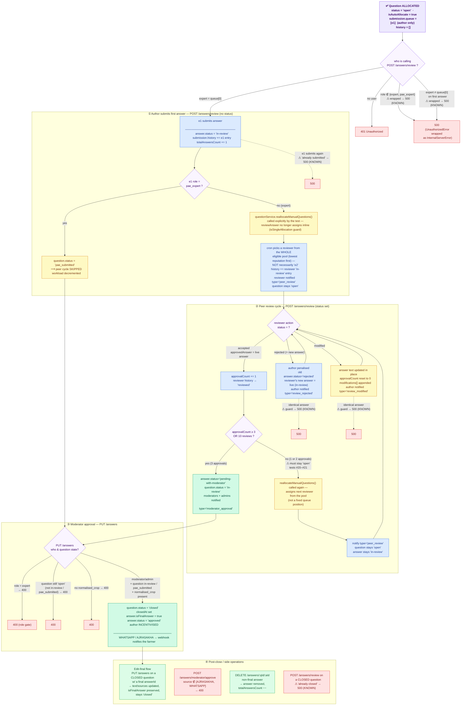

# Post-Allocation Review Workflow — E2E Test Flow

Covers `PostAllocation.e2e.test.ts` (**27 tests**). This suite begins where
allocation ends — a question whose submission already has a populated `queue`
(manual allocation → `ManualAllocation.e2e.test.ts`, auto allocation →
`QuestionAutoAllocation.e2e.test.ts`) — and drives it through the full
expert peer-review → moderator-approval state machine.

> **2026-08-19 architecture change:** `main` extended the single-allocation model
> (previously WHATSAPP/AJRASAKHA only) to also cover OUTREACH/AGRI_EXPERT. Both
> `AnswerService.reviewAnswer`'s inline "assign next reviewer" logic and
> `QuestionService.autoAllocateExperts()`'s bulk fill are now unconditional no-ops for
> these sources (`isSingleAllocation` guard). The next reviewer in the chain is now
> assigned **only** by `questionService.reallocateManualQuestions()` — a cron that mirrors
> the time-bound engine (STF-first for the very first reviewer is not required here since
> this cron's "unallocated" bucket only fires for `firstAllocationAt=null`, and this suite's
> fixtures seed a single author directly; but the *reviewer* slots it fills come from the
> whole eligible-expert pool ordered by lowest reputation, not a fixture-controlled queue).
> Two consequences for this suite:
> - The fixture (`seedAllocatedQuestion`) now seeds `queue: [experts[0]]` (author only) +
>   `isAutoAllocate: true`, not a pre-filled 4-expert queue — the queue grows one member at
>   a time as `reallocateManualQuestions()` is called between steps.
> - Tests can no longer assert *which* expert (`experts[1]`/`[2]`/`[3]`) becomes the next
>   reviewer — only *that* one gets assigned. Each chain test resolves the actual assignee
>   from the DB after calling the cron and stores it in a `reviewer2`/`reviewer3`/`reviewer4`
>   variable for the next step to use.

> **To preview this diagram locally:** install the VS Code extension
> **"Markdown Preview Mermaid Support"** then press `Ctrl+Shift+V`.
> It also renders natively on GitHub.

---


```mermaid
flowchart TD

  classDef entry   fill:#ede9fe,stroke:#7c3aed,color:#3b0764,font-weight:bold
  classDef expert  fill:#dbeafe,stroke:#2563eb,color:#1e3a8a
  classDef mod      fill:#dcfce7,stroke:#16a34a,color:#14532d
  classDef ok      fill:#d1fae5,stroke:#059669,color:#064e3b
  classDef err     fill:#fee2e2,stroke:#dc2626,color:#7f1d1d
  classDef warn    fill:#fef9c3,stroke:#d97706,color:#78350f
  classDef decide  fill:#faf5ff,stroke:#7c3aed,color:#3b0764
  classDef fail    fill:#fdba74,stroke:#ea580c,color:#7c2d12,font-weight:bold

  START["✅ Question ALLOCATED
  status = 'open'  ·  isAutoAllocate = true
  submission.queue = [e1]  (author only)
  history = []"]:::entry

  %% ── AUTHORIZATION GUARDS (POST /answers/review) ──────────────────────
  START --> GUARD{"who is calling
  POST /answers/review ?"}:::decide

  GUARD -- "no user" --> G401["401 Unauthorized"]:::err
  GUARD -- "role ∉ {expert, pae_expert}
  ⚠ wrapped → 500 (KNOWN)" --> G500["500
  (UnauthorizedError wrapped
  as InternalServerError)"]:::err
  GUARD -- "expert ≠ queue[0]
  on first answer
  ⚠ wrapped → 500 (KNOWN)" --> G500

  GUARD -- "expert = queue[0]" --> FIRST

  %% ── FIRST SUBMISSION (no status) ─────────────────────────────────────
  subgraph AUTHOR ["① Author submits first answer  —  POST /answers/review  (no status)"]
    FIRST["e1 submits answer
    ─────────────────────────
    answer.status = 'in-review'
    submission.history += e1 entry
    totalAnswersCount += 1"]:::expert

    FIRST --> PAEQ{"e1 role =
    pae_expert ?"}:::decide

    PAEQ -- "yes" --> PAE["question.status = 'pae_submitted'
    ⟶ peer cycle SKIPPED
    workload decremented"]:::warn

    PAEQ -- "no (expert)" --> CRON1["questionService.reallocateManualQuestions()
    called explicitly by the test —
    reviewAnswer no longer assigns inline
    (isSingleAllocation guard)"]:::warn

    CRON1 --> ASSIGN2["cron picks a reviewer from the WHOLE
    eligible pool (lowest reputation first) —
    NOT necessarily 'e2'
    history += reviewer 'in-review' entry
    reviewer notified  type='peer_review'
    question stays 'open'"]:::expert

    FIRST -. "e1 submits again
    ⚠ 'already submitted' → 500 (KNOWN)" .-> DUP500["500"]:::err
  end

  %% ── PEER REVIEW CYCLE (status set) ───────────────────────────────────
  ASSIGN2 --> REVIEW{"reviewer action
  status = ?"}:::decide

  subgraph PEER ["② Peer review cycle  —  POST /answers/review  (status set)"]

    REVIEW -- "accepted
    approvedAnswer = live answer" --> ACC["approvalCount += 1
    reviewer history → 'reviewed'"]:::expert

    ACC --> ACCQ{"approvalCount ≥ 3
    OR 10 reviews ?"}:::decide
    ACCQ -- "no (1 or 2 approvals)
    ⚠ must stay 'open'
    tests #20–#21" --> NEXTCRON["reallocateManualQuestions() called again —
    assigns next reviewer from the pool
    (not a fixed queue position)"]:::warn
    NEXTCRON --> NEXT["notify type='peer_review'
    question stays 'open'
    answer stays 'in-review'"]:::expert
    NEXT --> REVIEW
    ACCQ -- "yes (3 approvals)" --> READY["answer.status='pending-with-moderator'
    question.status = 'in-review'
    moderators + admins notified
    type='moderator_approval'"]:::ok

    REVIEW -- "rejected (+ new answer)" --> REJ["author penalised
    old answer.status='rejected'
    reviewer's new answer = live (in-review)
    author notified type='review_rejected'"]:::expert
    REJ -. "identical answer
    ⚠ guard → 500 (KNOWN)" .-> RJ500["500"]:::err
    REJ --> REVIEW

    REVIEW -- "modified" --> MOD["answer text updated in place
    approvalCount reset to 0
    modifications[] appended
    author notified type='review_modified'"]:::warn
    MOD -. "identical answer
    ⚠ guard → 500 (KNOWN)" .-> MD500["500"]:::err
    MOD --> REVIEW
  end

  %% ── MODERATOR APPROVAL ───────────────────────────────────────────────
  READY --> MAPPROVE{"PUT /answers
  who & question state?"}:::decide
  PAE --> MAPPROVE

  subgraph MODERATOR ["③ Moderator approval  —  PUT /answers"]
    MAPPROVE -- "role = expert
    → 400" --> M400a["400 (role gate)"]:::err
    MAPPROVE -- "question still 'open'
    (not in-review / pae_submitted) → 400" --> M400b["400"]:::err
    MAPPROVE -- "no normalised_crop → 400" --> M400c["400"]:::err

    MAPPROVE -- "moderator/admin
    + question in-review / pae_submitted
    + normalised_crop present" --> CLOSE["question.status = 'closed'
    closedAt set
    answer.isFinalAnswer = true
    answer.status = 'approved'
    author INCENTIVISED
    ─────────────────────────────
    WHATSAPP / AJRASAKHA → webhook
    notifies the farmer"]:::ok
  end

  %% ── POST-CLOSE OPERATIONS ────────────────────────────────────────────
  subgraph EXTRAS ["④ Post-close / side operations"]
    direction LR
    EDIT["Edit-final flow
    PUT /answers on a CLOSED question
    w/ a final answerId
    → text/sources updated,
    isFinalAnswer preserved,
    stays 'closed'"]:::mod
    LLM["POST /answers/moderator/approve
    source ∉ {AJRASAKHA, WHATSAPP}
    → 400"]:::err
    DEL["DELETE /answers/:qId/:aId
    non-final answer
    → answer removed,
    totalAnswersCount −−"]:::mod
    LATE["POST /answers/review on
    a CLOSED question
    ⚠ 'already closed' → 500 (KNOWN)"]:::err
  end

  CLOSE --> EDIT
```

---

## The reviewAnswer error-mapping quirk (KNOWN)

`AnswerService.reviewAnswer` wraps its **entire** body in a `try/catch` and
rethrows every error as `InternalServerError`. The controller then re-throws
`InternalServerError` as HTTP **500**. So *every* failure inside the peer-review
endpoint (wrong role, wrong reviewer, duplicate submission, identical-answer
guard, closed question…) surfaces as **500** — never 400/401/403.

`approveAnswer` (PUT `/answers`) does **not** have this quirk: its role/state
guards correctly surface as **400**.

These are pinned as expected results in the suite and flagged `KNOWN`.

---

## Coverage table

| # | Scenario | Endpoint | Expected |
|---|----------|----------|:--------:|
| 1 | No user logged in | `POST /answers/review` | 401 |
| 2 | Moderator tries to author/review | `POST /answers/review` | 500 (KNOWN) |
| 3 | Expert not at `queue[0]` submits first | `POST /answers/review` | 500 (KNOWN) |
| 4 | `queue[0]` (e1) submits first answer → in-review, cron assigns next reviewer¹ | `POST /answers/review` + `reallocateManualQuestions()` | 201 |
| 5 | Same author submits twice | `POST /answers/review` | 500 (KNOWN) |
| 6 | Assigned reviewer 2 accepts → approvalCount 1, cron assigns reviewer 3¹ | `POST /answers/review` + `reallocateManualQuestions()` | 201 |
| 7 | Assigned reviewer 3 accepts → approvalCount 2, cron assigns reviewer 4¹ | `POST /answers/review` + `reallocateManualQuestions()` | 201 |
| 8 | Assigned reviewer 4 accepts → 3 approvals → question `in-review` | `POST /answers/review` | 201 |
| 9 | Expert attempts final approval | `PUT /answers` | 400 |
| 10 | Moderator approves → `closed`, final answer, author incentivised | `PUT /answers` | 200 |
| 11 | Add answer to a closed question | `POST /answers/review` | 500 (KNOWN) |
| 12 | Reject with identical answer | `POST /answers/review` | 500 (KNOWN) |
| 13 | Reject with new answer → old rejected, author penalised, notified | `POST /answers/review` | 201 |
| 14 | Author notified `review_rejected` | (DB) | ✓ |
| 15 | Modify with identical answer | `POST /answers/review` | 500 (KNOWN) |
| 16 | Modify → text updated in place, approvalCount reset 0 | `POST /answers/review` | 201 |
| 17 | Author notified `review_modified` | (DB) | ✓ |
| 18 | Approve when question still `open` | `PUT /answers` | 400 |
| 19 | Approve when no `normalised_crop` | `PUT /answers` | 400 |
| 20 | LLM approve with non AJRASAKHA/WHATSAPP source | `POST /answers/moderator/approve` | 400 |
| 21 | Edit already-finalised answer on closed question | `PUT /answers` | 200 |
| 22 | PAE expert submits → `pae_submitted` (peer skipped)² | `POST /answers/review` | 201 |
| 23 | Moderator approves a `pae_submitted` question → `closed`² | `PUT /answers` | 200 |
| 24 | Delete non-final answer → removed, count decremented | `DELETE /answers/:qId/:aId` | 200 |
| 25 | After approvalCount=1: `question.status` is still `'open'` | `POST /answers/review` | `status='open'` |
| 26 | After approvalCount=2: `question.status` is STILL `'open'` (NOT `'in-review'`) | `POST /answers/review` | `status='open'` |
| 27 | After approvalCount=2: no `moderator_approval` notification sent | (DB) | notif absent |

¹ Reviewer identity is not asserted — only that `reallocateManualQuestions()` assigned
*someone* from the eligible pool. See the architecture note at the top of this doc.
² PAE cases self-`skip()` if no `pae_expert` user exists in the DB.

---

---

## Last Test Run Results

### 2026-06-16

**Total:** 27 tests — **25 passed, 2 failed**

Significant improvement over 2026-06-15 (20 passed → 25 passed). The reviewer-rejection
timeout (#13) and its cascades (#14) are resolved. One pre-existing failure (first-answer
timeout #4) persists, and one new regression appeared in the normalised_crop edge case (#19).

| # | Test | Result | Error |
|---|------|--------|-------|
| 1 | 401 when no user is logged in | ✅ | — |
| 2 | Moderator cannot author/review → 500 (KNOWN) | ✅ | — |
| 3 | Expert not at queue[0] cannot submit first answer → 500 (KNOWN) | ✅ | — |
| **4** | **e1 (queue[0]) submits first answer → in-review, e2 assigned** | ❌ **FAIL** | **Timeout 5009ms** — answer IS saved (server completes the write), but response exceeds the 5 s vitest timeout |
| 5 | e1 submits again → 500 (KNOWN: already submitted) | ✅ | Passes because #4's write completed despite timeout |
| 6 | e2 accepts → approvalCount 1, e3 assigned | ✅ | — |
| 7 | e3 accepts → approvalCount 2, e4 assigned | ✅ | — |
| 8 | e4 accepts → 3 approvals → question in-review | ✅ | — |
| 9 | Expert cannot do final approval → 400 | ✅ | — |
| 10 | Moderator approves → question closed, answer finalised | ✅ | — |
| 11 | Add answer to already-closed question → 500 (KNOWN) | ✅ | — |
| 12 | Reject with identical answer → 500 (KNOWN) | ✅ | — |
| 13 | e2 rejects with new answer → author penalised | ✅ | Previously timed out — now resolved |
| 14 | Author notified review_rejected | ✅ | — |
| 15 | Modify with identical answer → 500 (KNOWN) | ✅ | — |
| 16 | e2 modifies → text updated, approvalCount reset | ✅ | — |
| 17 | Author notified review_modified | ✅ | — |
| 18 | Approve when question still open → 400 | ✅ | — |
| **19** | **Approve with no normalised_crop → 400** | ❌ **FAIL** | **2030ms — NEW regression**: returned non-400 status; previously passed |
| 20 | LLM approve with non AJRASAKHA/WHATSAPP source → 400 | ✅ | — |
| 21 | Edit finalised answer on closed question → 200 | ✅ | — |
| 22 | PAE expert submits → `pae_submitted` | ✅ | — |
| 23 | Moderator approves `pae_submitted` → closed | ✅ | — |
| 24 | Delete non-final answer → removed, count decremented | ✅ | — |
| 25 | approvalCount=1: question still `'open'` | ✅ | — |
| 26 | approvalCount=2: question still `'open'` (not `'in-review'`) | ✅ | — |
| 27 | approvalCount=2: no `moderator_approval` notification sent | ✅ | — |

**Open issues (2026-06-16):**

**Test #4 (first-answer timeout):** `handleFirstSubmission` exceeds 5 s. The write completes
server-side (downstream tests pass), so this is likely a slow notification dispatch or push
notification lookup (`No subscription found for user …` appears in stderr). Investigate
`AnswerService.handleFirstSubmission` for blocking awaits on notification paths.

**Test #19 (normalised_crop regression):** `POST /answers/moderator/approve` no longer returns 400
when `question.normalised_crop` is absent. A recent commit (`fix #819` navigation, `fix #814`
account sync) may have altered the crop-normalisation guard in `approveAnswer`. Investigate
`AnswerService.approveAnswer` validation of `normalised_crop`.

---

### 2026-06-15

**Total:** 27 tests — **20 passed, 7 failed**

| # | Test | Result | Error |
|---|------|--------|-------|
| 1 | 401 when no user is logged in | ✅ | — |
| 2 | Moderator cannot author/review → 500 (KNOWN) | ✅ | — |
| 3 | Expert not at queue[0] cannot submit first answer → 500 (KNOWN) | ✅ | — |
| **4** | **e1 (queue[0]) submits first answer → in-review, e2 assigned** | ❌ **FAIL** | **Test timed out in 5000ms** |
| 5 | e1 submits again → 500 (KNOWN: already submitted) | ✅ | — |
| **6** | **e2 accepts → approvalCount 1, e3 assigned** | ❌ FAIL | `expected 400 to be 201` — cascade from #4 |
| **7** | **e3 accepts → approvalCount 2, e4 assigned** | ❌ FAIL | `expected 400 to be 201` — cascade from #4 |
| **8** | **e4 accepts → 3 approvals → question in-review** | ❌ FAIL | `expected 400 to be 201` — cascade from #4 |
| 9 | Expert cannot do final approval → 400 | ✅ | — |
| **10** | **Moderator approves → question closed, answer finalised** | ❌ FAIL | `expected 400 to be 200` — cascade from #4 |
| 11 | Add answer to already-closed question → 500 (KNOWN) | ✅ | — |
| 12 | Reject with identical answer → 500 (KNOWN) | ✅ | — |
| **13** | **e2 rejects with new answer → author penalised** | ❌ FAIL | **Test timed out in 5000ms** |
| **14** | **Author notified review_rejected** | ❌ FAIL | `expected null not to be null` — cascade from #13 |
| 15 | Modify with identical answer → 500 (KNOWN) | ✅ | — |
| 16 | e2 modifies → text updated, approvalCount reset | ✅ | — |
| 17 | Author notified review_modified | ✅ | — |
| 18 | Approve when question still open → 400 | ✅ | — |
| 19 | Approve with no normalised_crop → 400 | ✅ | — |
| 20 | LLM approve with non AJRASAKHA/WHATSAPP source → 400 | ✅ | — |
| 21 | Edit finalised answer on closed question → 200 | ✅ | — |
| 22 | PAE expert submits → `pae_submitted` | ✅ | — |
| 23 | Moderator approves `pae_submitted` → closed | ✅ | — |
| 24 | Delete non-final answer → removed, count decremented | ✅ | — |
| 25 | approvalCount=1: question still `'open'` | ✅ | — |
| 26 | approvalCount=2: question still `'open'` (not `'in-review'`) | ✅ | — |
| 27 | approvalCount=2: no `moderator_approval` notification sent | ✅ | — |

---

## Failing Paths (2026-06-15)

### 1. e1 first-answer submission times out (test #4) — cascades to tests #6-8 and #10

`POST /answers/review` (no status, first submission) hangs and never returns within 5000ms.
Tests #6, #7, #8 subsequently receive **400** (the question's submission state wasn't updated
so e2/e3/e4 are not recognised as the next reviewer) and #10 receives **400** (question never
reached `in-review` status so `approveAnswer` rejects it).

The fact that the modify path (test #16, uses the same endpoint with `status='modified'`) passes
suggests the timeout is specific to the **first-submission branch** (no `status` field, goes
through `handleFirstSubmission`). Investigate `AnswerService.reviewAnswer` → `handleFirstSubmission`
for a hanging await (DB call, AI call, notification write, etc.).

### 2. Reviewer rejection times out (test #13) — cascades to test #14

`POST /answers/review` with `status='rejected'` also hangs.
Notification for `review_rejected` is `null` (test #14) because the submission never completed.
The rejection branch uses `handleReviewerRejection` — investigate that path for a hanging await.
Note: the modify path (`handleReviewerModification`) works fine (test #16 passes), isolating
the timeout to `handleFirstSubmission` and `handleReviewerRejection` specifically.

---

## How to run

```bash
# From backend/  (~19 s against the real Atlas DB in .env)
pnpm exec vitest run src/e2e/post-allocation/PostAllocation.e2e.test.ts
```

The suite seeds every question it needs (tagged `E2E_PA_<ts>`) and deletes all
seeded questions, submissions, answers, reviews and notifications in `afterAll`.

---

## Timeout note (added 2026-08-25)

A full-suite run on 2026-08-24 (as part of an unrelated e2e coverage pass
across the rest of the backend) surfaced 2 failures here — both cascading from
the "the assigned reviewer rejects with a new answer" test timing out at
vitest's 5000ms default (the second failing test just reads a notification
that test writes). An isolated re-run passed cleanly, and manual-allocation's
identical failure mode (same root cause: a real `POST` + notification write
occasionally pushing past 5s under current Atlas latency) confirmed this
wasn't a fluke. Added an explicit 20000ms timeout to that one test as a
preventive fix — no application code changed, no assertions weakened.

---

## Last Run

**Date:** 25-08-2026 &nbsp;|&nbsp; **Result:** ✅ all 27 passed &nbsp;|&nbsp; **Duration:** 44.7 s

### 2026-08-20 (superseded by the timeout note above)

**Date:** 20-08-2026 &nbsp;|&nbsp; **Result:** ✅ all 27 passed &nbsp;|&nbsp; **Duration:** 55.2 s

> ⚠ Vitest only printed 21 of 27 test lines (passing suites are truncated in the output).

| # | Test | Result | Failure reason |
|---|------|:------:|----------------|
| 1 | Post-allocation — authorization guards > expert NOT at queue[0] cannot submit the first... | ✅ | — |
| 2 | Post-allocation — happy path (peer review → moderator approval) > e1 (queue[0]) submits... | ✅ | — |
| 3 | Post-allocation — happy path (peer review → moderator approval) > e1 cannot submit a se... | ✅ | — |
| 4 | Post-allocation — happy path (peer review → moderator approval) > assigned reviewer 2 a... | ✅ | — |
| 5 | Post-allocation — happy path (peer review → moderator approval) > assigned reviewer 3 a... | ✅ | — |
| 6 | Post-allocation — happy path (peer review → moderator approval) > assigned reviewer 4 a... | ✅ | — |
| 7 | Post-allocation — happy path (peer review → moderator approval) > expert cannot do the ... | ✅ | — |
| 8 | Post-allocation — happy path (peer review → moderator approval) > moderator approves → ... | ✅ | — |
| 9 | Post-allocation — happy path (peer review → moderator approval) > cannot add an answer ... | ✅ | — |
| 10 | Post-allocation — reviewer rejects the author answer > rejecting with an identical answ... | ✅ | — |
| 11 | Post-allocation — reviewer rejects the author answer > the assigned reviewer rejects wi... | ✅ | — |
| 12 | Post-allocation — reviewer modifies the author answer > modifying with an identical ans... | ✅ | — |
| 13 | Post-allocation — reviewer modifies the author answer > the assigned reviewer modifies ... | ✅ | — |
| 14 | Post-allocation — moderator approval edge cases > approve when question is still "open"... | ✅ | — |
| 15 | Post-allocation — moderator approval edge cases > approve when question has no normalis... | ✅ | — |
| 16 | Post-allocation — moderator approval edge cases > moderator can edit an already-finalis... | ✅ | — |
| 17 | Post-allocation — PAE expert submission > pae_expert submits → question becomes pae_sub... | ✅ | — |
| 18 | Post-allocation — PAE expert submission > moderator approves a pae_submitted question →... | ✅ | — |
| 19 | Post-allocation — delete answer > deleting a non-final answer removes it and decrements... | ✅ | — |
| 20 | Post-allocation — approvalCount=2 does NOT escalate to moderator > after 1 acceptance (... | ✅ | — |
| 21 | Post-allocation — approvalCount=2 does NOT escalate to moderator > after 2 acceptances ... | ✅ | — |
