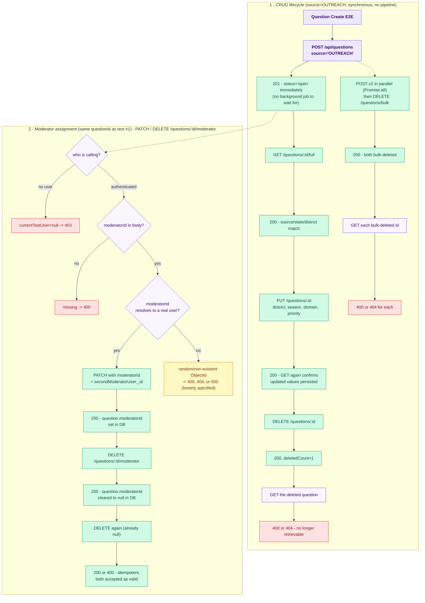

# Question Create — E2E Test Documentation

**File:** `src/e2e/question/QuestionCreate.e2e.test.ts`

---

## What this covers

Basic CRUD lifecycle for Questions (create, get, update, delete, bulk delete),
exercised against the **real Mongo DB** configured in `.env` (`DB_URL` / `DB_NAME`)
using the in-process harness.

| Method | Endpoint | Purpose |
|--------|----------|---------|
| `POST` | `/api/questions` | Create question (source=OUTREACH) |
| `GET` | `/api/questions/:id/full` | Get full question by ID |
| `PUT` | `/api/questions/:id` | Update question |
| `PATCH` | `/api/questions/:id/moderator` | Assign moderator to question |
| `DELETE` | `/api/questions/:id/moderator` | Remove moderator from question |
| `DELETE` | `/api/questions/:id` | Delete single question |
| `DELETE` | `/api/questions/bulk` | Bulk delete questions |

---

## Strategy

**In-process server** — same harness as `ManualAllocation.e2e.test.ts`.
`loadAppModules('all')` builds the real production DI container against the real DB.
Two moderator users are fetched from the DB: `moderatorUser` (via `MODERATOR_EMAIL`) and
`secondModeratorUser` (via `MODERATOR_EMAIL_2` from `.env.test`). The second is the
assignment target in the moderator-assignment sub-suite; `currentTestUser` is set per-test
to exercise auth variation.

`OUTREACH` questions are created **synchronously** (no background pipeline), so assertions
can be made immediately after the HTTP response.

---

## Auth strategy

Two moderator users fetched from the DB by `MODERATOR_EMAIL` and `MODERATOR_EMAIL_2`
(from `.env.test`). `x-internal-api-key` header attached to every request via helpers
(`apiPost`/`apiGet`/`apiPut`/`apiPatch`/`apiDelete`). No Firebase token exchange needed.
For the moderator-assignment tests, `currentTestUser` is toggled per-test to cover both
authenticated and unauthenticated (null) scenarios.

**Env vars required:** `MODERATOR_EMAIL`, `MODERATOR_EMAIL_2` — both must resolve to real
users in the DB or `beforeAll` throws.

---

## Why OUTREACH source

`OUTREACH` questions are created synchronously with status `open` and no background
pipeline, giving a clean starting state for CRUD testing without any polling or
allocation side effects.

## Flow diagram

> **To preview this diagram locally:** install the VS Code extension
> **"Markdown Preview Mermaid Support"** then press `Ctrl+Shift+V`.
> Diagrams also render natively on GitHub.



## Test cases (15 total)

### CRUD lifecycle (8 tests)

| # | Test | Expected |
|---|------|----------|
| 1 | Moderator creates question (source=OUTREACH, Punjab/Ludhiana/Brinjal/Rabi) | 201, `question_id` in body |
| 2 | Moderator gets created question by ID (`/questions/:id/full`) | 200, correct source/state/district |
| 3 | Moderator updates question (district, season, domain, priority) | 200 |
| 4 | Question reflects updated values | 200, `UPDATED` in text, `priority=high`, new district/season/domain |
| 5 | Moderator deletes question | 200, `deletedCount=1` |
| 6 | Deleted question no longer retrievable | 400 or 404 |
| 7 | Moderator bulk creates 2 questions (`Promise.all`) then bulk deletes both | 200 |
| 8 | Bulk-deleted questions not retrievable | 400 or 404 for each |

### Question Moderator Assignment (7 tests — `describe` sub-block)

These run against the same `questionId` created in test #1. `PATCH /questions/:id/moderator`
assigns a moderator; `DELETE /questions/:id/moderator` clears it.

| # | Test | Method | Expected |
|---|------|--------|----------|
| 9 | Assigns `secondModeratorUser` as moderator | `PATCH` | 200; `question.moderatorId` equals `secondModeratorUser._id` in DB |
| 10 | Missing `moderatorId` body field | `PATCH` | 400 |
| 11 | Non-existent `moderatorId` (random `ObjectId`) | `PATCH` | 400, 404, or 500 |
| 12 | Unauthenticated (`currentTestUser = null`) | `PATCH` | 403 |
| 13 | Removes moderator | `DELETE` | 200; `question.moderatorId` is null in DB |
| 14 | Removing moderator twice is idempotent | `DELETE` | 200 or 400 |
| 15 | Unauthenticated remove (`currentTestUser = null`) | `DELETE` | 403 |

## Notable implementation details

- **`pollUntil` timeout** was bumped from 15 s → 45 s to give more headroom when the
  background pipeline is slow.
- **`apiPatch`** helper added alongside `apiPost`/`apiGet`/`apiPut`/`apiDelete` — same
  `x-internal-api-key` pattern.

## Cleanup

`afterAll` deletes all tracked question IDs from `questions`, `question_submissions`,
and `notifications` (using the `enitity_id` field — note the typo in the collection).

---

## Last Test Run Results

### Pre-conversion (2026-06-15) — old live-server pattern

**Prerequisite:** live server running at `localhost:4000` + Firebase JWT token  
**Total:** 8 tests — **3 passed, 5 failed** (3 vacuously passed with no assertions)

| # | Test | Result | Error |
|---|------|--------|-------|
| **1** | **Moderator creates question → 201** | ❌ FAIL | Test timed out in 5000ms — ECONNREFUSED, no server |
| **2** | **Moderator gets question by ID → 200** | ❌ FAIL | `questionId` undefined (cascade from #1) |
| 3 | Moderator updates question → 200 | ✅ | vacuous pass — no assertions executed |
| 4 | Question reflects updated values → 200 | ✅ | vacuous pass |
| **5** | **Moderator deletes question → 200** | ❌ FAIL | `questionId` undefined (cascade from #1) |
| **6** | **Deleted question not retrievable** | ❌ FAIL | cascade from #5 |
| **7** | **Moderator bulk deletes questions → 200** | ❌ FAIL | Timeout / cascade |
| 8 | Bulk deleted not retrievable | ✅ | vacuous pass — empty id array |

### Post-conversion (2026-06-16) — in-process harness (actual run)

**Converted:** No live server needed. Firebase token replaced with `currentTestUser` +
`x-internal-api-key`. OUTREACH source replaces AGRI_EXPERT — synchronous, no polling.

**Total:** 8 tests — **2 passed, 6 failed** ❌

| # | Test | Result | Notes |
|---|------|--------|-------|
| **1** | **Moderator creates question → 201** | ❌ FAIL | got 400 — `Cannot read properties of undefined (reading 'data')` |
| **2** | **Moderator gets question by ID → 200** | ❌ FAIL | got 404 — cascade: `questionId` undefined |
| **3** | **Moderator updates question → 200** | ❌ FAIL | got 404 — cascade |
| **4** | **Question reflects updated values → 200** | ❌ FAIL | got 404 — cascade |
| **5** | **Moderator deletes question → 200** | ❌ FAIL | got 404 — cascade |
| 6 | Deleted question not retrievable | ✅ | 404 as expected |
| **7** | **Moderator bulk deletes 2 questions → 200** | ❌ FAIL | got 400 — both creates failed, `createdIds=[]` → "No question IDs found to delete!" |
| 8 | Bulk-deleted questions not retrievable | ✅ | pass (empty array) |

---

## How to run

```bash
# From backend/  (no live server needed — in-process against real Atlas DB in .env)
NODE_ENV=test pnpm exec vitest run src/e2e/question/QuestionCreate.e2e.test.ts
```

---

## Last Run

**Date:** 2026-07-04 &nbsp;|&nbsp; **Result:** ✅ all 15 passed &nbsp;|&nbsp; **Duration:** 9.4 s

> ⚠ Vitest only printed 10 of 15 test lines (passing suites are truncated in the output).

| # | Test | Result | Failure reason |
|---|------|:------:|----------------|
| 1 | Question Create E2E > moderator creates question successfully | ✅ | — |
| 2 | Question Create E2E > moderator gets created question by id | ✅ | — |
| 3 | Question Create E2E > moderator updates question successfully | ✅ | — |
| 4 | Question Create E2E > question reflects updated values | ✅ | — |
| 5 | Question Create E2E > Question Moderator Assignment > assigns question to moderator suc... | ✅ | — |
| 6 | Question Create E2E > Question Moderator Assignment > removes moderator successfully | ✅ | — |
| 7 | Question Create E2E > Question Moderator Assignment > removing moderator twice is idemp... | ✅ | — |
| 8 | Question Create E2E > moderator deletes question successfully | ✅ | — |
| 9 | Question Create E2E > moderator bulk deletes questions | ✅ | — |
| 10 | Question Create E2E > bulk deleted questions are not retrievable | ✅ | — |
