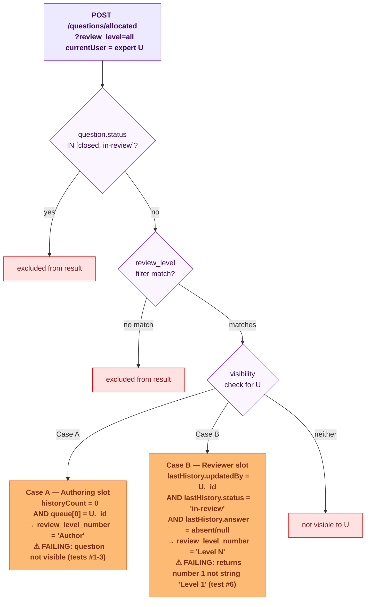

# Reviewer Queue — E2E Test Documentation

**File:** `src/e2e/reviewer-queue/ReviewerQueue.e2e.test.ts`  
**Related:** `src/e2e/auto-allocation/AutoAllocation.e2e.test.ts`, `src/e2e/post-allocation/PostAllocation.e2e.test.ts`

> **To preview diagrams locally:** install the VS Code extension  
> **"Markdown Preview Mermaid Support"** then press `Ctrl+Shift+V`.  
> Diagrams also render natively on GitHub.

---

## What this covers

The **read path** that surfaces allocated questions in an expert's dashboard:

| Endpoint | Method | Description |
|----------|--------|-------------|
| `POST /api/questions/allocated` | `getAllocatedQuestions` | Returns the questions an expert currently owns — authoring or reviewer slot |

This is the link between allocation (writing `queue`) and visibility (reading the queue back). Allocation suites verify that `queue` is populated correctly; this suite verifies that the right expert can actually **see** the question.

---

## Why this suite exists

When a question is allocated, the system:
1. Writes the expert's `_id` into `submission.queue`
2. Sends an `answer_creation` notification to that expert

If `POST /allocated` has a broken filter — wrong `userId` check, wrong `status` exclusion, or the `review_level` query param not passed — the expert receives a notification but sees nothing in their dashboard. This suite explicitly pins the **notification ↔ visibility consistency** contract.

---

## Visibility rules (`getAllocatedQuestions` / `QuestionRepository`)

A question appears for expert `U` iff **both** of:

```
EITHER
  (A) historyCount = 0  AND  firstInQueue = U._id        ← authoring slot
  OR
  (B) lastHistory.updatedBy = U._id
      AND lastHistory.status = 'in-review'
      AND lastHistory.answer is absent / null             ← reviewer slot

AND question.status NOT IN ['closed', 'in-review']       ← status gate
AND review_level filter matches                           ← 'all' | 'Author' | 'Level N'
```

`review_level_number` returned per question:
- `historyCount ≤ 1` → `'Author'`
- `historyCount = N` (N ≥ 2) → `'Level N-1'`

> **Important:** if `review_level` query param is omitted, the MongoDB `$expr` branch evaluates to false for all three cases (`'all'`, `'Author'`, `Level N`) and returns 0 results. Always pass `review_level=all` (or a specific level) from the frontend.

---

## Flow diagram



---

## What each group tests

### Group 1 — Author slot visibility (4 tests)

Fresh question: `queue=[e1]`, `history=[]`. Expert `e1` has the authoring slot.

| # | What | Expected |
|---|------|----------|
| 1 | `POST /allocated` returns question for `queue[0]` | question in response |
| 2 | `review_level_number` is `'Author'` (historyCount = 0) | `'Author'` |
| 3 | Notification `entity_id` matches question in response (consistency check) | `notif.enitity_id === found.id` |
| 4 | Closed question with same expert in queue NOT returned | absent from response |

### Group 2 — Reviewer slot visibility (3 tests)

Reviewer state: `queue=[e1, e2]`, `history=[{e1 answer, status='reviewed'}, {e2 in-review, answer=null}]`.

| # | What | Expected |
|---|------|----------|
| 5 | Reviewer (`e2`, last `in-review` entry) sees the question | question in response |
| 6 | `review_level_number` is `'Level 1'` (historyCount = 2) | `'Level 1'` |
| 7 | Completed author (`e1`, no longer in-review) does NOT see the question | absent from response |

### Group 3 — Status exclusion and wrong-user guard (2 tests)

| # | Condition | Expected |
|---|-----------|----------|
| 8 | `status='in-review'` question (awaiting moderator) NOT visible to any expert | absent from response |
| 9 | Expert NOT in queue at all cannot see the question | absent from response |

### Group 4 — STF expert visibility after time-bound allocation (3 tests, Issues #1 and #7)

*Seeds a WHATSAPP question with an STF expert at `queue[0]` (no history) and verifies the STF
expert can see it in `/allocated`. Self-skips if no STF expert exists in the DB.*

Production report: "STFs not receiving author level questions even when they are in queue" /
"Despite getting a notification, question not appearing in the agri expert's dashboard."

| # | What | Expected |
|---|------|----------|
| 10 | STF expert sees their WHATSAPP question in `POST /allocated` (author slot, no history) | question in response |
| 11 | `review_level_number` is `'Author'` for the STF expert's authoring slot | `'Author'` |
| 12 | `answer_creation` notification for STF expert resolves to a question visible in `POST /allocated` | `notif.enitity_id === found.id` |

### Group 5 — Author-slot before reviewer-slot ordering (2 tests, Issue #2)

*Seeds the same STF expert with an author-slot question (newer `createdAt`) and a reviewer-slot
question (older `createdAt`). If the response is sorted by `createdAt` only, the reviewer question
appears first (wrong). Correct behaviour: author-slot appears first regardless of creation time.*

Production report: "STFs are getting review level questions when author level questions are available."

| # | What | Expected |
|---|------|----------|
| 13 | Both author-slot and reviewer-slot questions are visible in `POST /allocated` | both present |
| 14 | Author-slot question appears **before** reviewer-slot question in response | `authorIdx < reviewerIdx` — may fail if sort is createdAt-only (documents bug) |

---

## Status exclusion reference

| Status | Excluded from `POST /allocated`? | Reason |
|--------|:--------------------------------:|--------|
| `open` | No | experts still have work |
| `delayed` | No | experts still have work |
| `duplicate` | No | experts still have work |
| `pae_submitted` | No | moderator hasn't closed yet |
| `non_agri` | No | routing decision, not closed |
| `in-review` | **Yes** | 3 approvals done; awaiting moderator |
| `closed` | **Yes** | fully resolved |

> **Regression note:** if `status='in-review'` is set *prematurely* (e.g. after 2 approvals instead of 3), the question vanishes from all experts' queues mid-cycle. Test #8 pins that correctly-set `in-review` questions are excluded; `PostAllocation.e2e.test.ts` Group 8 pins that the status is not set prematurely.

---

---

## Last Test Run Results

### 2026-06-16

**Total:** 9 tests — **5 passed, 4 failed** (unchanged from 2026-06-15)

Same 4 failures remain. No regressions, no fixes.

| # | Group | Test | Result | Error |
|---|-------|------|--------|-------|
| **1** | **G1** | **question appears in POST /allocated for queue[0] (author slot)** | ❌ FAIL | `expected undefined to be defined` — question not in response |
| **2** | **G1** | **review_level_number is `'Author'` (historyCount = 0)** | ❌ FAIL | `expected undefined to be 'Author'` |
| **3** | **G1** | **notification entity_id matches question in POST /allocated** | ❌ FAIL | `expected undefined to be defined` |
| 4 | G1 | closed question with same expert NOT returned | ✅ pass | — |
| 5 | G2 | reviewer (expertUser2) sees question in POST /allocated | ✅ pass | — |
| **6** | **G2** | **review_level_number is `'Level 1'` (historyCount = 2)** | ❌ FAIL | `expected 1 to be 'Level 1'` — returns number, not string |
| 7 | G2 | completed author (expertUser1) NOT visible after submitting | ✅ pass | — |
| 8 | G3 | in-review question NOT visible to any expert | ✅ pass | — |
| 9 | G3 | expert NOT in queue cannot see question | ✅ pass | — |

Both bugs from 2026-06-15 are still present (see Failing Paths section below).

---

### 2026-06-15

**Total:** 9 tests — **5 passed, 4 failed**

| # | Group | Test | Result | Error |
|---|-------|------|--------|-------|
| 1 | G1 | question appears in POST /allocated for queue[0] (author slot) | ❌ FAIL | `expected undefined to be defined` — question not in response |
| 2 | G1 | review_level_number is `'Author'` (historyCount = 0) | ❌ FAIL | `expected undefined to be 'Author'` — field missing |
| 3 | G1 | notification entity_id matches question in POST /allocated | ❌ FAIL | `expected undefined to be defined` — question not visible |
| 4 | G1 | closed question with same expert NOT returned | ✅ pass | — |
| 5 | G2 | reviewer (expertUser2) sees question in POST /allocated | ✅ pass | — |
| 6 | G2 | review_level_number is `'Level 1'` (historyCount = 2) | ❌ FAIL | `expected 1 to be 'Level 1'` — returns number, not string |
| 7 | G2 | completed author (expertUser1) NOT visible after submitting | ✅ pass | — |
| 8 | G3 | in-review question NOT visible to any expert | ✅ pass | — |
| 9 | G3 | expert NOT in queue cannot see question | ✅ pass | — |

---

## Failing Paths (2026-06-15)

Two distinct regressions:

### 1. Author slot (Case A) — question not visible to queue[0] expert (tests #1-3)

`POST /allocated` returns 200 with 10 results, but the specific test question is not among them.
The allocated expert cannot see their question in the dashboard.

Likely cause: a change to the MongoDB `$expr` filter in `getAllocatedQuestions` that no longer
matches the Case A pattern (`historyCount=0 AND queue[0]=U._id`), possibly a field name
change or condition rewrite.

### 2. `review_level_number` field returns a number instead of a string (test #6)

The field returns `1` (number) instead of `'Level 1'` (string).
The Case A equivalent (`'Author'`) also appears to be missing entirely (returns `undefined`).

**Effect on the frontend:** any code that string-compares `review_level_number === 'Author'`
or `review_level_number === 'Level 1'` will silently fail, hiding questions from experts'
dashboards.

**Fix target:** `QuestionRepository.getAllocatedQuestions` — the projection or aggregation stage
that computes `review_level_number`. The string formatting (`'Author'`, `'Level N'`) needs
to be applied in the query, not just checked in the application layer.

---

## How to run

```bash
# From backend/  (~15 s against the real Atlas DB in .env)
pnpm exec vitest run src/e2e/reviewer-queue/ReviewerQueue.e2e.test.ts
```

---

## Last Run

**Date:** 2026-06-19 &nbsp;|&nbsp; **Result:** ✅ all 9 passed &nbsp;|&nbsp; **Duration:** 16.6 s

> ⚠ Vitest only printed 1 of 9 test lines (passing suites are truncated in the output).

| # | Test | Result | Failure reason |
|---|------|:------:|----------------|
| 1 | Reviewer queue — reviewer slot visibility > reviewer (expertUser2) sees the question in... | ✅ | — |
