# Feature Name

WhatsApp Question Ingestion — End-to-End

---

# Module

```text
src/e2e/whatsapp        (test)
src/modules/question    (system under test)
```

WhatsApp questions are NOT handled by `src/modules/whatsapp` (that module is
read-only: threads / users / send-message). They enter through the **shared**
question-ingestion endpoint that every source uses.

---

# Purpose

Verify the complete backend journey of a question that arrives from WhatsApp,
end-to-end, against the **real Mongo database in `.env`** (`DB_URL` / `DB_NAME`),
with every service that lives outside the backend replaced by a dummy.

The four sources (`AJRASAKHA`, `WHATSAPP`, `AGRI_EXPERT`/bulk+single, `OUTREACH`)
share the same ingestion + processing pipeline. This suite covers `WHATSAPP`
first and stops at the **hand-off boundary** — the point where the
WhatsApp-specific flow ends (status becomes `duplicate` / `non_agri` / `open`,
submission row created, moderators notified) and the shared common pipeline
begins.

## SCOPE — what is intentionally NOT covered here

**Expert allocation is OUT of scope for this suite.** Allocation
(`reallocateTimeBoundQuestions`, cron-driven) is the COMMON path shared by every
time-bound source (WHATSAPP/AJRASAKHA). It is deliberately left for a dedicated
common-path test rather than duplicated per source. A fresh WhatsApp question is
created with `isAutoAllocate=false`; once the background pipeline drives it to
`open`, `isAutoAllocate` is flipped to `true` (commit `03c55740`, see below), but
allocation itself is NOT performed at ingestion — the submission is still created
unallocated (empty queue). The WhatsApp flow legitimately ends at the
`open`/unallocated-submission boundary; the cron later picks the question up
because `isAutoAllocate` is now `true`.

---

# Flow Diagram

> **To preview this diagram locally:** install the VS Code extension
> **"Markdown Preview Mermaid Support"** then press `Ctrl+Shift+V`.
> It also renders natively on GitHub.

```mermaid
%%{init: {'flowchart': {'nodeSpacing': 50, 'rankSpacing': 60}}}%%
flowchart TD
  classDef entry  fill:#ede9fe,stroke:#7c3aed,color:#3b0764,font-weight:bold
  classDef bg     fill:#dbeafe,stroke:#2563eb,color:#1e3a8a
  classDef ok     fill:#d1fae5,stroke:#059669,color:#064e3b
  classDef warn   fill:#fef9c3,stroke:#d97706,color:#78350f
  classDef err    fill:#fee2e2,stroke:#dc2626,color:#7f1d1d
  classDef decide fill:#faf5ff,stroke:#7c3aed,color:#3b0764
  classDef tb     fill:#fce7f3,stroke:#db2777,color:#831843
  classDef fail   fill:#fdba74,stroke:#ea580c,color:#7c2d12,font-weight:bold

  ROOT["POST /api/questions
  source = 'WHATSAPP'
  auth: x-internal-api-key"]:::entry

  AUTH{"x-internal-api-key
  header correct?"}:::decide
  A401["401 Unauthorized"]:::err

  PAYLOAD{"payload valid?"}:::decide
  P400["400 — missing district field
  (class-validator on QuestionDetailsDto,
  fires before the service runs)"]:::err
  P500["empty question text
  KNOWN BUG-001: returns 500
  (BadRequestError re-wrapped as
  InternalServerError in addQuestion's
  outer catch) — should be 400"]:::fail

  SAVE["addQuestion()
  status='pending', priority='high'
  isAutoAllocate=false
  question + bare submission inserted"]:::ok

  ASYNC["setImmediate to
  processQuestionInBackground()"]:::bg

  ROOT --> AUTH
  AUTH -- no --> A401
  AUTH -- yes --> PAYLOAD
  PAYLOAD -- "missing district" --> P400
  PAYLOAD -- "empty question" --> P500
  PAYLOAD -- ok --> SAVE --> ASYNC

  subgraph THREAD["1 - Thread validation - validateTimeBoundQuestionThread"]
    T1{"threadId
    empty?"}:::decide
    T2["isTesting = true
    status stays 'pending'
    (THREAD_ID_MISSING - no API call made)"]:::warn
    T3["fetchWhatsAppMessage(threadId)
    up to 4 attempts: 1 initial + 3 retries
    backoff 3s / 6s / 12s"]:::tb
    T4{"outcome across
    all attempts?"}:::decide
    T5["'not found' every attempt
    hadSuccessfulApiCall=true
    -> isTesting=true, status stays 'pending'"]:::warn
    T6["unreachable every attempt (non-'not-found' error)
    hadSuccessfulApiCall=false
    -> isValid=true - 'API down' is not 'test question'
    -> question proceeds to pipeline"]:::warn
    T7["1st attempt fails (e.g. ECONNREFUSED),
    a retry then succeeds
    -> isValid=true -> proceeds"]:::ok
    T1 -- yes --> T2
    T1 -- no --> T3 --> T4
    T4 -- "not found (all)" --> T5
    T4 -- "unreachable (all)" --> T6
    T4 -- "fails then recovers" --> T7
  end

  subgraph DUP["2 - Duplicate-check pipeline - runDuplicateCheckPipeline"]
    D1["searchGdb(embedding)"]:::tb
    D2{"GDB result?"}:::decide
    D3["exact_match found
    -> status='duplicate', isExact=true
    referenceQuestionId recorded
    (extractObjectId also resolves {$oid} format)"]:::ok
    D4["selected_match only (no exact_match)
    -> status='duplicate', isExact=false
    referenceSource='reviewer'"]:::ok
    D5["BOTH exact_match and selected_match present
    -> exact_match wins (isExact=true)"]:::ok
    D6["match has a non-ObjectId question_id
    -> that match is skipped, treated as a miss"]:::warn
    D7["searchGdb throws
    NOT caught inside runDuplicateCheckPipeline
    (no try/catch around the GDB call) - propagates
    to processQuestionInBackground's outer
    pipelineError catch -> status='open' directly.
    checkPendingDuplicate + LLM never run."]:::warn
    D8["no GDB match (miss or skipped-invalid-id)"]:::warn

    D9["checkPendingDuplicate(embedding)
    added 2026-07-01 - Gate Keeper / Auditor
    workflow, GDB 'pending duplicate' queue"]:::tb
    D10{"pending-duplicate
    result?"}:::decide
    D11["duplicate_question_id returned
    -> status='queue_duplicate'
    referenceQuestionId/referenceQuestion/
    similarityScore recorded, referenceSource='reviewer'
    isAutoAllocate=false. LLM NOT consulted.
    See GatekeeperAuditor.e2e.md for what happens next"]:::ok
    D12["no duplicate_question_id in response (miss)
    -> falls through to the LLM"]:::warn
    D13["checkPendingDuplicate throws
    (its own try/catch, distinct from the
    GDB catch and the LLM catch)
    -> falls through to the LLM"]:::warn

    D14["checkConceptDuplicate (LLM)"]:::tb
    D15{"LLM verdict?"}:::decide
    D16["non-agri -> status='non_agri'"]:::ok
    D17["agri -> status='open'
    isAutoAllocate flipped TRUE (commit 03c55740)"]:::ok
    D18["LLM throws (own try/catch)
    -> degrades gracefully"]:::warn

    D1 --> D2
    D2 -- "exact_match" --> D3
    D2 -- "selected_match only" --> D4
    D2 -- "both" --> D5
    D2 -- "invalid question_id" --> D6 --> D8
    D2 -- "throws" --> D7
    D2 -- "no match" --> D8
    D8 --> D9 --> D10
    D10 -- FOUND --> D11
    D10 -- MISS --> D12 --> D14
    D10 -- THROWS --> D13 --> D14
    D14 --> D15
    D15 -- "non-agri" --> D16
    D15 -- "agri" --> D17
    D15 -- "throws" --> D18 --> D17
  end

  NOTIFY["notify moderators
  type='question_from_whatsapp'
  (only the 'open' path reaches this -
  duplicate/queue_duplicate/non_agri/isTesting
  all return earlier)"]:::ok

  ASYNC --> T1
  T6 --> D1
  T7 --> D1
  T2 -.-> STOP1["pending / isTesting
  (no further processing)"]:::err
  T5 -.-> STOP1
  D7 -.-> STOP2["open
  (via outer pipelineError catch)"]:::warn
  D17 --> NOTIFY
```



**Not covered by this diagram** (belongs to the common allocation path, tested elsewhere):
expert allocation via `reallocateTimeBoundQuestions` — see `AutoAllocation.e2e.md` / `AllocationOrdering.e2e.md`.

---

# Main Files

```text
src/e2e/whatsapp/WhatsAppQuestion.e2e.test.ts          # the test
src/modules/question/controllers/QuestionController.ts # POST /questions (addQuestion)
src/modules/question/services/QuestionService.ts       # addQuestion + processQuestionInBackground + reallocateTimeBoundQuestions
src/shared/functions/flexibleAuth.ts                   # internal-API-key auth used by WhatsApp
src/modules/ai/services/AiService.ts                   # the ONLY external boundary (dummied)
src/modules/question/aiservice/checkConceptDuplicate.ts# LLM non-agri classifier (mocked)
src/bootstrap/jobs/timeBoundReAllocateCron.ts          # drives allocation in prod
```

---

# Main API Endpoints

| Method | Endpoint | Purpose |
| ------ | --------------- | ------------------------------------------------- |
| POST | /api/questions | Ingest a question (all sources; WhatsApp uses `source: "WHATSAPP"` + `x-internal-api-key`) |

WhatsApp authenticates via `FlexibleAuth` (the `x-internal-api-key` header), not
a Firebase JWT. No `@CurrentUser` is present; `userId` comes from the body.

---

# Main Service Functions

| Function | Purpose |
| -------------------------------- | ----------------------------------------------------------- |
| `addQuestion` | Validates, embeds, inserts question (`pending`) + bare submission, kicks off background processing |
| `processQuestionInBackground` | Thread validation → duplicate-check pipeline → sets terminal status → notifies moderators |
| `validateTimeBoundQuestionThread`| Confirms the WhatsApp thread exists (else marks `isTesting`). Retries 3x with 3/6/12 s backoff. |
| `runDuplicateCheckPipeline` | GDB search → LLM non-agri check; decides `duplicate` / `non_agri` / `open` |
| `reallocateTimeBoundQuestions` | The common allocation path (cron-driven) for WHATSAPP/AJRASAKHA — **NOT tested in this suite (common path, parked)** |

---

# Database Collections / Tables Used

```text
questions
question_submissions
notifications
duplicate_questions
users           (read: experts/moderators for allocation + notifications)
```

---

# External Services Used (all DUMMIED in the test)

- AI embedding server — `AiService.getEmbedding` (`POST /embed`)
- WhatsApp/LangGraph thread state — `AiService.fetchWhatsAppMessage` (`GET /threads/:id/state`)
- Golden-dataset search — `AiService.searchGdb` (`POST /v1/gdb/search`)
- LLM duplicate / non-agri classifier — `checkConceptDuplicate` (OpenAI/Gemma)

The test rebinds `CORE_TYPES.AIService` to a dummy and `vi.mock`s
`checkConceptDuplicate`. Nothing leaves the process.

---

# Important Business Logic

```text
- WhatsApp/Ajrasakha questions are time-bound: forced priority='high',
  status='pending', isAutoAllocate=false on ingestion. When the background
  pipeline resolves the question to status='open', isAutoAllocate is flipped to
  true (QuestionService.ts:1545 / :1551, commit 03c55740). Questions that end as
  'duplicate' / 'non_agri' / isTesting keep isAutoAllocate=false.
- Thread validation: if the WhatsApp thread can't be matched (API reachable but
  no message), the question is flagged isTesting=true and dropped.
- "Question found" = GDB exact_match/selected_match -> status='duplicate' with
  referenceQuestionId / referenceQuestion / similarityScore / isExact recorded
  (this is the link to the already-answered question).
- No GDB match -> LLM decides: non-agri -> status='non_agri'; agri -> status='open'.
- Expert allocation is NOT done at ingestion. The 2-min time-bound cron
  (reallocateTimeBoundQuestions) only picks up questions with isAutoAllocate=true.
  As of commit 03c55740, reaching status='open' auto-sets isAutoAllocate=true, so
  'open' questions become cron candidates WITHOUT a moderator manually enabling it
  (previously a moderator had to toggle it on).
- extractObjectId (QuestionService.ts:1056) accepts both plain hex strings AND
  MongoDB extended-JSON format ({$oid: "..."}).
```

---

# Possible Error Cases (all now exercised)

```text
- Missing / wrong x-internal-api-key        -> 401                              [tested]
- Empty question text                        -> 400 (BadRequestError)            [tested, KNOWN BUG: returns 500]
- Missing required detail fields             -> 400 (BadRequestError)            [tested, returns 400 via class-validator]
- Thread id missing (empty string)           -> question flagged isTesting       [tested]
- Thread id present but API says "not found" -> question flagged isTesting       [tested]
- Thread API completely unreachable          -> question proceeds to open        [tested]
- Thread API fails on first attempt only     -> question proceeds to open        [tested — retry path]
- GDB service throws                         -> pipeline degrades to status=open [tested]
- GDB exact_match has invalid ObjectId       -> falls through to LLM -> open    [tested]
- GDB selected_match has invalid ObjectId    -> falls through to LLM -> open    [tested]
- GDB exact_match uses {$oid} format         -> marks duplicate correctly        [tested]
- LLM classifier unreachable                 -> pipeline degrades to status=open [tested]
```

---

# Test Cases (18 total)

```text
AUTH
  ✓  reject ingestion without internal API key (401)
  ✓  reject ingestion with wrong internal API key (401)

INVALID PAYLOAD
  ✓  missing a required detail field (district) -> 400
       Note: comes from class-validator on QuestionDetailsDto, NOT from
       QuestionService.addQuestion's own guard — QuestionDetailsDto has
       @IsNotEmpty() on district, so validation fires before the service runs.
  ✗  empty question text -> 400   [KNOWN BUG — returns 500, see BUG-001]

DUPLICATE CHECK — FOUND paths
  ✓  FOUND: GDB exact_match -> status 'duplicate', isExact=true + reference recorded
  ✓  SIMILAR: GDB selected_match (no exact) -> status 'duplicate', isExact=false,
       referenceSource='reviewer' (second duplicate mechanism; LLM not consulted)
  ✓  PRIORITY: GDB returns both exact_match and selected_match -> exact_match wins
       (isExact=true, referenceQuestionId points to exact_match)
  ✓  INVALID ID (exact_match): GDB exact_match has non-ObjectId question_id ->
       match skipped, falls through to LLM -> status 'open'
  ✓  INVALID ID (selected_match): GDB selected_match has non-ObjectId question_id
       AND exact_match is null -> match skipped, falls through to LLM -> status 'open'
  ✓  OID FORMAT: GDB exact_match.question_id is {$oid: "..."} MongoDB extended-JSON
       format -> extractObjectId resolves it correctly -> status 'duplicate', isExact=true

DUPLICATE CHECK — NOT-FOUND paths
  ✓  NOT FOUND (agri): no GDB match + LLM says agri -> status 'open', unallocated submission
  ✓  NON-AGRI: no GDB match + LLM says non-agri -> status 'non_agri'

DEGRADATION
  ✓  LLM FAILURE: classifier throws -> pipeline degrades gracefully to status 'open'
  ✓  GDB FAILURE: searchGdb throws -> pipeline degrades gracefully to status 'open'
       (error caught by processQuestionInBackground pipelineError catch, not inside
       runDuplicateCheckPipeline which has no try/catch around the GDB call)

THREAD VALIDATION (validateTimeBoundQuestionThread)
  ✓  EMPTY threadId: immediate short-circuit (THREAD_ID_MISSING), fetchWhatsAppMessage
       never called -> isTesting=true, status stays 'pending'
  ✓  NOT-FOUND after retries: valid threadId, API throws "No matching WhatsApp message
       found" on all 4 attempts (1 initial + 3 retries with 3/6/12 s backoff) ->
       hadSuccessfulApiCall=true -> isTesting=true, status stays 'pending' (~21 s)
  ✓  API COMPLETELY DOWN: valid threadId, API throws non-"not-found" error on all
       attempts -> hadSuccessfulApiCall=false -> isValid=true (API down ≠ test question)
       -> question proceeds through pipeline to status 'open' (~21 s)
  ✓  TRANSIENT FAILURE + RETRY: first attempt throws ECONNREFUSED, retry 1 succeeds
       (hadSuccessfulApiCall=true on retry 1) -> isValid=true -> pipeline runs -> 'open'
       (~3 s — only one retry delay incurred)

NOT covered (common path, separate test): expert allocation
(reallocateTimeBoundQuestions).
```

# Test Cases — added 2026-07-01 (21 total)

Gate Keeper / Auditor workflow (merge `origin/copy/gatekeeper-auditor-workflow`)
added a third duplicate-check outcome: after a GDB miss, `runDuplicateCheckPipeline`
now calls `AiService.checkPendingDuplicate` (the GDB "pending duplicate" queue)
BEFORE falling through to the LLM. `dummyAi.checkPendingDuplicate` was added
alongside `searchGdb`/`fetchWhatsAppMessage`.

```text
QUEUE-DUPLICATE (GDB pending-duplicate queue)
  ✓  FOUND: checkPendingDuplicate returns duplicate_question_id -> status
       'queue_duplicate', referenceQuestionId/referenceQuestion/similarityScore
       recorded (referenceSource='reviewer'), isAutoAllocate=false. LLM not consulted.
  ✓  MISS: checkPendingDuplicate returns {detail: ...} with no duplicate_question_id
       -> falls through to the LLM -> status 'open' (same as a GDB miss)

DEGRADATION
  ✓  checkPendingDuplicate throws -> caught by its own try/catch in
       runDuplicateCheckPipeline (distinct from the GDB/LLM catches) -> falls
       through to the LLM -> status 'open', exactly as before this feature existed
```

See also `src/e2e/gatekeeper-auditor/GatekeeperAuditor.e2e.md` for the rest of the
workflow (Push to Auditor, Auditor finalize, Cancel Duplicate, close-propagation)
— this suite only covers ingestion-time `queue_duplicate` detection.

---

# How To Run

```bash
# Uses the DB in .env. Run from backend/.
pnpm exec vitest run src/e2e/whatsapp/WhatsAppQuestion.e2e.test.ts
```

Notes:
- The suite forces `NODE_ENV=development` at the top so the Atlas (`mongodb+srv`)
  client keeps TLS enabled (`MongoDatabase` disables TLS when `NODE_ENV=test`).
- Background processing runs via `setImmediate`, so tests SUBMIT then POLL the
  `questions` collection for the terminal status.
- All documents created during a run are deleted in `afterAll` (tracked by a
  per-run `RUN_TAG`).

---

# Last Test Run Results

## 2026-06-16 (addQuestion regression — 14 failed)

**Total:** 18 tests — **4 passed, 14 failed**  
**Duration:** ~22 s

Every test that calls `POST /api/questions` expected 201 and got 400
(`"Cannot read properties of undefined (reading 'data')"` at `QuestionController.addQuestion:467`).
Tests that pass are the two auth gates, the class-validator payload rejection, and the known-500 empty-question test — none of which reach the question-save path.

| # | Test | Result | Error |
|---|------|--------|-------|
| 1 | AUTH: no internal API key → 401 | ✅ | — |
| 2 | AUTH: wrong internal API key → 401 | ✅ | — |
| 3 | PAYLOAD: missing district field → 400 | ✅ | class-validator fires before service |
| **4** | **FOUND: GDB exact_match → duplicate, isExact=true** | ❌ FAIL | 400 — addQuestion regression |
| **5** | **SIMILAR: GDB selected_match → duplicate, isExact=false** | ❌ FAIL | 400 |
| **6** | **NOT FOUND (agri): → open, unallocated submission** | ❌ FAIL | 400 |
| **7** | **NON-AGRI: LLM says non-agri → non_agri** | ❌ FAIL | 400 |
| **8** | **THREAD INVALID: empty threadId → isTesting=true** | ❌ FAIL | 400 |
| **9** | **LLM FAILURE: classifier throws → open** | ❌ FAIL | 400 |
| **10** | **THREAD NOT-FOUND: all retries fail → isTesting** | ❌ FAIL | 400 |
| **11** | **THREAD DOWN: API unreachable → open** | ❌ FAIL | 400 |
| **12** | **GDB FAILURE: searchGdb throws → open** | ❌ FAIL | 400 |
| **13** | **RETRY SUCCEEDS: first attempt fails, retry → open** | ❌ FAIL | 400 |
| **14** | **INVALID exact_match ID: non-ObjectId → open** | ❌ FAIL | 400 |
| **15** | **INVALID selected_match ID: non-ObjectId → open** | ❌ FAIL | 400 |
| **16** | **OID FORMAT: exact_match.question_id as {$oid} → duplicate** | ❌ FAIL | 400 |
| **17** | **PRIORITY: both exact+selected → exact_match wins** | ❌ FAIL | 400 |
| 18 | PAYLOAD: empty question text → 500 (known bug) | ✅ | Still returns 500 as documented |


---

## 2026-06-11 (baseline — 17 passed, 1 failed)

**Vitest version:** 3.2.4  
**Total:** 18 tests — **17 passed, 1 failed**  
**Duration:** ~59 s (dominated by the two 21-s retry tests + one 3-s transient-retry test)

| # | Test | Result | Time |
|---|------|--------|------|
| 1 | AUTH: no internal API key → 401 | ✅ pass | 39 ms |
| 2 | AUTH: wrong internal API key → 401 | ✅ pass | 5 ms |
| 3 | PAYLOAD: missing district field → 400 | ✅ pass | 27 ms |
| 4 | FOUND: GDB exact_match → duplicate, isExact=true | ✅ pass | 1422 ms |
| 5 | SIMILAR: GDB selected_match → duplicate, isExact=false | ✅ pass | 234 ms |
| 6 | NOT FOUND (agri): → open, unallocated submission (isAutoAllocate=true) | ✅ pass | 1510 ms |
| 7 | NON-AGRI: LLM says non-agri → non_agri | ✅ pass | 231 ms |
| 8 | THREAD INVALID: empty threadId → isTesting=true, pending | ✅ pass | 229 ms |
| 9 | LLM FAILURE: classifier throws → open (graceful degrade) | ✅ pass | 232 ms |
| 10 | THREAD NOT-FOUND: API says "not found" on all retries → isTesting | ✅ pass | 21871 ms |
| 11 | THREAD DOWN: API completely unreachable → open | ✅ pass | 21809 ms |
| 12 | GDB FAILURE: searchGdb throws → open (graceful degrade) | ✅ pass | 242 ms |
| 13 | RETRY SUCCEEDS: first attempt ECONNREFUSED, retry succeeds → open | ✅ pass | 3404 ms |
| 14 | INVALID exact_match ID: non-ObjectId → skipped, LLM → open | ✅ pass | 249 ms |
| 15 | INVALID selected_match ID: non-ObjectId → skipped, LLM → open | ✅ pass | 1052 ms |
| 16 | OID FORMAT: exact_match.question_id as {$oid} → duplicate, isExact=true | ✅ pass | 254 ms |
| 17 | PRIORITY: both exact+selected match → exact_match wins | ✅ pass | 241 ms |
| 18 | PAYLOAD: empty question text → 400 | ❌ **FAIL** (returns 500) | 53 ms |

---

# Anything Risky / Important?

```text
- Runs against the REAL .env database. Test docs are tagged and cleaned up.
  The 'open' path writes moderator notifications (cleaned up by questionId).
  Allocation is NOT triggered, so no expert/reputation state is mutated.
- The repo has a latent circular-import bug: AnswerService imports CORE_TYPES
  from the core barrel (#root/modules/core/index.js) instead of core/types.js.
  Under vitest this leaves CORE_TYPES undefined, so the test warms up the module
  graph by importing AnswerService BEFORE loadAppModules('all'). Fixing the
  import in AnswerService would remove the need for the warm-up.
- TEARDOWN RACE (handled): processQuestionInBackground sets status='open' and
  THEN writes moderator notifications in the same setImmediate chain. Open-path
  tests assert as soon as status flips to 'open' and return, leaving that write
  in flight. When afterAll then called db.disconnect(), the late write hit a
  null DB handle and logged (swallowed) "Cannot read properties of null
  (reading 'collection')" — harmless to assertions but noisy. afterAll now calls
  drainOpenQuestionNotifications() (waits for each 'open' question's notification
  BEFORE the deletes/disconnect), so teardown is deterministic. The Ajrasakha
  suite handles the same race per-test via waitForNotification(). Root cause of
  the null deref is in MongoDatabase: after disconnect() nulls this.database, a
  re-connect() returns the cached connectingPromise WITHOUT repopulating
  this.database, so getCollection() dereferences null. Not fixed here (infra
  change out of scope; only reachable when disconnect races in-flight work,
  which production never does).
```

---

# Behavior Changes

## CHG-001 — open questions now auto-enable `isAutoAllocate` (2026-06-12)

**Commit:** `03c55740` — "Added auto allocation on for open questions" (mamatha12-reddy).

**What changed:** In `processQuestionInBackground`, both `open`-transition paths
(`QuestionService.ts:1545` success path and `:1551` pipeline-error path) now write
`{ status: 'open', isAutoAllocate: true }` instead of just `{ status: 'open' }`.

**Effect:** Time-bound (WHATSAPP/AJRASAKHA) questions are still inserted with
`isAutoAllocate=false`, but as soon as the pipeline resolves them to `open`, the
flag flips to `true`. They therefore become candidates for the
`reallocateTimeBoundQuestions` cron immediately, without a moderator manually
toggling auto-allocate. Questions that terminate as `duplicate` / `non_agri` /
`isTesting` keep `isAutoAllocate=false`.

**Test impact:** Test #6 (NOT FOUND agri → open) previously asserted
`isAutoAllocate=false` and started failing (`expected true to be false`,
`WhatsAppQuestion.e2e.test.ts:461`) after this commit. The assertion was updated to
`true`. The matching Ajrasakha open-path assertion
(`AjrasakhaQuestion.e2e.test.ts:342`) was updated the same way. This was a
deliberate product change, not a regression — no code fix is needed.

---

# Known Bugs (found during testing)

## BUG-001 — empty question text returns 500 instead of 400 (partially fixed)

**Status:** Partially fixed as of 2026-06-11.

**Affected tests:**
- ❌ "invalid payload (empty question text)" — `question: ''` → expected 400, **still returns 500**
- ✅ "invalid payload (missing required detail field)" — missing `district` → **now returns 400** (fixed)

**Root cause (empty question text — still broken):**

`QuestionService.addQuestion` (QuestionService.ts:1165) throws `BadRequestError('Question is required')` for an empty question. But the method's outer `catch` block (line 1322) catches ALL errors indiscriminately and rethrows them as `InternalServerError`:

```typescript
// QuestionService.ts:1322-1331
} catch (error) {
  console.error(error);
  // ...
  throw new InternalServerError(`Failed to add question: ${error}`);
}
```

The controller (QuestionController.ts:332-354) catches service errors and re-throws them, but when it sees an `InternalServerError` it re-throws it as `InternalServerError` again (line 350), resulting in a 500 response instead of 400.

**Fix:** In the outer `catch` of `addQuestion`, check whether the caught error is already a `BadRequestError` (or `HttpError` with `httpCode < 500`) and re-throw it directly rather than wrapping it in `InternalServerError`.

**Why the "missing district" test was fixed:** `QuestionDetailsDto` has `@IsNotEmpty()` (or equivalent) validation on `district`. When `district` is missing, `routing-controllers`' class-validator fires BEFORE the service is called, returning 400 directly without ever entering `addQuestion`. The service's faulty outer catch is never reached.

**Note:** The comment in the test file for the "missing district" case is now outdated — it says "this 400 does NOT come from class-validator". It now DOES come from class-validator on `QuestionDetailsDto`. The comment should be updated if/when BUG-001 is fully fixed.

---

## Last Run

**Date:** 2026-06-25 &nbsp;|&nbsp; **Result:** ✅ all 18 passed &nbsp;|&nbsp; **Duration:** 1.4 min

> ⚠ Vitest only printed 12 of 18 test lines (passing suites are truncated in the output).

| # | Test | Result | Failure reason |
|---|------|:------:|----------------|
| 1 | WhatsApp ingestion — question FOUND (GDB duplicate, reference answer linked) > marks th... | ✅ | — |
| 2 | WhatsApp ingestion — question NOT FOUND (common pipeline -> open) > opens the question ... | ✅ | — |
| 3 | WhatsApp ingestion — invalid thread (time-bound thread validation fails) > flags the qu... | ✅ | — |
| 4 | WhatsApp ingestion — LLM failure degrades gracefully to open > still opens the question... | ✅ | — |
| 5 | WhatsApp ingestion — valid threadId, API returns "not found" on all retries → isTesting... | ✅ | — |
| 6 | WhatsApp ingestion — WhatsApp API completely unreachable → question proceeds to open > ... | ✅ | — |
| 7 | WhatsApp ingestion — GDB service throws → degrades gracefully to open > still opens the... | ✅ | — |
| 8 | WhatsApp ingestion — transient thread API failure then retry succeeds → open > proceeds... | ✅ | — |
| 9 | WhatsApp ingestion — GDB exact_match has invalid question_id → falls through to open > ... | ✅ | — |
| 10 | WhatsApp ingestion — GDB selected_match has invalid question_id → falls through to open... | ✅ | — |
| 11 | WhatsApp ingestion — GDB exact_match uses $oid format → marked duplicate > marks the qu... | ✅ | — |
| 12 | WhatsApp ingestion — GDB returns both exact_match and selected_match → exact_match wins... | ✅ | — |

## 2026-07-01 (21 total — added queue_duplicate coverage)

**Total:** 21 tests — **20 passed, 1 failed**

The 1 failure (`WhatsApp API completely unreachable → question proceeds to open`) is
KNOWN BUG-002 (see project memory `project_e2e_inprocess_harness`), found the same
day and unrelated to the queue_duplicate additions — a pre-existing hang in
`validateTimeBoundQuestionThread`'s "API down" branch introduced by commit
`e20e8b8e`, not something this change touches. All 3 new queue_duplicate tests passed.
