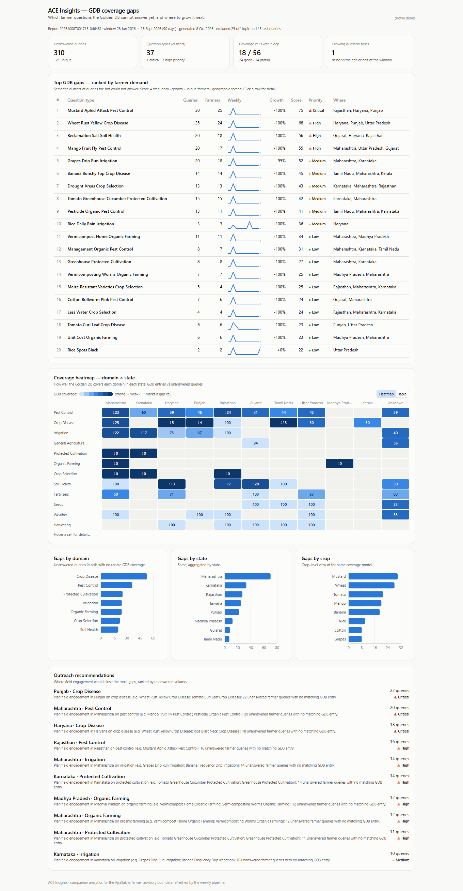

# ACE Insights — GDB Coverage Gap Detector

Companion analytics service for the [AjraSakha](https://github.com/vicharanashala/ajrasakha)
farmer-advisory bot (ACE). When the bot cannot answer a farmer's question from the Golden
Database (GDB) it sends a "2-hour disclaimer" and routes the query to human experts. Nobody
had a systematic view of *which* questions trigger that most. This service turns those
unanswered queries into a **prioritised weekly GDB Gap Report**, a **domain × state coverage
heatmap** and **outreach recommendations**, so the agri and outreach teams can grow the GDB
where farmers need it most.

It never modifies the AjraSakha code base: it reads the bot's logs from MongoDB (read-only)
and writes everything it produces to its own `ace_insights` database.



## What it does

1. **Pulls** every disclaimer-triggered query (`farmer_feedback.disclaimer_logs`,
   `gdb_gap_detector.raw_queries`) and normalises language, state, domain and crop.
2. **Clusters** them by meaning — multilingual sentence embeddings
   (`paraphrase-multilingual-MiniLM-L12-v2`) + agglomerative clustering on cosine distance,
   implemented with sentence-transformers / torch.
3. **Scores** each question type by farmer demand: frequency, growth over time, unique farmers,
   geographic spread → CRITICAL / HIGH / MEDIUM / LOW.
4. **Maps coverage**: for every domain × state, GDB entries vs unanswered queries → good /
   partial / gap.
5. **Reports** weekly: top-20 gaps with a recommended action, the heatmap, and ranked
   state × domain outreach recommendations. Stored in Mongo, served by a FastAPI read API,
   shown in a React dashboard.

First report on the sample data: [`docs/FIRST_GAP_REPORT.md`](docs/FIRST_GAP_REPORT.md).

## Quick start (Windows; Linux/macOS analogous)

```bat
python -m venv .venv && .venv\Scripts\activate
pip install torch --index-url https://download.pytorch.org/whl/cpu
pip install -r requirements.txt
copy .env.example .env                       :: fill MONGODB_URI

pytest                                       :: 21 tests, no network, no model download
python -m pipeline.run_gap_report --dry-run  :: compute only (downloads the model once)
python -m pipeline.run_gap_report            :: write clusters, heatmap, report to ace_insights

uvicorn backend.app.main:app --reload        :: API on http://localhost:8000  (/docs)
cd frontend && pnpm install && pnpm dev      :: dashboard on http://localhost:5173
```

Weekly automation: `.github/workflows/weekly.yml` runs the job every Monday (needs the
`MONGODB_URI` repository secret). CI (`ci.yml`) runs ruff + pytest + the frontend build on
every pull request.

## Layout

```
backend/app/
  config.py            every threshold / weight / URL as a setting; demo + prod profiles
  db.py                read-only seed DBs → writes only to ace_insights
  models.py            pydantic models; outputs mirror the seed gap_reports / clusters shapes
  normalize.py         languages ↔ codes, state cleanup, 3 domain taxonomies → 1, crop extraction
  ingest/              readers for disclaimer_logs, raw_queries, gdb_entries
  services/            embeddings (cached), clustering, gap_scoring, coverage, gap_report
  routers/gaps.py      GET /gaps/summary, /report/latest, /reports, /clusters, /heatmap, /trends
pipeline/run_gap_report.py   the weekly job (--dry-run, --period-days)
frontend/              Vite + React 19 + TypeScript + Tailwind + Recharts dashboard
tests/                 pytest on synthetic fixtures + mongomock + a hash embedder
docs/                  DESIGN.md · API.md · FIRST_GAP_REPORT.md · screenshots/
```

## Configuration

See `.env.example`. Notable knobs: `ACE_PROFILE` (demo | prod), `GAP_REPORT_PERIOD_DAYS`,
`CLUSTER_DISTANCE_THRESHOLD`, `MIN_CLUSTER_SIZE`, `GAP_WEIGHT_*`, `COVERAGE_GOOD`,
`COVERAGE_PARTIAL`, `EMBEDDING_BACKEND` (`sentence-transformers` | `hash`).

## Known limitations

* Built and validated on the hackathon sample cluster (345 unanswered queries, 96-entry mini
  GDB). Against the production GDB the coverage percentages will rise; the ranking of gaps
  should hold. Swap `ingest/gdb_source.py` to read the real GDB — nothing downstream changes.
* Growth is computed over the report window; with bursty sample data most clusters show
  "−100 %". It becomes meaningful with continuous weekly logs.
* Clustering is O(n³) worst case; fine for thousands of queries per run. See
  `docs/DESIGN.md` for the scaling path.

## Privacy

Farmer identifiers are stored only as a salted SHA-256 prefix; query text is kept (it is the
subject of the analysis) but never printed by the job, which reports aggregates only.
