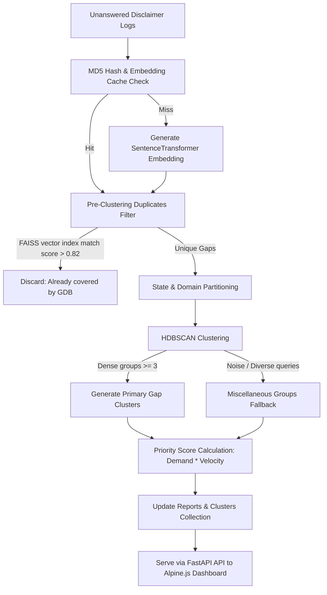

# Growth Database (GDB) Coverage Gap Detector Sidecar

A self-contained, conflict-free analytical sidecar attachment for the **Ajrasakha** platform. This tool identifies and prioritizes coverage gaps between unanswered farmer query disclaimer logs and the existing Growth Database (GDB), presenting actionable data insights via an interactive dashboard without modifying any existing platform files.

---

## 🏗️ System Architecture & Workflow

The system is designed as an asynchronous, read-only analytical attachment. It processes database entries incrementally and compiles insights without causing any performance overhead or query delays for end-users.



### 1. Incremental Ingestion & Embedding Cache
* **MD5 Hashing**: To prevent redundant embedding recalculation, every query is hashed using MD5. 
* **MongoDB Cache (`gdb_gap_detector.query_embeddings`)**: The pipeline checks if the vector has already been computed. If yes, it loads the vector in `<1ms`. If no, it encodes it using `SentenceTransformer` and caches the result.

### 2. Pre-Clustering Duplicate Filtering
* **FAISS Indexing**: A flat Inner Product FAISS index is built on-the-fly from the current GDB questions.
* **Vector Search Match**: The pipeline runs vector similarity checks. If a query matches an existing GDB question with a cosine score $\ge 0.82$, it is flagged as covered and excluded. This ensures only genuine gaps are clustered.

### 3. Partitioned HDBSCAN Clustering
* **Partitioning**: Queries are first partitioned by `(state, domain)` to ensure time complexity scales linearly $O(N)$ with database volume instead of quadratically $O(N^2)$.
* **HDBSCAN Clustering**: Identifies dense semantic groups of similar unanswered queries within each partition.
* **Miscellaneous Fallback**: Queries labeled as noise or in sparse partitions are grouped into a special `"Miscellaneous Questions"` card, ensuring **100% of unaddressed farmer questions** are visible.

---

## 📂 File Structure

The entire sidecar resides inside the `gdb_gap_detector/` folder, ensuring zero merge conflicts with your core files:

```text
gdb_gap_detector/
├── api/
│   └── main.py                  # FastAPI Server (hosts API endpoints & static dashboard)
├── dashboard/
│   └── index.html               # Dual-theme Alpine.js visual dashboard
├── pipeline/
│   ├── gap_pipeline.py          # Core pipeline (filtering, HDBSCAN clustering, report generation)
│   ├── overlap_check.py         # FAISS Indexer & Cross-Encoder overlap validation
│   └── test_gap_pipeline.py     # Unit testing suite
├── .env.example                 # Configuration blueprint
└── requirements.txt             # Isolated python package list
```

---

## ⚙️ Configuration (.env)

Duplicate `gdb_gap_detector/.env.example` as `gdb_gap_detector/.env` and adjust the variables:

| Variable | Default Value | Description |
| :--- | :--- | :--- |
| `DB_URL` | `mongodb://localhost:27017` | MongoDB connection URI. |
| `TIME_WINDOW_DAYS` | `30` | Rolling historical window for disclaimer ingestion. |
| `MIN_CLUSTER_SIZE` | `3` | Minimum density parameter for HDBSCAN clusters. |
| `SIMILARITY_THRESHOLD`| `0.82` | Overlap similarity limit (1.0 = identical). |

---

## 🚀 Setup & Execution Instructions

Ensure you have Python 3.8+ installed.

### 1. Initialize Virtual Environment & Install Dependencies
Navigate to the project root and run:
```powershell
# Create virtual environment
python -m venv venv

# Activate virtual environment
# On Windows PowerShell:
.\venv\Scripts\Activate.ps1
# On Linux / macOS:
source venv/bin/activate

# Install required packages
pip install -r gdb_gap_detector/requirements.txt
```

### 2. Run the Pipeline
Run the background analytical script to ingest logs, cluster topics, and save report metrics into MongoDB:
```bash
python gdb_gap_detector/pipeline/gap_pipeline.py
```

### 3. Launch the API Server
Start the FastAPI server (running on port `8090` by default):
```bash
python gdb_gap_detector/api/main.py
```
Open **`http://localhost:8090`** in your browser to view the interactive dashboard.

---

## 🎨 Interactive Dashboard Features
* **Adaptive Light & Dark Themes**: Visual settings are persisted in local storage.
* **Slanted Matrix Heatmap**: A compact grid representation showing GDB coverage percentage by State and Domain.
* **Dynamic Search & Filters**: Search for keyword terms or click on heatmap cells/outreach targets to instantly isolate related clusters.
* **One-Click PDF Exporter**: Downloads an executive multi-page PDF summary, outreach strategy table, and top prioritized gaps.
