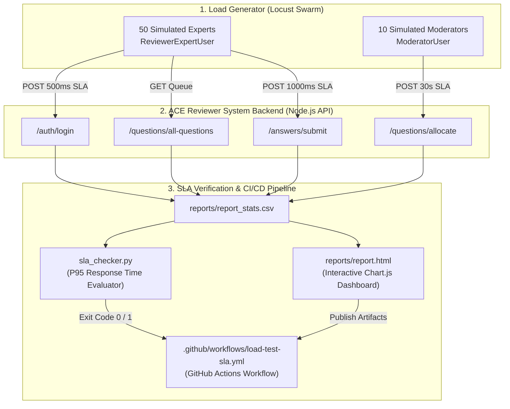

# 🚀 Product Document (product.md)
## Project 7: Reviewer System Load & SLA Testing Suite

---

## 📌 Executive Summary

As the **Ajrasakha / ACE Knowledge Pipeline** scales toward **200,000 Golden Database (GDB) entries**, the Reviewer System backend (`desk.vicharanashala.ai` / Node.js API) experiences high concurrent traffic:
- **50+ Agricultural Experts** simultaneously review, edit, and validate Q&A pairs.
- **10+ Moderators** monitor unassigned backlogs and trigger question allocations.
- **1-Minute Background Cron Jobs** continuously re-allocate time-bound questions.

This product provides an automated **Locust Load and SLA Testing Suite** to stress-test the Reviewer System under peak concurrency, measure 95th percentile (P95) response times against strict SLA thresholds, and fail CI/CD builds automatically upon performance regressions.

---

## 📐 Architecture & Workflow Diagram



---

## 🛠️ System Components & Technical Specifications

| Component | Technology | Description |
|---|---|---|
| **Load Swarm Generator** | Locust 2.46+ (Python) | Simulates concurrent expert logins, queue fetching, answer submissions, and moderation allocations with realistic think times. |
| **Configuration Manager** | `config.py` | Centralized SLA thresholds (Login ≤ 500ms, Answer Submit ≤ 1000ms, Allocation ≤ 30s) and target API route definitions. |
| **SLA Evaluator Engine** | `sla_checker.py` (Pandas) | Parses 95th percentile (P95) response times from Locust output CSVs and exits with status code `1` on SLA breach. |
| **Visual Dashboard Generator** | Locust HTML & Chart.js | Renders offline interactive charts for Requests Per Second (RPS), Response Time distribution, and Failure logs. |
| **Automated CI/CD Workflow** | GitHub Actions YAML | Headless execution pipeline on staging deployment triggers with automated report artifact publishing. |

---

## 🎯 SLA Threshold Matrix

| API Endpoint | Operation | SLA Threshold Target (P95) | Impact if Breached |
|---|---|---|---|
| `POST /auth/login` | Expert Authentication | **≤ 500 ms** | Experts delayed from accessing review queue. |
| `POST /answers/submit` | Expert Answer Submission | **≤ 1000 ms** | Review bottleneck; validated Q&As delayed from entering GDB. |
| `POST /questions/allocate` | Moderator Allocation | **≤ 30,000 ms (30s)** | Unanswered farmer queries drop allocation SLA window. |

---

## 💻 Local Execution & Verification

### 1. Interactive Web Interface Mode
```bash
cd load_tests
pip install -r requirements.txt
locust -f locustfile.py --host=http://localhost:3000
```
*Access Web Dashboard at `http://localhost:8089`.*

### 2. Headless Automated Execution & SLA Check
```bash
mkdir -p reports
locust -f locustfile.py --headless -u 50 -r 10 --run-time 1m --host=http://localhost:3000 --csv=reports/report --html=reports/report.html
python sla_checker.py reports/report_stats.csv
```
