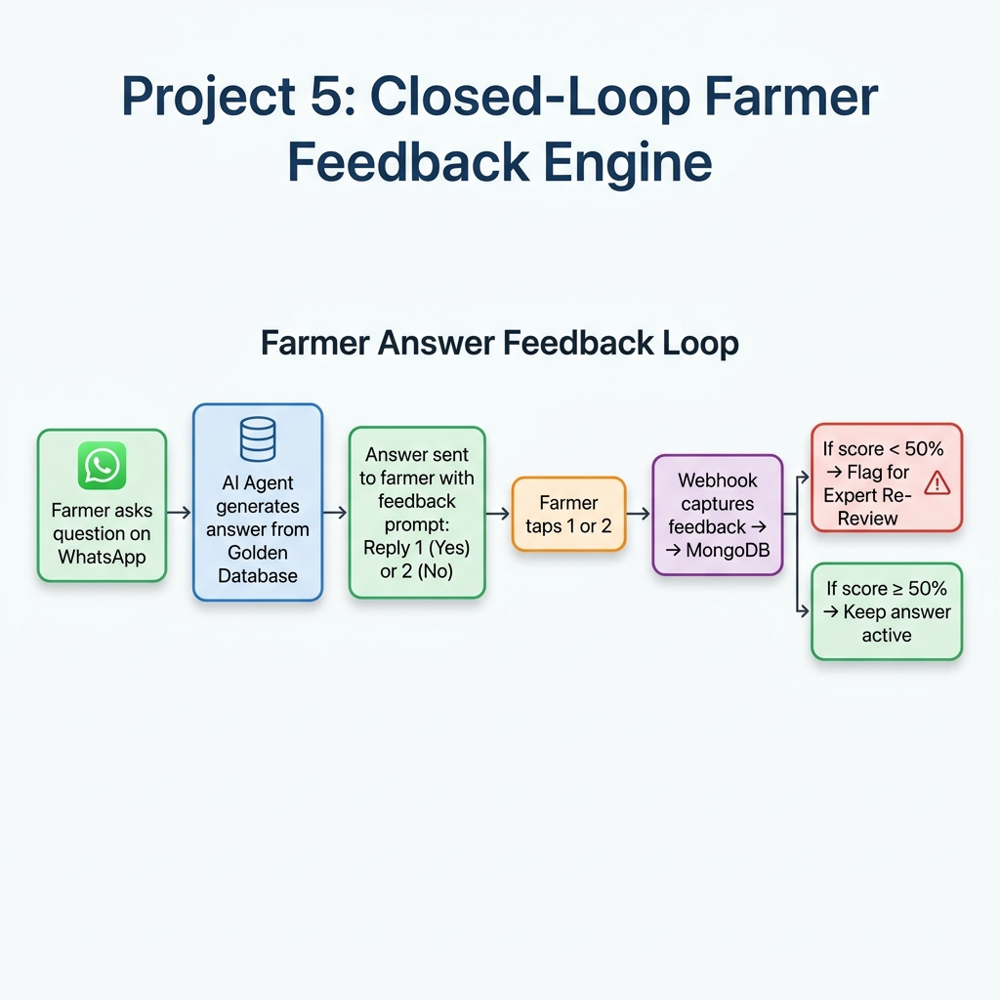
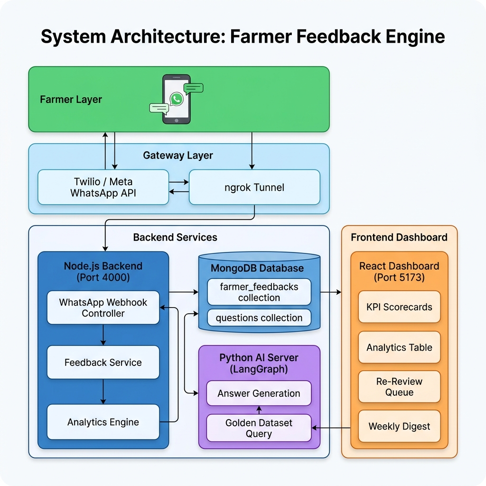
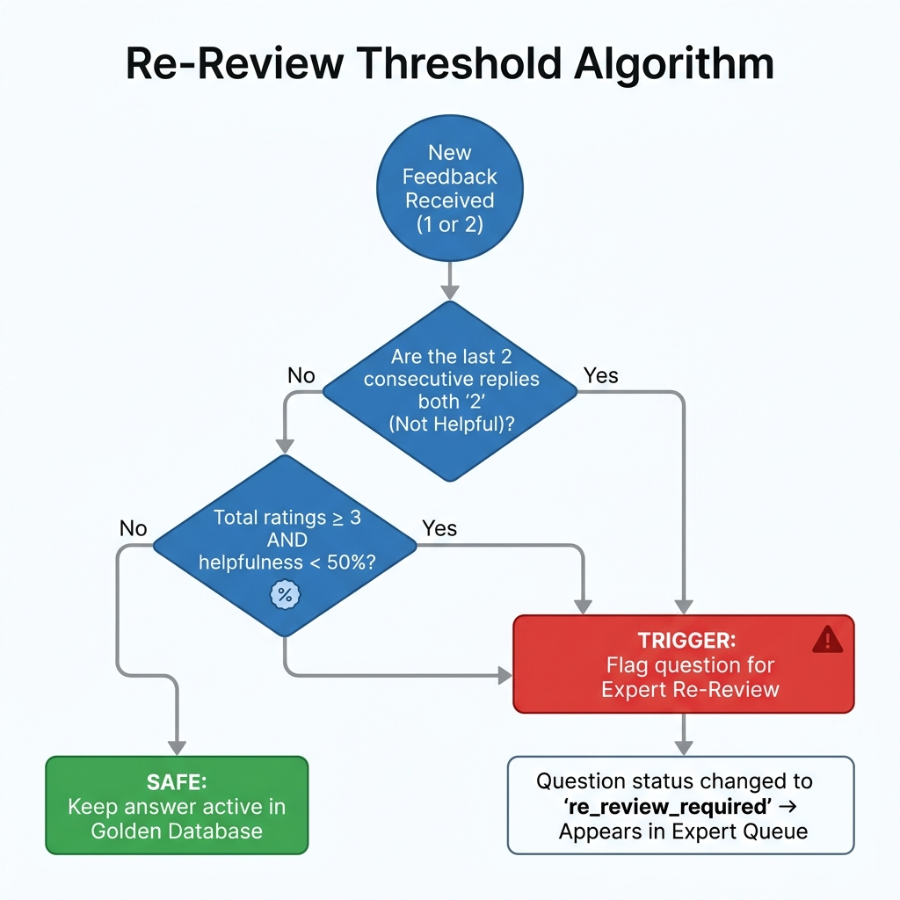

# Product Documentation: Farmer Answer Feedback Loop (ACE) — Project 5

## 1. Executive Summary & Problem Statement

When farmers ask agricultural questions via WhatsApp or Web Chat (e.g., *"How do I control stem borer in paddy?"*), the **Ajrasakha** AI agent retrieves vetted knowledge directly from the **Golden Dataset (GDB)** and **Package of Practices (POP)**.

Historically, however, once an answer was dispatched, there was **no closed feedback loop** to verify whether the farmer found the answer actionable, clear, or accurate for their specific regional context. Without direct telemetry, agricultural experts could not easily identify low-performing answers or region-specific knowledge gaps.

**Project 5: Farmer Answer Feedback Loop (ACE)** bridges this gap by introducing an end-to-end telemetry, analytics, and automated re-review pipeline. It transforms our AI answering engine into a **continuous self-improving quality loop** where farmer feedback directly drives knowledge base refinement.

---

## 2. End-to-End Workflow Diagram



### A. For Farmers (1-Tap Telemetry)
Whenever the AI generates an outbound answer on WhatsApp or the Web interface, the system automatically appends a localized, 1-tap feedback prompt:
> *"Was this answer helpful to your farming needs? Reply 1 for Yes | Reply 2 for No"*

When a farmer replies with `1` or `2`, the **Telemetry Capture Engine** records the rating and links it directly to:
* **Golden Dataset Entry ID (`gdbEntryId`)**
* **Crop Domain** (e.g., Paddy, Cotton, Soybean)
* **Geographical State** (e.g., Maharashtra, Karnataka, Telangana)
* **Language** (`hi` - Hindi, `mr` - Marathi, `te` - Telugu, `en` - English)

### B. For Agricultural Experts (Automated Safety Net)
Instead of manually reviewing thousands of answers, human experts rely on an **Algorithmic Safety Net**:
1. **Real-Time Calculation:** Every incoming vote updates the cumulative helpfulness percentage of that specific GDB entry.
2. **Automated Flagging Trigger:** If an answer's score drops below **50% helpfulness** (or receives **2 consecutive negative votes**), the system automatically flags the entry and reverts its status to `re_review_required`.
3. **Expert Re-Review Queue:** Flagged answers instantly appear on the expert dashboard (`/dashboard/feedback`), allowing agricultural scientists to review and rewrite the response before it is served to another farmer.

---

## 3. System Architecture Diagram



### Component Breakdown

| Layer | Component | Port | Responsibility |
|:---|:---|:---|:---|
| **Farmer Layer** | WhatsApp (Twilio / Meta) | — | Farmer sends questions and feedback replies |
| **Gateway Layer** | Twilio / Meta API + ngrok Tunnel | — | Routes webhooks to local/production backend |
| **Backend** | Node.js Backend | 4000 | WhatsApp webhook, feedback service, analytics engine |
| **Database** | MongoDB | 27017 | `farmer_feedbacks` and `questions` collections |
| **AI** | Python LangGraph Server | 2024/2026 | Answer generation from Golden Dataset |
| **Frontend** | React Dashboard | 5173 | KPI scorecards, analytics tables, re-review queue |

---

## 4. Re-Review Threshold Algorithm (Visual Aid)



### Trigger Conditions

| Condition | Rule | Example |
|:---|:---|:---|
| **Consecutive Negatives** | Last 2 replies are both `2` | Farmer A says `2`, Farmer B says `2` → **Triggered** |
| **Low Helpfulness Score** | Score < 50% with ≥ 3 total ratings | 1 helpful + 3 not helpful = 25% → **Triggered** |

### Threshold Logic (Code)
```typescript
// Triggered automatically on every feedback submission
const lastTwoNegative =
  feedbacks.length >= 2 &&
  feedbacks[0].reply === '2' &&
  feedbacks[1].reply === '2';

const helpfulnessRate = totalRatings > 0
  ? (helpfulCount / totalRatings) * 100
  : 100;

if (lastTwoNegative || (totalRatings >= 3 && helpfulnessRate < 50)) {
  await questionRepo.updateQuestionStatus(gdbEntryId, 're_review_required');
}
```

---

## 5. Feature Inventory & Implementation Status

| # | Component | Endpoint / Path | Description | Status |
|---|:---|:---|:---|:---|
| 1 | **WhatsApp Webhook Interceptor** | `POST /api/whatsapp/webhook` | Intercepts incoming WhatsApp messages. If reply is `1` or `2`, routes to the feedback engine. Accepts form-encoded Twilio data and JSON payloads. | ✅ Completed |
| 2 | **Telemetry Capture API** | `POST /api/feedback/capture` | Receives numeric feedback (`1` / `2`), links with `gdbEntryId`, domain, state, and language, and persists to MongoDB. | ✅ Completed |
| 3 | **Multi-Dimensional Analytics** | `GET /api/feedback/analytics` | Aggregation engine computing total votes, helpfulness percentage, and sliced distribution by GDB entry, domain, language, and state. | ✅ Completed |
| 4 | **Automated Re-Review Trigger** | `POST /api/feedback/trigger-rereview/:gdbEntryId` | Evaluates helpfulness threshold and automatically moves low-scoring entries back to the expert review queue. | ✅ Completed |
| 5 | **Weekly Executive Digest** | `GET /api/feedback/weekly-digest` | Trailing 7-day automated report compiling total volume, quality percentages, and top flagged items for agricultural leadership. | ✅ Completed |
| 6 | **Interactive Expert Dashboard** | `frontend: /dashboard/feedback` | Modern responsive UI featuring live KPI scorecards, multi-dimension filters, progress bars, and 1-click "Re-queue for Review" actions. | ✅ Completed |

---

## 6. Technical Specifications

### A. Database Schema (`farmer_feedbacks` Collection)

```typescript
interface IFarmerFeedback {
  _id?: ObjectId;
  gdbEntryId: string;           // Links to the Golden Dataset entry
  questionId?: string;          // Links to the Question document
  userId?: string;              // User ID (if logged in via web)
  phoneNumber?: string;         // WhatsApp phone number
  reply: '1' | '2';            // '1' = Helpful, '2' = Not Helpful
  isHelpful: boolean;           // Derived from reply
  domain?: string;              // e.g., 'Crop Management', 'Pest Control'
  language?: string;            // e.g., 'en', 'hi', 'te', 'mr'
  state?: string;               // e.g., 'Kerala', 'Maharashtra'
  createdAt?: Date;
  updatedAt?: Date;
}
```

**Database Indexes** (created automatically for performance):
- `{ gdbEntryId: 1 }` — Fast lookups for re-review threshold checks
- `{ domain: 1 }` — Domain-level analytics queries
- `{ language: 1 }` — Language-level analytics queries
- `{ state: 1 }` — State-level analytics queries
- `{ createdAt: -1 }` — Time-series ordering for weekly digest

### B. Analytics Response Structure

```typescript
interface IFeedbackAnalyticsResponse {
  totalFeedbacks: number;                    // Total votes collected
  overallHelpfulnessRatePct: number;         // e.g., 78.5
  byGdbEntry: IHelpfulnessRateSummary[];     // Per-question breakdown
  byDomain: IHelpfulnessRateSummary[];       // Per-crop-domain breakdown
  byLanguage: IHelpfulnessRateSummary[];     // Per-language breakdown
  byState: IHelpfulnessRateSummary[];        // Per-state breakdown
}

interface IHelpfulnessRateSummary {
  key: string;                // GDB entry ID, domain name, language code, or state
  label: string;              // Human-readable label
  totalRatings: number;
  helpfulCount: number;
  notHelpfulCount: number;
  helpfulnessRatePct: number; // e.g., 85.5
}
```

### C. Weekly Digest Report Structure

```typescript
interface IWeeklyFeedbackDigestReport {
  weekStartDate: string;                       // e.g., "2026-07-17"
  weekEndDate: string;                         // e.g., "2026-07-24"
  totalFeedbacksCollected: number;
  overallHelpfulnessPct: number;
  lowPerformingEntries: IWeeklyFeedbackDigestEntry[];  // Entries with < 60% helpfulness
  domainBreakdown: IHelpfulnessRateSummary[];
}
```

---

## 7. Project File Structure

```
backend/src/modules/
├── feedback/                              # NEW MODULE (Project 5)
│   ├── container.ts                       # Inversify DI container bindings
│   ├── index.ts                           # Module exports & setup
│   ├── controllers/
│   │   └── FarmerFeedbackController.ts    # REST API endpoints (4 routes)
│   ├── interfaces/
│   │   └── IFeedback.ts                   # TypeScript interfaces & contracts
│   ├── models/
│   │   └── FarmerFeedbackModel.ts         # MongoDB repository (CRUD + indexes)
│   └── services/
│       └── FarmerFeedbackService.ts       # Business logic, analytics, re-review trigger
│
├── whatsapp/controllers/
│   └── WhatsAppController.ts              # MODIFIED: Added webhook interceptor for feedback
│
frontend/src/
├── components/Feedback/
│   └── FarmerHelpfulnessDashboard.tsx      # NEW: Full dashboard UI component (452 lines)
├── routes/dashboard/
│   └── feedback.tsx                       # NEW: Route registration for /dashboard/feedback

docs/diagrams/
├── workflow_diagram.png                   # End-to-end workflow visual
├── architecture_diagram.png              # System architecture visual
└── rereview_flowchart.png                # Re-review algorithm decision tree
```

---

## 8. API Reference

### 8.1 `POST /api/whatsapp/webhook` — WhatsApp Feedback Interceptor
**Purpose:** Intercepts incoming WhatsApp messages from Twilio/Meta. If the body is `1` or `2`, routes to the feedback engine.

| Parameter | Type | Source | Required | Description |
|:---|:---|:---|:---|:---|
| `Body` or `reply` | string | Webhook body | Yes | The farmer's reply text |
| `From` or `phoneNumber` | string | Webhook body | No | Farmer's WhatsApp number |
| `gdbEntryId` | string | Webhook body | No | Golden Dataset entry ID (defaults to `GDB-DEFAULT`) |
| `questionId` | string | Webhook body | No | Associated question ID |
| `domain` | string | Webhook body | No | Crop domain (defaults to `General`) |
| `language` | string | Webhook body | No | Language code (defaults to `en`) |
| `state` | string | Webhook body | No | Indian state (defaults to `Unknown`) |

**Response (feedback detected):**
```json
{ "success": true, "feedbackRecorded": true, "data": { "feedbackId": "...", "isHelpful": true, "reReviewTriggered": false } }
```

### 8.2 `POST /api/feedback/capture` — Direct Feedback Capture
**Purpose:** JSON-based endpoint for direct feedback submission from the web dashboard or internal tools.

**Request Body:**
```json
{ "reply": "1", "gdbEntryId": "603b5a9a1...", "domain": "Pest Control", "language": "hi", "state": "Maharashtra" }
```

**Response:**
```json
{ "success": true, "message": "Thank you for your positive feedback!", "data": { "feedbackId": "...", "isHelpful": true, "reReviewTriggered": false } }
```

### 8.3 `GET /api/feedback/analytics` — Helpfulness Analytics
**Purpose:** Returns multi-dimensional helpfulness analytics data for the dashboard.

| Query Param | Type | Required | Description |
|:---|:---|:---|:---|
| `domain` | string | No | Filter by crop domain |
| `language` | string | No | Filter by language |
| `state` | string | No | Filter by state |
| `startDate` | string | No | Filter start date |
| `endDate` | string | No | Filter end date |

### 8.4 `POST /api/feedback/trigger-rereview/:gdbEntryId` — Manual Re-Review Trigger
**Purpose:** Manually forces a re-review evaluation for a specific GDB entry. Used by experts from the dashboard.

### 8.5 `GET /api/feedback/weekly-digest` — Weekly Executive Digest
**Purpose:** Generates a trailing 7-day summary report with total feedbacks collected, overall helpfulness percentage, low-performing entries, and domain breakdown.

---

## 9. Frontend Dashboard Features

The Farmer Feedback Dashboard (`/dashboard/feedback`) includes three main views:

### Tab 1: Helpfulness Analytics
- **KPI Scorecards:** Total Feedbacks, Overall Helpfulness %, Low-Performing GDBs count, Weekly Digest Window
- **Dimension Switcher:** Toggle between Domain, Language, State, and GDB Entry views
- **Data Table:** Shows each dimension with total ratings, helpful count, not-helpful count, helpfulness percentage, and a color-coded progress bar
- **Color Coding:** Green (≥75%), Amber (50–74%), Red (<50%)

### Tab 2: Re-Review Triggers
- Lists all GDB entries that have been automatically flagged by the safety net algorithm
- Shows each entry's total responses, not-helpful count, helpfulness rate, and flagged status
- **1-Click Re-Queue:** Experts can click "Re-queue Review" to manually trigger the re-review process

### Tab 3: Weekly Feedback Digest
- **Digest Highlights:** Summary paragraph with total feedbacks and aggregate helpfulness
- **Domain Quality Summary:** Per-domain helpfulness breakdown for the trailing 7 days

---

## 10. System & Infrastructure Improvements

In addition to building the feedback engine, the following stability fixes were integrated:

1. **MongoDB Standalone Fallback (`BaseService.ts` & `bulkDelete.worker.ts`)**
   * *Problem:* Multi-document transactions failed on local standalone MongoDB.
   * *Solution:* Implemented fallback logic that detects standalone node incompatibility and gracefully executes queries outside of a transaction context.

2. **Unified Firebase Configuration (`.env` & `firebaseAdmin.ts`)**
   * *Problem:* `auth/api-key-not-valid` errors blocked local login and signup.
   * *Solution:* Standardized `VITE_FIREBASE_*` variables across root and frontend `.env` files.

3. **WhatsApp Webhook Middleware (`WhatsAppController.ts`)**
   * *Problem:* Twilio sends form-encoded data (`application/x-www-form-urlencoded`), but the controller expected JSON.
   * *Solution:* Added `@UseBefore(urlencoded({ extended: true }))` middleware to correctly parse Twilio payloads.

---

## 11. How to Run Locally (Testing Guide)

### Prerequisites
| Service | Command | Port |
|:---|:---|:---|
| Node.js Backend | `cd backend && pnpm run dev` | 4000 |
| Frontend Dashboard | `cd frontend && npm run dev` | 5173 |
| AI Server (optional) | `cd ai && uv run langgraph dev` | 2024/2026 |
| WhatsApp Tunnel | `npx ngrok http 4000` | Random HTTPS URL |

### Testing the Feedback Loop
1. **Start the backend** (`pnpm run dev` in `backend/`)
2. **Start the frontend** (`npm run dev` in `frontend/`)
3. **Open the Farmer Feedback Dashboard:** `http://localhost:5173/dashboard/feedback`
4. **Send feedback via curl:**
   ```bash
   curl -X POST http://localhost:4000/api/feedback/capture \
     -H "Content-Type: application/json" \
     -d '{"reply": "1", "gdbEntryId": "test-garlic-kerala", "domain": "Crop Management", "state": "Kerala"}'
   ```
5. **Refresh the dashboard** to see the feedback appear in real-time.

### Testing via Real WhatsApp (Twilio Sandbox)
1. Start ngrok: `npx ngrok http 4000`
2. Copy the HTTPS URL and paste it in **Twilio Console > Sandbox Settings > When a message comes in** as: `https://YOUR_NGROK_ID.ngrok-free.app/api/whatsapp/webhook`
3. Send `1` or `2` from your phone to the Twilio Sandbox number.
4. Check the backend terminal for: `[WhatsAppController] Intercepted feedback reply "1" from whatsapp:+...`

### Testing the Re-Review Auto-Trigger
1. Send **three** `2` (Not Helpful) responses for the same `gdbEntryId`.
2. The backend will automatically log: `[FarmerFeedbackService] Triggered re-review for GDB Entry...`
3. The dashboard's "Re-Review Triggers" tab will show the flagged entry.

---

## 12. Production Deployment Checklist

To activate the real-time WhatsApp feedback capture on the production cloud environment:

- [ ] Bind the live **Meta WhatsApp Business API / Turn.io Webhook** to point to `POST https://<production-domain>/api/whatsapp/webhook`
- [ ] Configure **Interactive Button Payloads** to include `gdbEntryId`, `questionId`, `domain`, `language`, and `state` in the hidden payload
- [ ] Verify the `farmer_feedbacks` MongoDB collection indexes are created on the production database
- [ ] Test end-to-end flow: Send feedback via WhatsApp → Verify it appears on the dashboard → Trigger re-review threshold

---

## 13. Technology Stack

| Layer | Technology |
|:---|:---|
| Backend Framework | Node.js + TypeScript + `routing-controllers` |
| Dependency Injection | Inversify |
| Database | MongoDB (standalone / replica set compatible) |
| Frontend | React + TypeScript + TanStack Router |
| UI Components | Shadcn/UI + Lucide Icons + Tailwind CSS |
| WhatsApp Integration | Twilio Sandbox (dev) / Meta Business API (prod) |
| AI Engine | Python LangGraph + LangSmith (monitoring) |
| Tunneling (dev) | ngrok / localtunnel |
