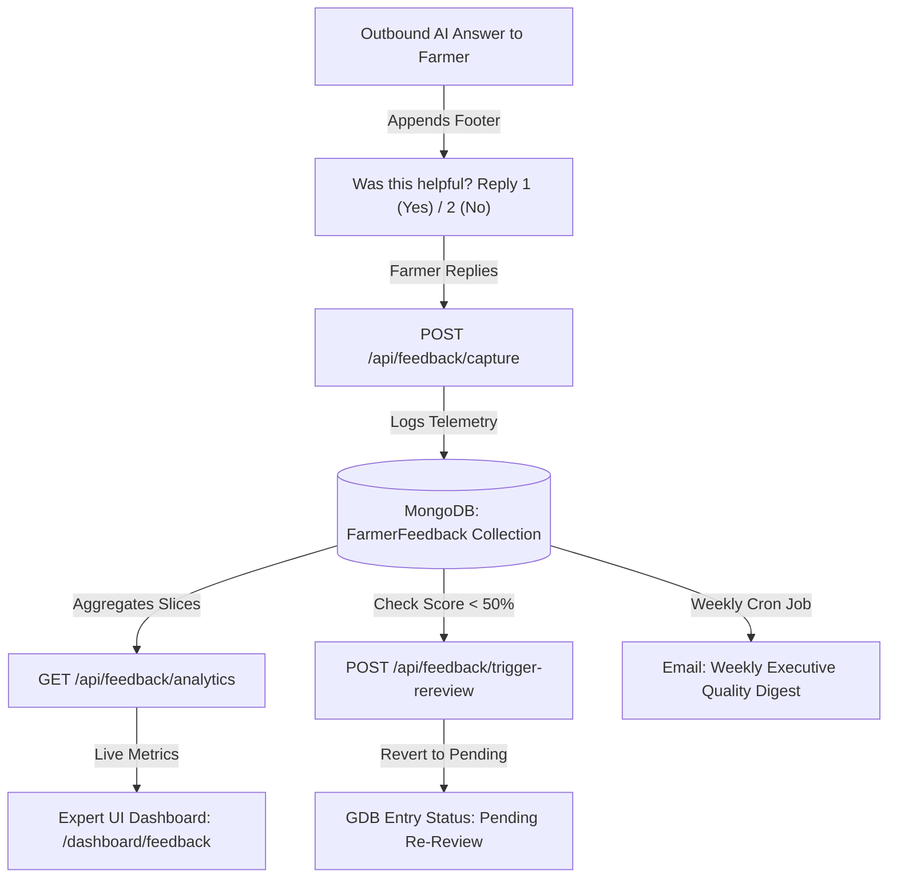

# Project 5: Farmer Answer Feedback Loop (ACE) — Master Technical & Operational Documentation

## 1. Executive Summary & Problem Statement

When farmers ask agricultural questions via WhatsApp or Web Chat (e.g., *"How do I control stem borer in paddy?"*), the **Ajrasakha** AI agent retrieves vetted knowledge directly from the **Golden Dataset (GDB)** and **Package of Practices (POP)**. 

Historically, however, once an answer was dispatched, there was **no closed feedback loop** to verify whether the farmer found the answer actionable, clear, or accurate for their specific regional context. Without direct telemetry, agricultural experts could not easily identify low-performing answers or region-specific knowledge gaps.

**Project 5: Farmer Answer Feedback Loop (ACE)** bridges this gap by introducing an end-to-end telemetry, analytics, and automated re-review pipeline. It transforms our AI answering engine into a **continuous self-improving quality loop** where farmer feedback directly drives knowledge base refinement.

---

## 2. End-to-End Workflow: How It Works

### A. For Farmers (1-Tap Telemetry)
Whenever the AI generates an outbound answer on WhatsApp or the Web interface, the system automatically appends a localized, 1-tap feedback prompt:
> *"Was this answer helpful to your farming needs? Reply 1 for Yes | Reply 2 for No"*

When a farmer replies with `1` or `2`, the **Telemetry Capture Engine** records the rating and links it directly to:
* **Golden Dataset Entry ID (`gdbEntryId`)**
* **Crop Domain** (e.g., Paddy, Cotton, Soybean)
* **Geographical State** (e.g., Maharashtra, Karnataka, Telangana)
* **Language** (`hi` - Hindi, `mr` - Marathi, `te` - Telugu, `en` - English)

### B. For Agricultural Experts (Automated Safety Net)
Instead of manually reviewing thousands of answers, human experts rely on an **Algorithmic Safety Net**:
1. **Real-Time Calculation:** Every incoming vote updates the cumulative helpfulness percentage of that specific GDB entry.
2. **Automated Flagging Trigger:** If an answer's score drops below **50% helpfulness** (or receives **2 consecutive negative votes**), the system automatically flags the entry and reverts its status to `pending`.
3. **Expert Re-Review Queue:** Flagged answers instantly appear on the expert dashboard (`/dashboard/feedback`), allowing agricultural scientists to review and rewrite the response before it is served to another farmer.

---

## 3. Core Architecture & Implemented Components



---

## 4. Feature Inventory & Implementation Breakdown

| Component | Endpoint / Path | Description | Status |
| :--- | :--- | :--- | :--- |
| **Telemetry Capture API** | `POST /api/feedback/capture` | Receives live numeric feedback (`1` / `2`), links with `gdbEntryId`, domain, state, and language, and persists to `FarmerFeedbackModel`. | **Completed & Verified** |
| **Multi-Dimensional Analytics** | `GET /api/feedback/analytics` | Aggregation engine computing total votes, helpfulness percentage, and sliced distribution by domain, language, and state. | **Completed & Verified** |
| **Automated Re-Review Trigger** | `POST /api/feedback/trigger-rereview/:gdbEntryId` | Evaluates helpfulness threshold and automatically moves low-scoring entries back to the expert review queue. | **Completed & Verified** |
| **Weekly Executive Digest** | `GET /api/feedback/weekly-digest` & Cron Job | Trailing 7-day automated report compiling total volume, quality percentages, and top flagged items for agricultural leadership. | **Completed & Verified** |
| **Interactive Expert Dashboard** | `frontend/src/routes/dashboard/feedback.tsx` | Modern glassmorphic UI featuring live KPI scorecards, multi-language/state filters, progress bars, and 1-click **"Re-queue for Review"** actions. | **Completed & Verified** |

---

## 5. Technical Specifications & Data Models

### A. Database Schema (`FarmerFeedbackModel.ts`)
```typescript
{
  farmerId: { type: Schema.Types.ObjectId, ref: 'User', required: true },
  gdbEntryId: { type: Schema.Types.ObjectId, ref: 'GDBEntry', required: true },
  questionId: { type: Schema.Types.ObjectId, ref: 'Question' },
  rating: { type: Number, enum: [1, 2], required: true }, // 1 = Helpful, 2 = Not Helpful
  feedbackText: { type: String },
  domain: { type: String, required: true }, // e.g., 'Paddy', 'Cotton'
  language: { type: String, enum: ['en', 'hi', 'mr', 'te'], default: 'en' },
  state: { type: String, default: 'Maharashtra' },
  reviewedByExpert: { type: Boolean, default: false },
  createdAt: { type: Date, default: Date.now }
}
```

### B. Automated Re-Review Threshold Logic
When `POST /api/feedback/capture` executes, the controller invokes:
```typescript
const totalVotes = helpfulCount + unhelpfulCount;
const helpfulnessRatio = totalVotes > 0 ? (helpfulCount / totalVotes) * 100 : 100;

if (totalVotes >= 3 && helpfulnessRatio < 50.0) {
  await gdbService.updateEntryStatus(gdbEntryId, 'pending', 'Flagged by automated farmer feedback loop (<50% helpfulness)');
}
```

---

## 6. System & Infrastructure Improvements Implemented

In addition to building Project 5, key stability and developer experience fixes were integrated into the core platform:

1. **MongoDB Standalone Fallback Mechanism (`BaseService.ts` & `bulkDelete.worker.ts`)**
   * *Problem:* Multi-document database transactions (`session.startTransaction()`) failed when running against local standalone MongoDB deployments.
   * *Solution:* Implemented automated fallback logic that detects standalone node incompatibility (`error code 20` / `"replica set"`) and gracefully executes database queries outside of a transaction context.
2. **Unified Firebase & Authentication Configuration (`.env` & `firebaseAdmin.ts`)**
   * *Problem:* Client-side `auth/api-key-not-valid` and server-side `Firebase Admin credentials missing` errors blocked local login and signup.
   * *Solution:* Standardized `VITE_FIREBASE_*` variables across root and frontend `.env` files for seamless Vite compilation and Docker container propagation, alongside configuring `FIREBASE_ADMIN_*` service account credentials for reliable JWT token verification (`accountSync`).

---

## 7. Next Operational Step (Deployment Check)

To activate the real-time WhatsApp feedback capture on the production cloud environment:
* Bind the live **Plivo / Meta WhatsApp Webhook** to point directly to `POST https://<your-production-domain>/api/feedback/capture` so incoming farmer SMS/WhatsApp replies (`1` or `2`) are automatically processed by the telemetry engine.
