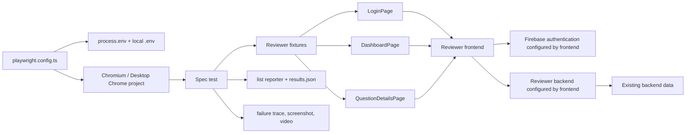
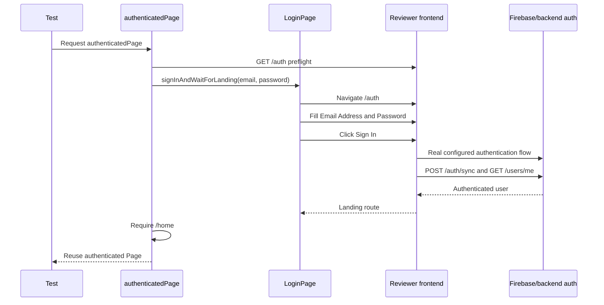

# Reviewer Playwright QA

## 1. Project Overview

`reviewer-playwright` is an isolated Playwright test package for the Ajrasakha Reviewer frontend. Its implemented scope is one read-oriented vertical slice:

```text
email/password login -> /home -> All Questions -> first question -> question details
```

The package exists to exercise the real browser UI against the configured Reviewer frontend while leaving the frontend and backend package configuration unchanged. It currently covers authentication and role resolution, the Reviewer shell, question-list navigation, selected-question details, deep-link persistence, metadata, allocation rendering, exit navigation, and selected loading/error/partial-response behavior.

This is not a complete Reviewer regression suite. The executable source contains 12 test definitions for the `expert` role. It has no database client, seed process, cleanup process, API test layer, authentication bypass, or mutating business workflow. Most tests use real authentication and real backend data; three error cases intercept selected business responses in the browser.

### Current maturity

- **Implemented:** TypeScript/Playwright package, one Chromium project, reusable authentication and page-object layers, 12 catalogue-linked tests, JSON result output, and failure artifacts.
- **Environment-dependent:** real login requires an existing user and reachable Firebase/frontend/backend services; detail tests require an existing visible question.
- **Not yet proven green:** the checked-in `test-results/results.json` records 12 skipped results and no passed business test. `AUTOMATION-REPORT.md` is a historical report from an earlier environment and also records zero executed/passed tests.
- **Read-oriented:** the suite does not create, edit, finalize, or delete questions. The application-driven `POST /auth/sync` remains part of real login, so any user/session synchronization performed by the backend is outside this package's control.

---

## 2. Repository Structure

```text
qa/reviewer-playwright/
├── .env                         # Local secrets/configuration; ignored by Git
├── .env.example                 # Safe template for the three supported QA variables
├── .gitignore                   # Excludes dependencies, secrets, and generated reports
├── AUTOMATION-REPORT.md         # Historical Phase 3 implementation/execution report
├── README.md                    # This engineer-facing guide
├── package.json                 # npm scripts and QA-only development dependencies
├── package-lock.json            # npm lockfile; currently resolves Playwright 1.61.1
├── playwright.config.ts         # Environment loader and Playwright runtime policy
├── tsconfig.json                # Strict, no-emit TypeScript configuration
├── fixtures/
│   └── reviewer.fixture.ts      # Frontend preflight, real login, and page-object fixtures
├── pages/
│   ├── login.page.ts            # Login form and landing-page interactions
│   ├── dashboard.page.ts        # All Questions list and first-question navigation
│   └── question-details.page.ts # Detail header, metadata, allocation, and Exit assertions
├── tests/
│   ├── dashboard-question-details.spec.ts # PERM, DASH, and QDET vertical-slice tests
│   └── question-details-errors.spec.ts     # Loading, empty, failure, and partial-data tests
├── node_modules/                # Generated npm dependencies; ignored by Git
└── test-results/
    ├── .gitkeep                 # Keeps the result directory in source control
    ├── results.json             # Generated JSON reporter output; ignored by Git
    └── artifacts/               # Traces, screenshots, videos, and run metadata; ignored
```

### Root files

| File | Responsibility and interaction |
|---|---|
| `.env.example` | Documents `REVIEWER_BASE_URL`, `REVIEWER_USER_EMAIL`, and `REVIEWER_USER_PASSWORD`. Copy it to `.env`; never place credentials in the example. |
| `.gitignore` | Prevents `.env`, `node_modules`, `playwright-report`, and generated `test-results` content from being committed while preserving `test-results/.gitkeep`. |
| `package.json` | Declares an ESM-only private package and the `test`, `test:list`, and `typecheck` scripts. It uses npm via `package-lock.json`. |
| `package-lock.json` | Pins the installed dependency graph. The current lock resolves `@playwright/test` 1.61.1 and declares Playwright's Node requirement as Node 18 or newer. |
| `playwright.config.ts` | Loads local environment values, declares test/result directories, timeouts, reporters, artifacts, execution policy, and the Chromium/Desktop Chrome project. |
| `tsconfig.json` | Type-checks config, pages, fixtures, and tests using strict NodeNext/ES2022 settings without emitting JavaScript. |
| `AUTOMATION-REPORT.md` | Records the original Phase 3 scope, catalogue traceability, missing coverage, selector weaknesses, and the environment blockers observed when it was written. Treat its execution section as historical rather than current runtime truth. |

### Source directories

| Directory | Responsibility and interaction |
|---|---|
| `fixtures/` | Extends Playwright's base test with environment, authenticated-page, dashboard, and question-detail fixtures. Tests import `test` and `expect` from this layer. |
| `pages/` | Encapsulates browser selectors and repeated actions. Page objects receive the fixture-owned `Page`; they do not own browser lifecycle or test data. |
| `tests/` | Defines the 12 executable catalogue cases. Tests combine fixtures/page objects with response-derived assertions and targeted routing for deterministic failures. |
| `test-results/` | Receives the JSON report and retained artifacts. It is generated output, not framework source. |
| `node_modules/` | Generated dependency installation. Recreate it with `npm ci`; do not edit it. |

There is currently no `helpers/`, `utilities/`, `data/`, `mocks/`, `setup/`, or `global-teardown/` implementation.

---

## 3. Architecture

### Execution architecture



### Playwright configuration

`playwright.config.ts` defines the complete runner policy:

| Setting | Implemented value |
|---|---|
| Test directory | `./tests` |
| Artifact directory | `./test-results/artifacts` |
| Parallelism | `fullyParallel: false` |
| Workers | `1` |
| Retries | `0` |
| Test timeout | 45 seconds |
| Assertion timeout | 10 seconds |
| Accidental focused tests | `forbidOnly: true` |
| Projects | One project: `chromium` with `Desktop Chrome` device settings |
| Reporters | Terminal `list` reporter and JSON reporter at `test-results/results.json` |
| Trace | Retained on failure |
| Screenshot | Captured only on failure |
| Video | Retained on failure |
| Web server | None; application services must already be running |
| Global setup/teardown | None |
| Stored authentication state | None; authenticated tests log in through the UI |

### Environment loading

The config locates `.env` beside `playwright.config.ts` and parses lines matching `KEY=value`. Single- or double-quoted values are unwrapped. Existing shell variables win: a key already present in `process.env` is not overwritten by `.env`.

The runner base URL is:

1. `REVIEWER_BASE_URL`, when set; otherwise
2. `http://127.0.0.1:5173`.

The checked-in `.env.example` uses `http://localhost:5173`. Set the desired host explicitly when host resolution or cookie/origin behavior matters.

### Fixtures

`fixtures/reviewer.fixture.ts` provides four fixtures:

- `environmentPage` calls `GET /auth` through Playwright's request context with a five-second timeout. For tests that consume this fixture, an unreachable frontend or non-success response is annotated as blocked and skipped.
- `authenticatedPage` requires `REVIEWER_USER_EMAIL` and `REVIEWER_USER_PASSWORD`, performs a real UI login, and requires the final URL to match `/home`. Missing credentials throw a configuration error for authenticated tests other than PERM-001.
- `dashboardPage` wraps the authenticated page in `DashboardPage`.
- `questionDetailsPage` wraps the same authenticated page in `QuestionDetailsPage`.

PERM-001 deliberately consumes Playwright's base `page`, not `authenticatedPage`. It handles missing credentials locally so only PERM-001 is skipped, and then independently verifies the real auth responses and expert landing route.



### Page objects

- `LoginPage` opens `/auth`, validates the `Welcome Back` heading, fills labeled credentials, clicks `Sign In`, and waits for one of the implemented landing-route shapes. The shared fixture further restricts its tests to `/home`.
- `DashboardPage` waits for the `/home` shell, opens the `All Questions` tab, accepts either the Question column or `No questions found`, and opens the first clickable question. It waits for `/questions/{id}/full` and returns the response-derived ID, question text, and response body to the test.
- `QuestionDetailsPage` asserts question text, normalized status text, timestamps/actions, metadata fallbacks, allocation queue entries/statuses, and in-page Exit behavior.

### API interception strategy

The suite has no standalone API client and does not mock authentication. Browser routing is confined to the error/partial-data spec:

| Test | Interception behavior |
|---|---|
| ERR-001 | Holds `**/users/me`, then calls `route.continue()` so the real request proceeds unchanged. |
| ERR-002 | Holds and fulfills `**/questions/detailed?**` with an empty list response. The intercepted list request does not reach the backend. |
| ERR-003 | Fulfills `**/questions/*/full` with a controlled HTTP 500. The intercepted full-detail request does not reach the backend. |
| ERR-010 | Calls `route.fetch()` for the real full-detail response, removes optional fields from the in-memory JSON, then fulfills the browser request with that modified response. Backend data is not changed. |

All other test traffic is application-driven and reaches the frontend's configured services.

---

## 4. Prerequisites

### QA runner

- Node.js **18 or newer**. This is the minimum declared by the locked Playwright package.
- npm, because this package includes `package-lock.json` and its scripts are npm-oriented.
- Playwright's Chromium browser binary.

### Application services

- The Reviewer frontend must be running at `REVIEWER_BASE_URL`. The frontend package defines `vite --port 5173` for both `dev` and `start`.
- The frontend's configured Reviewer backend must be reachable. This QA package does not configure or address the backend directly.
- The frontend and backend must have working Firebase client/admin configuration for real email/password authentication.
- The backend must be connected to its configured database.
- An existing account must match `REVIEWER_USER_EMAIL`/`REVIEWER_USER_PASSWORD`.
- PERM-001 specifically requires both `POST /auth/sync` and `GET /users/me` to return role `expert`, followed by `/home`.
- QDET-001/002/003/004/006/011 and ERR-003/010 require at least one question visible and clickable in All Questions. QDET cases and ERR-010 also require that question's `/questions/{id}/full` request to succeed.

The QA project neither provisions nor validates MongoDB directly. It contains no DB URI, database client, seed script, record builder, or cleanup implementation.

---

## 5. Local Installation

### 1. Clone the actual repository

```powershell
git clone https://github.com/vicharanashala/ajrasakha.git
cd ajrasakha
```

### 2. Install the Reviewer backend and frontend

The product packages use pnpm commands in their own manifests/documentation:

```powershell
cd backend
pnpm install
cd ..\frontend
pnpm install
```

Configure `backend/.env` and `frontend/.env` from their own example files with the real local database and Firebase settings. This QA package does not supply those credentials or services.

### 3. Install the QA package deterministically

```powershell
cd ..\qa\reviewer-playwright
npm ci
npx playwright install chromium
```

### 4. Configure QA environment values

```powershell
Copy-Item .env.example .env
```

Edit only the local `.env`:

```env
REVIEWER_BASE_URL=http://localhost:5173
REVIEWER_USER_EMAIL=
REVIEWER_USER_PASSWORD=
```

Use an existing expert account. `.env` is ignored by Git; do not commit it.

### 5. Start the product services

In one terminal, start the configured backend:

```powershell
cd C:\path\to\ajrasakha\backend
pnpm dev
```

In another terminal, start the frontend on its manifest-defined port:

```powershell
cd C:\path\to\ajrasakha\frontend
pnpm start
```

The backend port and API base URL are environment-controlled; the QA package intentionally has no backend URL variable. Ensure the frontend's `VITE_API_BASE_URL` points at the running backend.

### 6. Verify installation without executing business tests

```powershell
cd C:\path\to\ajrasakha\qa\reviewer-playwright
npm run typecheck
npm run test:list
```

The discovery command should list 12 tests in the `chromium` project.

---

## 6. Running Tests

Run commands from `qa/reviewer-playwright`.

### Package commands

```powershell
# Run all tests
npm test

# List discovered tests without running them
npm run test:list

# Type-check config, fixtures, page objects, and specs
npm run typecheck
```

### Playwright CLI commands

```powershell
# Run one spec
npx playwright test tests/dashboard-question-details.spec.ts

# Run one catalogue test by title
npx playwright test tests/dashboard-question-details.spec.ts --grep "PERM-001"

# Run one test in a visible browser
npx playwright test tests/dashboard-question-details.spec.ts --grep "PERM-001" --headed --workers=1

# Open Playwright Inspector and pause-friendly debugging
npx playwright test tests/dashboard-question-details.spec.ts --grep "QDET-001" --debug

# Use Playwright's interactive UI runner
npx playwright test --ui

# Run the only configured project explicitly
npx playwright test --project=chromium
```

### Reports and artifacts

Every normal run prints the list report and rewrites:

```text
test-results/results.json
```

There is no HTML reporter in the current config, so `playwright show-report` is not part of this framework's configured workflow. On failure, inspect `test-results/artifacts`; the config retains the trace and video and captures a screenshot.

Open a retained trace with:

```powershell
npx playwright show-trace test-results\artifacts\<test-artifact-directory>\trace.zip
```

Artifact directory names are generated by Playwright and depend on the failed test.

---

## 7. Current Test Coverage

### Authentication and permissions

| ID | What the test validates |
|---|---|
| PERM-001 | Performs real email/password login; waits for successful `POST /auth/sync` and `GET /users/me`; requires both payloads to report role `expert`; requires final route `/home`. Missing credentials skip only this test. Invalid configured credentials fail. |

### Dashboard shell and question navigation

| ID | What the test validates |
|---|---|
| DASH-001 | Authenticated `/home` exposes All Questions, and opening the tab renders either the Question column or the implemented empty state. |
| QDET-001 | Selecting the first visible question receives a successful full-detail response whose `_id` and question are strings, then renders the matching question text and Exit action. |
| QDET-002 | A response-derived `/home?question={id}` deep link renders the same question, survives reload, and preserves the ID in the URL. |
| QDET-003 | The detail header renders response-derived question/status, Exit, View LifeCycle, View Audit, Created, and Updated UI. |
| QDET-004 | State, district, crop, normalized crop, season, and domain match the full-detail response, using `-` for absent values and comma-joining domain arrays. |
| QDET-006 | The allocation queue renders each returned reviewer by name/email title and exposes at least one recognized allocation status when the queue is non-empty; an empty queue renders No Experts Allocated. |
| QDET-011 | The in-page Exit action leaves question details and returns to either the question table or empty state. |

### Loading, empty, error, and partial-data behavior

| ID | What the test validates |
|---|---|
| ERR-001 | While a real `/users/me` response is held, protected home does not render All Questions; releasing the request restores the shell. |
| ERR-002 | A held detailed-question request displays the loading spinner; fulfilling it with an empty result renders No questions found. |
| ERR-003 | A controlled 500 from full details clears the loading spinner and does not render stale detail title/Exit UI. It does not assert a visible error panel because the implemented selected-query branch has none. |
| ERR-010 | Removing optional context, metrics, closure/moderator, and metadata fields from a real upstream full response leaves a stable detail screen and renders `-` for district, normalized crop, season, and domain. |

### Data origin by test group

- PERM-001 uses real authentication/user responses and does not read a question.
- DASH-001 uses real authentication and real list behavior but allows an empty list.
- All QDET tests use the arbitrary first real question returned to the user.
- ERR-001 uses a delayed but otherwise real user response.
- ERR-002 uses real authentication with a fabricated empty question-list response.
- ERR-003 uses a real list question with a fabricated full-detail 500 response.
- ERR-010 uses real list/full data but alters only the browser-delivered full response.

No test creates, updates, finalizes, or deletes a question.

---

## 8. Current Implementation Status

| Area | Status |
|---|---|
| Package isolation | Implemented as a private ESM npm package under `qa/reviewer-playwright`; no product package import or config mutation is required. |
| TypeScript | Strict, no-emit NodeNext configuration implemented. |
| Environment loading | Implemented for local `.env` with shell-variable precedence. |
| Browser configuration | Chromium/Desktop Chrome only; one worker; no retries. |
| Authentication | Real UI login implemented; PERM-001 verifies backend/frontend role `expert`; shared fixture verifies `/home`. |
| Environment preflight | Implemented for tests using `environmentPage`; unreachable/non-OK `/auth` becomes an annotated skip. |
| Dashboard | All Questions tab and table/empty-state assertions implemented. |
| Question details | First-question open, response identity, deep link/reload, header, metadata, allocation, and Exit implemented. |
| Error handling | Delayed user response, delayed/empty list, full-detail 500, and partial full response implemented with browser routing. |
| Test data | Existing-data only; no deterministic record provisioning. |
| Database tooling | Not implemented. The suite reaches data only through application APIs. |
| Helpers/utilities | No separate helper or utility layer; shared behavior currently resides in page objects and fixtures. |
| Reporting | Terminal list plus JSON implemented. No HTML/JUnit reporter. |
| Artifacts | Failure screenshot, trace, and video implemented. |
| CI | No QA-specific CI workflow or command is present in this package. |

---

## 9. Work Completed So Far

### Framework foundation

- Created an isolated Playwright/TypeScript package with its own manifest, lockfile, config, and ignored local environment.
- Added strict type-checking and deterministic npm installation metadata.
- Configured serial Chromium execution, explicit timeouts, JSON results, and failure artifacts.

### Reusable automation components

- Added an environment preflight and real authenticated-page fixture.
- Added login, dashboard, and question-detail page objects.
- Centralized the existing product selector fallbacks, including the clickable question span, metadata sibling traversal, and reviewer title attributes.

### Vertical slice

- Implemented 12 catalogue-ID tests covering PERM-001, DASH-001, six QDET cases, and four ERR cases.
- Made test expectations derive question identity, status, metadata, and allocation data from actual full-detail responses.
- Added controlled browser interception for loading, empty, failure, and missing-optional-field behavior without changing backend records.

### Validation record

- The project currently contains installed dependencies and generated discovery/result artifacts.
- The checked-in/generated JSON result inventory contains all 12 test titles under Chromium.
- No successful live business assertion is documented: current generated results are skipped, and the historical automation report records zero executed/passed cases. A clean local run with reachable services, valid expert credentials, and suitable question data remains required.

---

## 10. Development Roadmap

The repository contains no authoritative scheduled roadmap or TODO list. The phase labels below distinguish the implemented slice from explicit gaps recorded in `AUTOMATION-REPORT.md`; unimplemented items are not presented as completed commitments.

### Phase 1 — Implemented foundation

- QA-only Playwright package and strict TypeScript configuration.
- Local environment loading and failure-artifact policy.
- Real UI login fixture and three page objects.
- One expert-role, read-oriented dashboard-to-detail slice.
- Controlled loading/error/partial-response coverage.

### Phase 2 — Planned work is not defined in source

No concrete Phase 2 implementation plan exists in this repository. Before extending coverage, maintainers need to decide and document:

- how stable test questions are identified or provisioned;
- whether authentication state should be reused or every test should keep logging in;
- which additional roles receive credentials/fixtures;
- whether new catalogue documents referenced by source comments will live in this repository;
- whether CI and HTML/JUnit reporting are required.

These are current architectural gaps, not implemented features.

### Phase 3 — Explicitly unimplemented coverage areas

The historical report explicitly lists the following as not implemented:

- answer mutation and answer lifecycle;
- moderation workflows;
- duplicate-question workflows;
- reviewer allocation mutation;
- GDB workflows;
- AI workflows;
- administration flows;
- broad browser-history traversal;
- visible question-ID assertions;
- author-tag cases that require guaranteed author-bearing records;
- dashboard analytics failure coverage.

These are future coverage candidates. The repository contains no fixtures, page objects, or tests for them yet.

---

## 11. Known Limitations

1. **Only one role is asserted.** PERM-001 requires role string `expert`. There are no reviewer/moderator/admin persona fixtures or role matrix.
2. **Question selection is arbitrary.** `DashboardPage` selects the first visible table row; no stable ID, marker, query, or fixture controls which record is used.
3. **Existing data is required.** Eight tests need a visible question, and most need a successful full-detail record. The project cannot seed or clean data.
4. **No direct database safety boundary exists because there is no database layer.** Tests rely on UI behavior and backend APIs. Login's `/auth/sync` may have backend-owned user/session side effects not defined here.
5. **Authentication repeats.** No `storageState` or setup project is implemented; every fixture-based test logs in independently.
6. **Credential behavior differs intentionally.** Missing credentials skip PERM-001, while the other authenticated tests throw an error after the environment preflight.
7. **Frontend-unreachable behavior differs for PERM-001.** The shared environment fixture skips its consumers, but PERM-001 uses the base page and will fail navigation rather than receive that fixture annotation.
8. **Single-browser coverage.** Only Chromium/Desktop Chrome is configured; Firefox, WebKit, mobile, and alternate viewport coverage are absent.
9. **Serial, no-retry execution.** One worker and zero retries make order/resource use simple but provide no parallel coverage or retry diagnostics.
10. **No automatic service startup.** There is no Playwright `webServer`; frontend/backend/Firebase/database dependencies must already be available.
11. **No stable accessible selector for a question row.** The page object uses `span.cursor-pointer` because the production question is not exposed as a link, button, named control, or test ID.
12. **Metadata selectors traverse sibling spans.** Labels and values are not semantically associated.
13. **Reviewer bubbles lack list semantics/stable IDs.** Queue checks fall back to `title` attributes containing name or email.
14. **Loading checks use CSS.** ERR-002/003 locate `.animate-spin`, coupling assertions to styling.
15. **No explicit full-detail error UI is asserted.** ERR-003 verifies stale details are absent, but the implementation trace records no error panel/retry control.
16. **No visible question ID assertion.** Identity is established through the API response and deep-link query, not a rendered ID.
17. **Reporting is minimal.** JSON/list reporters are configured; HTML, JUnit, coverage, dashboards, and CI publishing are not.
18. **The historical report is stale execution evidence.** It predates the currently installed dependency directory and must not be treated as proof of present environment readiness.
19. **Referenced catalogue files are external/absent here.** Source comments name documents such as `02-question-details.md`, but those files are not in the current real `qa` checkout.

---

## 12. Contributing

### General conventions

- Keep all QA changes inside `qa/reviewer-playwright` unless a product change is separately approved.
- Use catalogue IDs at the beginning of test titles, for example `QDET-012 ...`.
- Add a source comment above each test identifying its functional catalogue and product implementation trace.
- Import `test` and `expect` from `fixtures/reviewer.fixture.js` when using shared fixtures.
- Keep `.js` on relative TypeScript imports; the project uses NodeNext ESM resolution.
- Prefer role, label, heading, and visible-text locators. Add a narrowly scoped fallback only when the current product markup lacks a semantic selector, and document why in code.
- Register `waitForResponse` or `page.route` before the UI action that triggers the request.
- Derive expectations from real API responses when the record is not deterministic.
- Mock only the endpoint needed for the scenario; do not bypass authentication for authenticated business cases.
- Never commit `.env`, credentials, generated results, traces, videos, screenshots, or `node_modules`.

### Add a page object

1. Create `pages/<feature>.page.ts`.
2. Accept a Playwright `Page` in the constructor.
3. Expose stable locators and cohesive user actions/assertions.
4. Keep test orchestration and scenario-specific branching in the spec.
5. If broadly reused, add a typed fixture in `fixtures/reviewer.fixture.ts` and instantiate it with the existing page fixture.

### Add or extend a fixture

1. Add its type to `ReviewerFixtures`.
2. Add it to `base.extend<ReviewerFixtures>({ ... })`.
3. Depend on the narrowest existing fixture: use `environmentPage` for unauthenticated environment-dependent behavior and `authenticatedPage` for expert `/home` behavior.
4. Use `await use(value)` exactly once and allow Playwright to own page/context cleanup.
5. If the fixture mutates external state, add explicit scoped cleanup before introducing the test; no such cleanup architecture currently exists.

### Add a helper or utility

No helper directory currently exists. Introduce one only when logic is shared across page objects/specs and has no page ownership. Include the new path in `tsconfig.json` if it falls outside the existing `pages`, `fixtures`, or `tests` globs.

### Add a test

1. Choose the relevant existing spec or add `tests/<feature>.spec.ts`.
2. State required role, existing data, and whether traffic is real or intercepted in the test comments.
3. Avoid assuming the first record has a particular state unless the test provisions or uniquely identifies that state.
4. For error tests, assert both the controlled response and the visible application behavior.
5. Run the validation sequence:

```powershell
npm run typecheck
npm run test:list
npx playwright test tests\<feature>.spec.ts --grep "<TEST-ID>" --workers=1
```

---

## 13. Appendix

### Environment variable reference

| Variable | Required | Default | Used by |
|---|---:|---|---|
| `REVIEWER_BASE_URL` | No | `http://127.0.0.1:5173` | Playwright `baseURL` and environment-blocked diagnostic text. `.env.example` explicitly sets `http://localhost:5173`. |
| `REVIEWER_USER_EMAIL` | Yes for authentication | None | PERM-001 and `authenticatedPage`. Must identify an existing applicable user. |
| `REVIEWER_USER_PASSWORD` | Yes for authentication | None | PERM-001 and `authenticatedPage`. Keep it only in the shell or ignored `.env`. |

Shell variables override values in `.env`:

```powershell
$env:REVIEWER_BASE_URL = "http://localhost:5173"
$env:REVIEWER_USER_EMAIL = "<existing-expert-email>"
$env:REVIEWER_USER_PASSWORD = "<secret>"
```

### Application endpoints observed or controlled by the suite

| Method/path | Purpose in current tests |
|---|---|
| `GET /auth` | Frontend reachability preflight for fixture-based tests and login page navigation. |
| `POST /auth/sync` | Real login synchronization; PERM-001 requires a successful response with `user.role === "expert"`. |
| `GET /users/me` | Current-user resolution; PERM-001 requires role `expert`; ERR-001 delays this request. |
| `*/questions/detailed?*` | Question-list traffic matched by ERR-002. The test's matcher does not constrain the HTTP method. |
| `*/questions/{id}/full` | Full question detail used by QDET tests, failed by ERR-003, and response-modified by ERR-010. |

The frontend may issue other requests. These are the endpoints explicitly awaited or intercepted by this QA source.

### Troubleshooting

#### `node`, `npm`, or `npx` is not recognized

Install Node.js 18 or newer and ensure its installation directory is on `PATH`. Open a new shell, then verify:

```powershell
node --version
npm --version
npx playwright --version
```

#### Chromium executable is missing

```powershell
npx playwright install chromium
```

#### PERM-001 is skipped

Both credential variables are empty or absent. Configure `REVIEWER_USER_EMAIL` and `REVIEWER_USER_PASSWORD`. PERM-001 is the only test with its own missing-credential skip.

#### Other authenticated tests fail before assertions

The shared fixture throws when either credential is missing. If the frontend is unreachable, fixture-based tests are skipped and annotated as blocked instead.

#### Login fails or does not reach `/home`

Verify all of the following:

- the frontend is reachable at the exact configured host;
- the frontend points to the running backend;
- Firebase client and backend Admin configuration belong to the intended environment;
- the user exists and can authenticate;
- `/auth/sync` and `/users/me` resolve the expected user;
- the selected user lands at `/home`.

#### QDET or ERR-003/ERR-010 cannot click a question

The authenticated user must see at least one table row containing the production `span.cursor-pointer` question trigger. There is no seed/fallback question.

#### A test passes locally but uses a different question on the next run

That is possible by design: the current page object chooses the first returned row. Inspect list ordering and database contents; the framework has no stable test record selector.

#### No HTML report appears

The config uses list and JSON reporters only. Read `test-results/results.json` or add an HTML reporter in a deliberate framework change.

### Repository conventions summary

- Package manager for this QA package: npm.
- Module format: ESM with NodeNext resolution.
- Test project: Chromium/Desktop Chrome.
- Execution: serial, one worker, no retries.
- Test naming: functional catalogue ID prefix.
- Primary abstraction: fixture-owned page objects.
- Test data: existing backend data or test-local browser response interception.
- External mutations: none implemented for question workflows.
